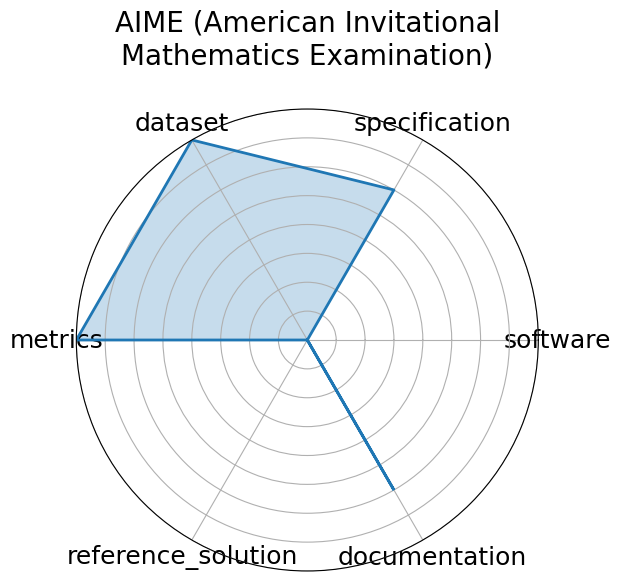

# AIME (American Invitational Mathematics Examination)

<a class="md-button back-link" href="../">← Back to all benchmarks</a>

  
Date: 2025-03-13

  
Name: AIME  American Invitational Mathematics Examination

  
Domain: Mathematics

  
Focus: Pre-college advanced problem solving

  
Task Types: Problem solving

  
Metrics: Accuracy

  
Models: unkown

<h3>Keywords</h3>

<a class="chip chip-link" href="../#kw=algebra">algebra</a> <a class="chip chip-link" href="../#kw=combinatorics">combinatorics</a> <a class="chip chip-link" href="../#kw=number%20theory">number theory</a> <a class="chip chip-link" href="../#kw=geometry">geometry</a> 

<h3>Citation</h3>

- TBD. Aime. March 2025. [Online accessed 2025-06-24]. URL: https://www.vals.ai/benchmarks/aime-2025-03-13.

<pre><code class="language-bibtex">@misc{www-aime,
  author = {TBD},
  title = {AIME},
  url = {https://www.vals.ai/benchmarks/aime-2025-03-13},
  month = mar,
  year = 2025,
  note = {[Online accessed 2025-06-24]}
}</code></pre>
<h3>Ratings</h3>

  
CategoryRating

  
  
Software
  
0.00
  

  
No code available

  
Specification
  
0.00
  

  
Obvious what the problems are, but not specified how to administer them to AI models. No HW constraints

  
Dataset
  
4.00
  

  
Easily accessible data with problems and solutions, but no splits

  
Metrics
  
5.00
  

  
(by default) Answer is correct or it&#x27;s not

  
Reference Solution
  
0.00
  

  
Not given. Human performance stats exist, but no mentions of AI performance

  
Documentation
  
0.00
  

  
Not given

  <strong>Average rating:</strong> 1.50/5
<h3>Radar plot</h3>

<strong>Edit:</strong> <a href="https://github.com/mlcommons-science/benchmark/tree/main/source">edit this entry</a>

