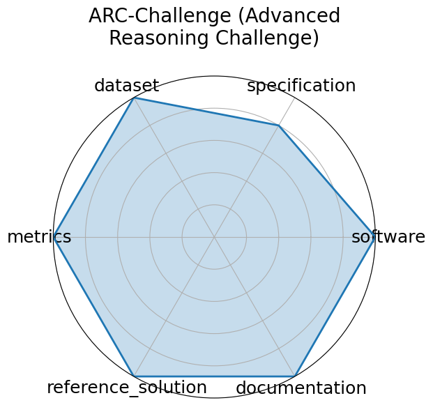

# ARC-Challenge (Advanced Reasoning Challenge)

<a class="md-button back-link" href="../">← Back to all benchmarks</a>

  
Date: 2018-03-14

  
Name: ARC-Challenge  Advanced Reasoning Challenge

  
Domain: Science

  
Focus: Grade-school science with reasoning emphasis

  
Task Types: Multiple choice

  
Metrics: Accuracy

  
Models: GPT-4, Claude

<h3>Keywords</h3>

<a class="chip chip-link" href="../#kw=grade-school">grade-school</a> <a class="chip chip-link" href="../#kw=science%20QA">science QA</a> <a class="chip chip-link" href="../#kw=challenge%20set">challenge set</a> <a class="chip chip-link" href="../#kw=reasoning">reasoning</a> 

<h3>Citation</h3>

- Peter Clark, Isaac Cowhey, and Oren Etzioni. Think you have solved question answering? try arc, the ai2 reasoning challenge. In EMNLP 2018, 237 248. 2018. URL: https://allenai.org/data/arc.

<pre><code class="language-bibtex">@inproceedings{clark2018think,
  title={Think you have solved question answering? Try ARC, the AI2 Reasoning Challenge},
  author={Clark, Peter and Cowhey, Isaac and Etzioni, Oren},
  booktitle={EMNLP 2018},
  pages={237-248},
  year={2018},
  url={https://allenai.org/data/arc}
}</code></pre>
<h3>Ratings</h3>

  
CategoryRating

  
  
Software
  
0.00
  

  
No link to code or documentation

  
Specification
  
2.00
  

  
Task is clear, but no constraints or format is mentioned

  
Dataset
  
4.00
  

  
Data accessible, offers instructions on how to download the data via CLI tools. No splits.

  
Metrics
  
5.00
  

  
(by default) All questions in the dataset are multiple choice, all have a correct answer

  
Reference Solution
  
1.00
  

  
There are over 300 models listed, but very few, if any, show performance on the dataset or list constraints

  
Documentation
  
5.00
  

  
Explains all necessary information inside a paper

  <strong>Average rating:</strong> 2.83/5
<h3>Radar plot</h3>

<strong>Edit:</strong> <a href="https://github.com/mlcommons-science/benchmark/tree/main/source">edit this entry</a>

