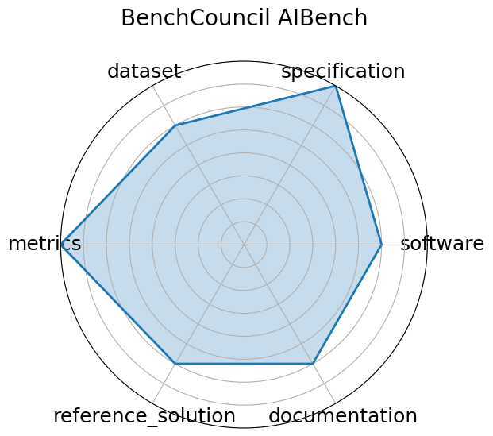

# BenchCouncil AIBench

<a class="md-button back-link" href="../">← Back to all benchmarks</a>

  
Date: 2020-01-01

  
Name: BenchCouncil AIBench

  
Domain: General

  
Focus: End-to-end AI benchmarking across micro, component, and application levels

  
Task Types: Training, Inference, End-to-end AI workloads

  
Metrics: Throughput, Latency, Accuracy

  
Models: ResNet, BERT, GANs, Recommendation systems

<h3>Keywords</h3>

<a class="chip chip-link" href="../#kw=benchmarking">benchmarking</a> <a class="chip chip-link" href="../#kw=AI%20systems">AI systems</a> <a class="chip chip-link" href="../#kw=application-level%20evaluation">application-level evaluation</a> 

<h3>Citation</h3>

- Wanling Gao, Fei Tang, Lei Wang, Jianfeng Zhan, Chunxin Lan, Chunjie Luo, Yunyou Huang, Chen Zheng, Jiahui Dai, Zheng Cao, Daoyi Zheng, Haoning Tang, Kunlin Zhan, Biao Wang, Defei Kong, Tong Wu, Minghe Yu, Chongkang Tan, Huan Li, Xinhui Tian, Yatao Li, Junchao Shao, Zhenyu Wang, Xiaoyu Wang, and Hainan Ye. Aibench: an industry standard internet service ai benchmark suite. 2019. URL: https://arxiv.org/abs/1908.08998, arXiv:1908.08998.

<pre><code class="language-bibtex">@misc{gao2019aibenchindustrystandardinternet,
  archiveprefix = {arXiv},
  author        = {Wanling Gao and Fei Tang and Lei Wang and Jianfeng Zhan and Chunxin Lan and Chunjie Luo and Yunyou Huang and Chen Zheng and Jiahui Dai and Zheng Cao and Daoyi Zheng and Haoning Tang and Kunlin Zhan and Biao Wang and Defei Kong and Tong Wu and Minghe Yu and Chongkang Tan and Huan Li and Xinhui Tian and Yatao Li and Junchao Shao and Zhenyu Wang and Xiaoyu Wang and Hainan Ye},
  eprint        = {1908.08998},
  primaryclass  = {cs.CV},
  title         = {AIBench: An Industry Standard Internet Service AI Benchmark Suite},
  url           = {https://arxiv.org/abs/1908.08998},
  year          = {2019}
}</code></pre>
<h3>Ratings</h3>

  
CategoryRating

  
  
Software
  
3.00
  

  
No containerized or automated implementation provided for full benchmark suite

  
Specification
  
4.00
  

  
Task coverage is broad and well-scoped, but system constraints and expected outputs are not uniformly defined

  
Dataset
  
3.00
  

  
Multiple datasets are mentioned, but not consistently FAIR-documented, versioned, or linked

  
Metrics
  
4.00
  

  
Metrics are appropriate, but standardization and reproducibility across tasks vary

  
Reference Solution
  
3.00
  

  
Reference models (e.g., ResNet, BERT) described; no turnkey implementation or results repository for all levels

  
Documentation
  
3.00
  

  
Paper is comprehensive, but minimal user-facing documentation or structured reproduction guide

  <strong>Average rating:</strong> 3.33/5
<h3>Radar plot</h3>

<strong>Edit:</strong> <a href="https://github.com/mlcommons-science/benchmark/tree/main/source">edit this entry</a>

