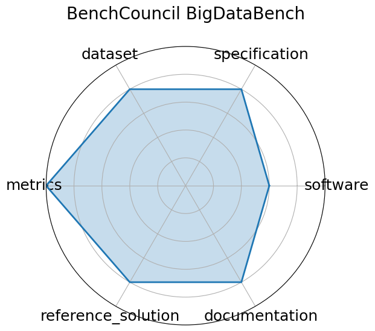

# BenchCouncil BigDataBench

<a class="md-button back-link" href="../">← Back to all benchmarks</a>

  
Date: 2020-01-01

  
Name: BenchCouncil BigDataBench

  
Domain: General

  
Focus: Big data and AI benchmarking across structured, semi-structured, and unstructured data workloads

  
Task Types: Data preprocessing, Inference, End-to-end data pipelines

  
Metrics: Data throughput, Latency, Accuracy

  
Models: CNN, LSTM, SVM, XGBoost

<h3>Keywords</h3>

<a class="chip chip-link" href="../#kw=big%20data">big data</a> <a class="chip chip-link" href="../#kw=AI%20benchmarking">AI benchmarking</a> <a class="chip chip-link" href="../#kw=data%20analytics">data analytics</a> 

<h3>Citation</h3>

- Wanling Gao, Jianfeng Zhan, Lei Wang, Chunjie Luo, Daoyi Zheng, Xu Wen, Rui Ren, Chen Zheng, Xiwen He, Hainan Ye, Haoning Tang, Zheng Cao, Shujie Zhang, and Jiahui Dai. Bigdatabench: a scalable and unified big data and ai benchmark suite. 2018. URL: https://arxiv.org/abs/1802.08254, arXiv:1802.08254.

<pre><code class="language-bibtex">@misc{gao2018bigdatabenchscalableunifiedbig,
  archiveprefix = {arXiv},
  author        = {Wanling Gao and Jianfeng Zhan and Lei Wang and Chunjie Luo and Daoyi Zheng and Xu Wen and Rui Ren and Chen Zheng and Xiwen He and Hainan Ye and Haoning Tang and Zheng Cao and Shujie Zhang and Jiahui Dai},
  eprint        = {1802.08254},
  primaryclass  = {cs.DC},
  title         = {BigDataBench: A Scalable and Unified Big Data and AI Benchmark Suite},
  url           = {https://arxiv.org/abs/1802.08254},
  year          = {2018}
}</code></pre>
<h3>Ratings</h3>

  
CategoryRating

  
  
Software
  
3.00
  

  
No automated setup across all tasks; some components require manual integration.

  
Specification
  
4.00
  

  
Specific I/O formats and hardware constraints are not uniformly detailed across all tasks.

  
Dataset
  
4.00
  

  
Some datasets lack consistent versioning or rich metadata annotations.

  
Metrics
  
5.00
  

  
None

  
Reference Solution
  
4.00
  

  
Not all benchmark components have fully reproducible baselines; deployment across platforms is fragmented.

  
Documentation
  
4.00
  

  
Setup requires manual steps; some task-specific instructions lack clarity.

  <strong>Average rating:</strong> 4.00/5
<h3>Radar plot</h3>

<strong>Edit:</strong> <a href="https://github.com/mlcommons-science/benchmark/tree/main/source">edit this entry</a>

