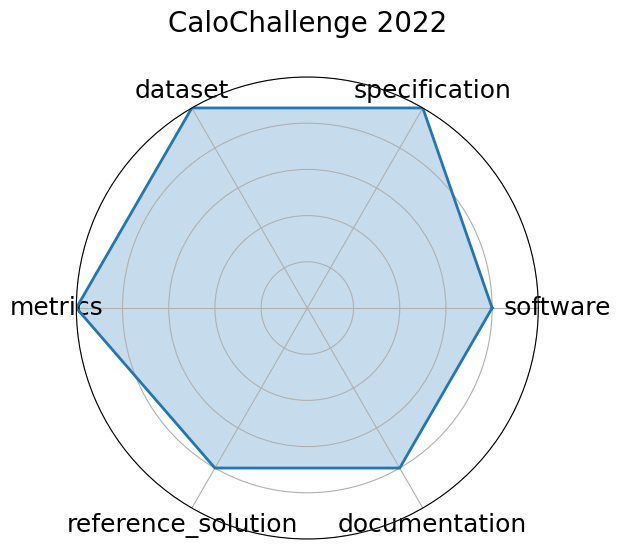

# CaloChallenge 2022

<a class="md-button back-link" href="../">← Back to all benchmarks</a>

  
Date: 2024-10-28

  
Name: CaloChallenge 2022

  
Domain: LHC Calorimeter; Particle Physics

  
Focus: Fast generative-model-based calorimeter shower simulation evaluation

  
Task Types: Surrogate modeling

  
Metrics: Histogram similarity, Classifier AUC, Generation latency

  
Models: VAE variants, GAN variants, Normalizing flows, Diffusion models

<h3>Keywords</h3>

<a class="chip chip-link" href="../#kw=calorimeter%20simulation">calorimeter simulation</a> <a class="chip chip-link" href="../#kw=generative%20models">generative models</a> <a class="chip chip-link" href="../#kw=surrogate%20modeling">surrogate modeling</a> <a class="chip chip-link" href="../#kw=LHC">LHC</a> <a class="chip chip-link" href="../#kw=fast%20simulation">fast simulation</a> 

<h3>Citation</h3>

- Claudius Krause, Michele Faucci Giannelli, Gregor Kasieczka, Benjamin Nachman, Dalila Salamani, David Shih, Anna Zaborowska, Oz Amram, Kerstin Borras, Matthew R. Buckley, Erik Buhmann, Thorsten Buss, Renato Paulo Da Costa Cardoso, Anthony L. Caterini, Nadezda Chernyavskaya, Federico A. G. Corchia, Jesse C. Cresswell, Sascha Diefenbacher, Etienne Dreyer, Vijay Ekambaram, Engin Eren, Florian Ernst, Luigi Favaro, Matteo Franchini, Frank Gaede, Eilam Gross, Shih-Chieh Hsu, Kristina Jaruskova, Benno Käch, Jayant Kalagnanam, Raghav Kansal, Taewoo Kim, Dmitrii Kobylianskii, Anatolii Korol, William Korcari, Dirk Krücker, Katja Krüger, Marco Letizia, Shu Li, Qibin Liu, Xiulong Liu, Gabriel Loaiza-Ganem, Thandikire Madula, Peter McKeown, Isabell-A. Melzer-Pellmann, Vinicius Mikuni, Nam Nguyen, Ayodele Ore, Sofia Palacios Schweitzer, Ian Pang, Kevin Pedro, Tilman Plehn, Witold Pokorski, Huilin Qu, Piyush Raikwar, John A. Raine, Humberto Reyes-Gonzalez, Lorenzo Rinaldi, Brendan Leigh Ross, Moritz A. W. Scham, Simon Schnake, Chase Shimmin, Eli Shlizerman, Nathalie Soybelman, Mudhakar Srivatsa, Kalliopi Tsolaki, Sofia Vallecorsa, Kyongmin Yeo, and Rui Zhang. Calochallenge 2022: a community challenge for fast calorimeter simulation. 2024. URL: https://arxiv.org/abs/2410.21611, arXiv:2410.21611.

<pre><code class="language-bibtex">@misc{krause2024calochallenge2022communitychallenge,
  archiveprefix = {arXiv},
  author        = {Claudius Krause and Michele Faucci Giannelli and Gregor Kasieczka and Benjamin Nachman and Dalila Salamani and David Shih and Anna Zaborowska and Oz Amram and Kerstin Borras and Matthew R. Buckley and Erik Buhmann and Thorsten Buss and Renato Paulo Da Costa Cardoso and Anthony L. Caterini and Nadezda Chernyavskaya and Federico A. G. Corchia and Jesse C. Cresswell and Sascha Diefenbacher and Etienne Dreyer and Vijay Ekambaram and Engin Eren and Florian Ernst and Luigi Favaro and Matteo Franchini and Frank Gaede and Eilam Gross and Shih-Chieh Hsu and Kristina Jaruskova and Benno Käch and Jayant Kalagnanam and Raghav Kansal and Taewoo Kim and Dmitrii Kobylianskii and Anatolii Korol and William Korcari and Dirk Krücker and Katja Krüger and Marco Letizia and Shu Li and Qibin Liu and Xiulong Liu and Gabriel Loaiza-Ganem and Thandikire Madula and Peter McKeown and Isabell-A. Melzer-Pellmann and Vinicius Mikuni and Nam Nguyen and Ayodele Ore and Sofia Palacios Schweitzer and Ian Pang and Kevin Pedro and Tilman Plehn and Witold Pokorski and Huilin Qu and Piyush Raikwar and John A. Raine and Humberto Reyes-Gonzalez and Lorenzo Rinaldi and Brendan Leigh Ross and Moritz A. W. Scham and Simon Schnake and Chase Shimmin and Eli Shlizerman and Nathalie Soybelman and Mudhakar Srivatsa and Kalliopi Tsolaki and Sofia Vallecorsa and Kyongmin Yeo and Rui Zhang},
  eprint        = {2410.21611},
  primaryclass  = {physics.ins-det},
  title         = {CaloChallenge 2022: A Community Challenge for Fast Calorimeter Simulation},
  url           = {https://arxiv.org/abs/2410.21611},
  year          = {2024}
}</code></pre>
<h3>Ratings</h3>

  
CategoryRating

  
  
Software
  
4.00
  

  
Community GitHub repos and model implementations are available for the 31 submissions.
While not fully unified in one place, the software is accessible and reproducible.

  
Specification
  
5.00
  

  
The task—evaluating fast generative calorimeter simulations—is clearly defined with
benchmarking protocols, constraints like latency and model complexity, and structured
evaluation criteria.

  
Dataset
  
5.00
  

  
Four well-structured calorimeter datasets are provided, with different voxel resolutions,
open access, signal/background separation, and metadata. FAIR principles are well covered.

  
Metrics
  
5.00
  

  
Metrics like histogram similarity, classifier AUC, and generation latency are well defined
and relevant for simulation quality, fidelity, and performance.

  
Reference Solution
  
4.00
  

  
Several baselines (GANs, VAEs, flows, diffusion models) are documented and evaluated.
Some are available via community repos, though not all are fully standardized or bundled.

  
Documentation
  
4.00
  

  
Accompanied by a detailed paper and dataset description. Reproduction of pipelines may require
additional setup or familiarity with the model submissions.

  <strong>Average rating:</strong> 4.50/5
<h3>Radar plot</h3>

<strong>Edit:</strong> <a href="https://github.com/mlcommons-science/benchmark/tree/main/source">edit this entry</a>

