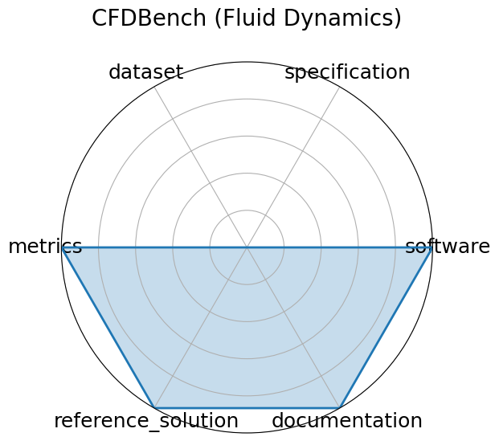

# CFDBench (Fluid Dynamics)

<a class="md-button back-link" href="../">← Back to all benchmarks</a>

  
Date: 2024-10-01

  
Name: CFDBench  Fluid Dynamics

  
Domain: Fluid Dynamics; Scientific ML

  
Focus: Neural operator surrogate modeling

  
Task Types: Surrogate modeling

  
Metrics: L2 error, MAE

  
Models: FNO, DeepONet, U-Net

<h3>Keywords</h3>

<a class="chip chip-link" href="../#kw=neural%20operators">neural operators</a> <a class="chip chip-link" href="../#kw=CFD">CFD</a> <a class="chip chip-link" href="../#kw=FNO">FNO</a> <a class="chip chip-link" href="../#kw=DeepONet">DeepONet</a> 

<h3>Citation</h3>

- Yining Luo, Yingfa Chen, and Zhen Zhang. Cfdbench: a large-scale benchmark for machine learning methods in fluid dynamics. 2024. URL: https://arxiv.org/abs/2310.05963.

<pre><code class="language-bibtex">@misc{luo2024cfdbenchlargescalebenchmarkmachine,
  title={CFDBench: A Large-Scale Benchmark for Machine Learning Methods in Fluid Dynamics},
  author={Luo, Yining and Chen, Yingfa and Zhang, Zhen},
  year={2024},
  url={https://arxiv.org/abs/2310.05963}
}</code></pre>
<h3>Ratings</h3>

  
CategoryRating

  
  
Software
  
5.00
  

  
The benchmark provides Python scripts for data loading, preprocessing, and model training/evaluation

  
Specification
  
0.00
  

  
Not listed

  
Dataset
  
0.00
  

  
Not given

  
Metrics
  
5.00
  

  
Quantitative metrics (L2 error, MAE, relative error) are clearly defined and align with regression task objectives.

  
Reference Solution
  
5.00
  

  
Baseline models like FNO and DeepONet are implemented, hardware specified.

  
Documentation
  
5.00
  

  
Associated paper gives all necessary information.

  <strong>Average rating:</strong> 3.33/5
<h3>Radar plot</h3>

<strong>Edit:</strong> <a href="https://github.com/mlcommons-science/benchmark/tree/main/source">edit this entry</a>

