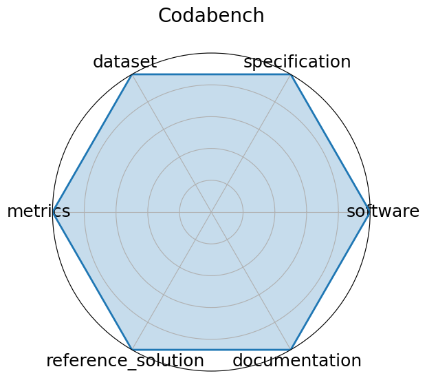

# Codabench

<a class="md-button back-link" href="../">← Back to all benchmarks</a>

  
Date: 2022-01-01

  
Name: Codabench

  
Domain: General ML; Multiple

  
Focus: Open-source platform for organizing reproducible AI benchmarks and competitions

  
Task Types: Multiple

  
Metrics: Submission count, Leaderboard ranking, Task-specific metrics

  
Models: Arbitrary code submissions

<h3>Keywords</h3>

<a class="chip chip-link" href="../#kw=benchmark%20platform">benchmark platform</a> <a class="chip chip-link" href="../#kw=code%20submission">code submission</a> <a class="chip chip-link" href="../#kw=competitions">competitions</a> <a class="chip chip-link" href="../#kw=meta-benchmark">meta-benchmark</a> 

<h3>Citation</h3>

- Zhen Xu, Sergio Escalera, Adrien Pavão, Magali Richard, Wei-Wei Tu, Quanming Yao, Huan Zhao, and Isabelle Guyon. Codabench: flexible, easy-to-use, and reproducible meta-benchmark platform. Patterns, 3(7):100543, July 2022. URL: http://dx.doi.org/10.1016/j.patter.2022.100543, doi:10.1016/j.patter.2022.100543.

<pre><code class="language-bibtex">@article{xu-2022,
  author    = {Xu, Zhen and Escalera, Sergio and Pavão, Adrien and Richard, Magali and Tu, Wei-Wei and Yao, Quanming and Zhao, Huan and Guyon, Isabelle},
  doi       = {10.1016/j.patter.2022.100543},
  issn      = {2666-3899},
  journal   = {Patterns},
  month     = jul,
  number    = {7},
  pages     = {100543},
  publisher = {Elsevier BV},
  title     = {Codabench: Flexible, easy-to-use, and reproducible meta-benchmark platform},
  url       = {http://dx.doi.org/10.1016/j.patter.2022.100543},
  volume    = {3},
  year      = {2022}
}</code></pre>
<h3>Ratings</h3>

  
CategoryRating

  
  
Software
  
1.00
  

  
This is a platform for posting benchmarks, not a benchmark in itself.

  
Specification
  
1.00
  

  
This is a platform for posting benchmarks, not a benchmark in itself.

  
Dataset
  
1.00
  

  
This is a platform for posting benchmarks, not a benchmark in itself.

  
Metrics
  
1.00
  

  
This is a platform for posting benchmarks, not a benchmark in itself.

  
Reference Solution
  
1.00
  

  
This is a platform for posting benchmarks, not a benchmark in itself.

  
Documentation
  
1.00
  

  
This is a platform for posting benchmarks, not a benchmark in itself.

  <strong>Average rating:</strong> 1.00/5
<h3>Radar plot</h3>

<strong>Edit:</strong> <a href="https://github.com/mlcommons-science/benchmark/tree/main/source">edit this entry</a>

