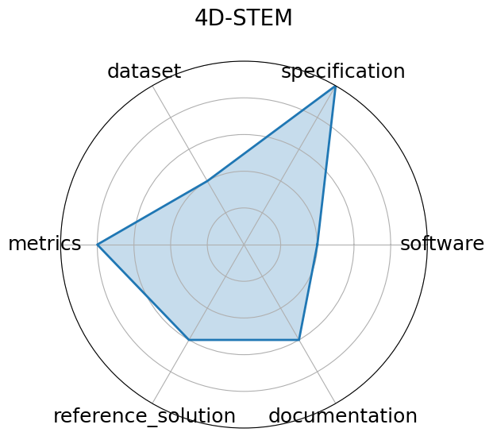

# 4D-STEM

<a class="md-button back-link" href="../">← Back to all benchmarks</a>

  
Date: 2023-12-03

  
Name: 4D-STEM

  
Domain: Material Science

  
Focus: Real-time ML for scanning transmission electron microscopy

  
Task Types: Image Classification, Streamed data inference

  
Metrics: Classification accuracy, Throughput

  
Models: CNN models (prototype)

<h3>Keywords</h3>

<a class="chip chip-link" href="../#kw=4D-STEM">4D-STEM</a> <a class="chip chip-link" href="../#kw=electron%20microscopy">electron microscopy</a> <a class="chip chip-link" href="../#kw=real-time">real-time</a> <a class="chip chip-link" href="../#kw=image%20processing">image processing</a> 

<h3>Citation</h3>

- Shuyu Qin, Joshua Agar, and Nhan Tran. Extremely noisy 4d-tem strain mapping using cycle consistent spatial transforming autoencoders. In AI for Accelerated Materials Design - NeurIPS 2023 Workshop. 2023. URL: https://openreview.net/forum?id=7yt3N0o0W9.

<pre><code class="language-bibtex">@inproceedings{qin2023extremely,
  title={Extremely Noisy 4D-TEM Strain Mapping Using Cycle Consistent Spatial Transforming Autoencoders},
  author={Shuyu Qin and Joshua Agar and Nhan Tran},
  booktitle={AI for Accelerated Materials Design - NeurIPS 2023 Workshop},
  year={2023},
  url={https://openreview.net/forum?id=7yt3N0o0W9}
}</code></pre>
<h3>Ratings</h3>

  
CategoryRating

  
  
Software
  
2.00
  

  
No standalone code repository or setup instructions provided

  
Specification
  
5.00
  

  
None

  
Dataset
  
2.00
  

  
No dataset links or FAIR metadata; unclear public access

  
Metrics
  
4.00
  

  
Only localization accuracy and inference time mentioned; not formally benchmarked with scripts

  
Reference Solution
  
3.00
  

  
BraggNN model is described and evaluated, but no direct implementation or inference scripts available

  
Documentation
  
3.00
  

  
Paper is clear, but lacks a GitHub repo or full reproducibility pipeline

  <strong>Average rating:</strong> 3.17/5
<h3>Radar plot</h3>

<strong>Edit:</strong> <a href="https://github.com/mlcommons-science/benchmark/tree/main/source">edit this entry</a>

