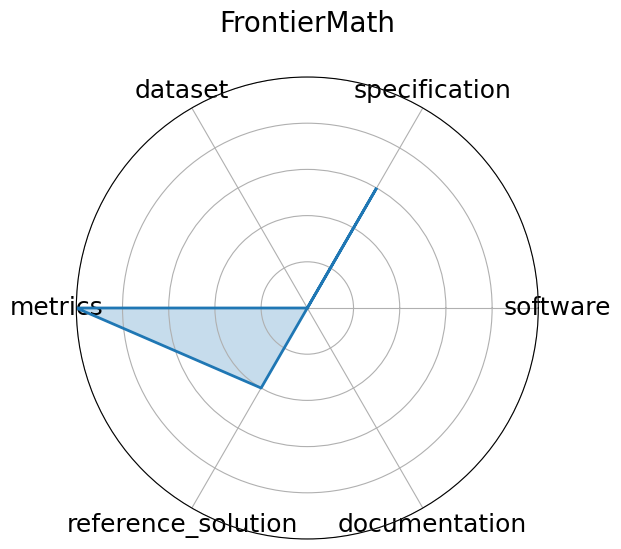

# FrontierMath

<a class="md-button back-link" href="../">← Back to all benchmarks</a>

  
Date: 2024-11-07

  
Name: FrontierMath

  
Domain: Mathematics

  
Focus: Challenging advanced mathematical reasoning

  
Task Types: Problem solving

  
Metrics: Accuracy

  
Models: unkown

<h3>Keywords</h3>

<a class="chip chip-link" href="../#kw=symbolic%20reasoning">symbolic reasoning</a> <a class="chip chip-link" href="../#kw=number%20theory">number theory</a> <a class="chip chip-link" href="../#kw=algebraic%20geometry">algebraic geometry</a> <a class="chip chip-link" href="../#kw=category%20theory">category theory</a> 

<h3>Citation</h3>

- Elliot Glazer, Ege Erdil, Tamay Besiroglu, Diego Chicharro, Evan Chen, Alex Gunning, Caroline Falkman Olsson, Jean-Stanislas Denain, Anson Ho, Emily de Oliveira Santos, Olli Järviniemi, Matthew Barnett, Robert Sandler, Matej Vrzala, Jaime Sevilla, Qiuyu Ren, Elizabeth Pratt, Lionel Levine, Grant Barkley, Natalie Stewart, Bogdan Grechuk, Tetiana Grechuk, Shreepranav Varma Enugandla, and Mark Wildon. Frontiermath: a benchmark for evaluating advanced mathematical reasoning in ai. 2024. URL: https://arxiv.org/abs/2411.04872, arXiv:2411.04872.

<pre><code class="language-bibtex">@misc{glazer2024frontiermathbenchmarkevaluatingadvanced,
  archiveprefix = {arXiv},
  author        = {Elliot Glazer and Ege Erdil and Tamay Besiroglu and Diego Chicharro and Evan Chen and Alex Gunning and Caroline Falkman Olsson and Jean-Stanislas Denain and Anson Ho and Emily de Oliveira Santos and Olli Järviniemi and Matthew Barnett and Robert Sandler and Matej Vrzala and Jaime Sevilla and Qiuyu Ren and Elizabeth Pratt and Lionel Levine and Grant Barkley and Natalie Stewart and Bogdan Grechuk and Tetiana Grechuk and Shreepranav Varma Enugandla and Mark Wildon},
  eprint        = {2411.04872},
  primaryclass  = {cs.AI},
  title         = {FrontierMath: A Benchmark for Evaluating Advanced Mathematical Reasoning in AI},
  url           = {https://arxiv.org/abs/2411.04872},
  year          = {2024}
}</code></pre>
<h3>Ratings</h3>

  
CategoryRating

  
  
Software
  
0.00
  

  
No link to code provided

  
Specification
  
3.00
  

  
Well-specified process for asking questions and receiving answers. No software or hardware constraints

  
Dataset
  
0.00
  

  
Paper and website had no link to any dataset. It may still exist somewhere

  
Metrics
  
5.00
  

  
(by default) All questions in the dataset have a correct answer

  
Reference Solution
  
2.00
  

  
Displays result of leading models on the benchmark, but none are trainable or list constraints

  
Documentation
  
0.00
  

  
No specified way to reproduce the reference solution

  <strong>Average rating:</strong> 1.67/5
<h3>Radar plot</h3>

<strong>Edit:</strong> <a href="https://github.com/mlcommons-science/benchmark/tree/main/source">edit this entry</a>

