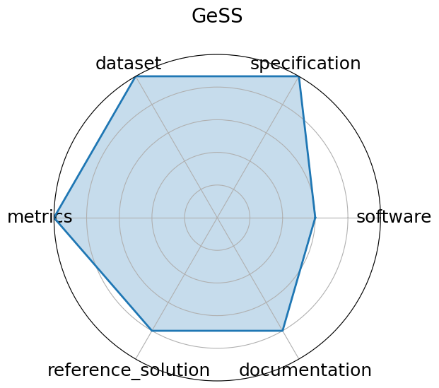

# GeSS

<a class="md-button back-link" href="../">← Back to all benchmarks</a>

  
Date: 2024-12-13

  
Name: GeSS

  
Domain: Scientific ML; Geometric Deep Learning

  
Focus: Benchmark suite evaluating geometric deep learning models under real-world distribution shifts

  
Task Types: Classification, Regression

  
Metrics: Accuracy, RMSE, OOD robustness delta

  
Models: GCN, EGNN, DimeNet++

<h3>Keywords</h3>

<a class="chip chip-link" href="../#kw=geometric%20deep%20learning">geometric deep learning</a> <a class="chip chip-link" href="../#kw=distribution%20shift">distribution shift</a> <a class="chip chip-link" href="../#kw=OOD%20robustness">OOD robustness</a> <a class="chip chip-link" href="../#kw=scientific%20applications">scientific applications</a> 

<h3>Citation</h3>

- Deyu Zou, Shikun Liu, Siqi Miao, Victor Fung, Shiyu Chang, and Pan Li. Gess: benchmarking geometric deep learning under scientific applications with distribution shifts. In A. Globerson, L. Mackey, D. Belgrave, A. Fan, U. Paquet, J. Tomczak, and C. Zhang, editors, Advances in Neural Information Processing Systems, volume 37, 92499–92528. Curran Associates, Inc., 2024. URL: https://proceedings.neurips.cc/paper_files/paper/2024/file/a8063075b00168dc39bc81683619f1a8-Paper-Datasets_and_Benchmarks_Track.pdf.

<pre><code class="language-bibtex">@inproceedings{neurips2024_a8063075,
  author = {Zou, Deyu and Liu, Shikun and Miao, Siqi and Fung, Victor and Chang, Shiyu and Li, Pan},
  booktitle = {Advances in Neural Information Processing Systems},
  editor = {A. Globerson and L. Mackey and D. Belgrave and A. Fan and U. Paquet and J. Tomczak and C. Zhang},
  pages = {92499--92528},
  publisher = {Curran Associates, Inc.},
  title = {GeSS: Benchmarking Geometric Deep Learning under Scientific Applications with Distribution Shifts},
  url = {https://proceedings.neurips.cc/paper_files/paper/2024/file/a8063075b00168dc39bc81683619f1a8-Paper-Datasets_and_Benchmarks_Track.pdf},
  volume = {37},
  year = {2024}
}</code></pre>
<h3>Ratings</h3>

  
CategoryRating

  
  
Software
  
3.00
  

  
Reference code expected post-conference; current public software availability limited.
Benchmark infrastructure partially described but not fully released yet.

  
Specification
  
5.00
  

  
Benchmark clearly defines OOD robustness scenarios with classification and regression
tasks in scientific domains, though no explicit hardware constraints are given.

  
Dataset
  
5.00
  

  
Curated datasets of 3D crystal structures and material properties are included and
publicly available for reproducible research.

  
Metrics
  
5.00
  

  
Uses well-established metrics such as MAE and structural validity for materials modeling,
plus accuracy and OOD robustness deltas.

  
Reference Solution
  
4.00
  

  
Two reference models (SODNet, DiffCSP-SC) are reported with results, code expected
to be released soon.

  
Documentation
  
4.00
  

  
Paper and poster provide solid explanation of benchmarks and scientific motivation;
more extensive user documentation forthcoming.

  <strong>Average rating:</strong> 4.33/5
<h3>Radar plot</h3>

<strong>Edit:</strong> <a href="https://github.com/mlcommons-science/benchmark/tree/main/source">edit this entry</a>

