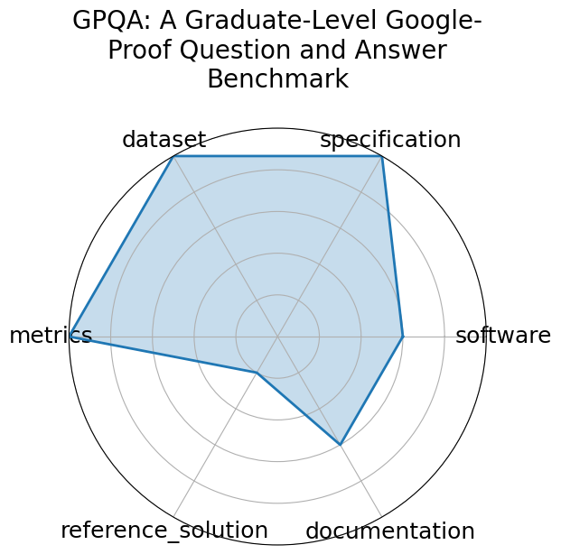

# GPQA: A Graduate-Level Google-Proof Question and Answer Benchmark

<a class="md-button back-link" href="../">← Back to all benchmarks</a>

  
Date: 2023-11-20

  
Name: GPQA: A Graduate-Level Google-Proof Question and Answer Benchmark

  
Domain: Science  Biology, Physics, Chemistry

  
Focus: Graduate-level, expert-validated multiple-choice questions hard even with web access

  
Task Types: Multiple choice

  
Metrics: Accuracy

  
Models: GPT-4 baseline

<h3>Keywords</h3>

<a class="chip chip-link" href="../#kw=Google-proof">Google-proof</a> <a class="chip chip-link" href="../#kw=multiple-choice">multiple-choice</a> <a class="chip chip-link" href="../#kw=expert%20reasoning">expert reasoning</a> <a class="chip chip-link" href="../#kw=science%20QA">science QA</a> 

<h3>Citation</h3>

- David Rein, Betty Li Hou, Asa Cooper Stickland, Jackson Petty, Richard Yuanzhe Pang, Julien Dirani, Julian Michael, and Samuel R. Bowman. Gpqa: a graduate-level google-proof q and a benchmark. 2023. URL: https://arxiv.org/abs/2311.12022, arXiv:2311.12022.

<pre><code class="language-bibtex">@misc{rein2023gpqagraduatelevelgoogleproofqa2,
  archiveprefix = {arXiv},
  author        = {David Rein and Betty Li Hou and Asa Cooper Stickland and Jackson Petty and Richard Yuanzhe Pang and Julien Dirani and Julian Michael and Samuel R. Bowman},
  eprint        = {2311.12022},
  primaryclass  = {cs.AI},
  title         = {GPQA: A Graduate-Level Google-Proof Q and A Benchmark},
  url           = {https://arxiv.org/abs/2311.12022},
  year          = {2023}
}</code></pre>
<h3>Ratings</h3>

  
CategoryRating

  
  
Software
  
3.00
  

  
Dataset and benchmark materials are publicly available via HuggingFace and GitHub,
but no integrated runnable code or software framework is provided.

  
Specification
  
5.00
  

  
Task is clearly defined as a multiple-choice benchmark requiring expert-level scientific reasoning.
Input/output formats and evaluation criteria are well described.

  
Dataset
  
5.00
  

  
The GPQA dataset is publicly released, well curated, with metadata and clearly documented splits.

  
Metrics
  
5.00
  

  
Accuracy is the primary metric and is clearly defined and appropriate for multiple-choice QA.

  
Reference Solution
  
1.00
  

  
No baseline implementations or starter code are linked or provided for reproduction.

  
Documentation
  
3.00
  

  
Documentation includes dataset description and benchmark instructions, but lacks detailed usage tutorials or pipelines.

  <strong>Average rating:</strong> 3.67/5
<h3>Radar plot</h3>

<strong>Edit:</strong> <a href="https://github.com/mlcommons-science/benchmark/tree/main/source">edit this entry</a>

