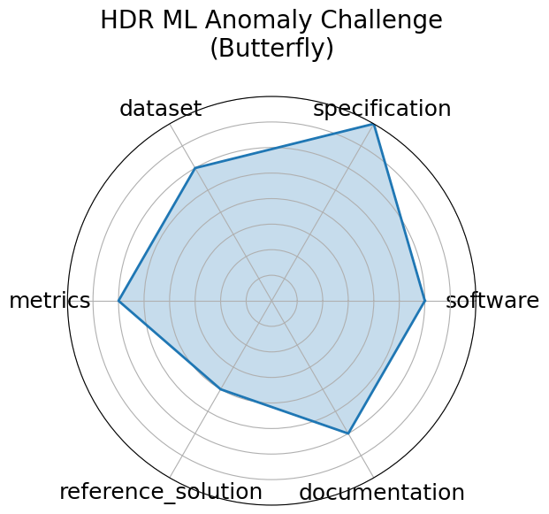

# HDR ML Anomaly Challenge (Butterfly)

<a class="md-button back-link" href="../">← Back to all benchmarks</a>

  
Date: 2025-03-03

  
Name: HDR ML Anomaly Challenge  Butterfly

  
Domain: Genomics; Image/CV

  
Focus: Detecting hybrid butterflies via image anomaly detection in genomic-informed dataset

  
Task Types: Anomaly detection

  
Metrics: Classification accuracy, F1 score

  
Models: CNN-based detectors

<h3>Keywords</h3>

<a class="chip chip-link" href="../#kw=anomaly%20detection">anomaly detection</a> <a class="chip chip-link" href="../#kw=computer%20vision">computer vision</a> <a class="chip chip-link" href="../#kw=genomics">genomics</a> <a class="chip chip-link" href="../#kw=butterfly%20hybrids">butterfly hybrids</a> 

<h3>Citation</h3>

- Elizabeth G. Campolongo, Yuan-Tang Chou, Ekaterina Govorkova, Wahid Bhimji, Wei-Lun Chao, Chris Harris, Shih-Chieh Hsu, Hilmar Lapp, Mark S. Neubauer, Josephine Namayanja, Aneesh Subramanian, Philip Harris, Advaith Anand, David E. Carlyn, Subhankar Ghosh, Christopher Lawrence, Eric Moreno, Ryan Raikman, Jiaman Wu, Ziheng Zhang, Bayu Adhi, Mohammad Ahmadi Gharehtoragh, Saúl Alonso Monsalve, Marta Babicz, Furqan Baig, Namrata Banerji, William Bardon, Tyler Barna, Tanya Berger-Wolf, Adji Bousso Dieng, Micah Brachman, Quentin Buat, David C. Y. Hui, Phuong Cao, Franco Cerino, Yi-Chun Chang, Shivaji Chaulagain, An-Kai Chen, Deming Chen, Eric Chen, Chia-Jui Chou, Zih-Chen Ciou, Miles Cochran-Branson, Artur Cordeiro Oudot Choi, Michael Coughlin, Matteo Cremonesi, Maria Dadarlat, Peter Darch, Malina Desai, Daniel Diaz, Steven Dillmann, Javier Duarte, Isla Duporge, Urbas Ekka, Saba Entezari Heravi, Hao Fang, Rian Flynn, Geoffrey Fox, Emily Freed, Hang Gao, Jing Gao, Julia Gonski, Matthew Graham, Abolfazl Hashemi, Scott Hauck, James Hazelden, Joshua Henry Peterson, Duc Hoang, Wei Hu, Mirco Huennefeld, David Hyde, Vandana Janeja, Nattapon Jaroenchai, Haoyi Jia, Yunfan Kang, Maksim Kholiavchenko, Elham E. Khoda, Sangin Kim, Aditya Kumar, Bo-Cheng Lai, Trung Le, Chi-Wei Lee, JangHyeon Lee, Shaocheng Lee, Suzan van der Lee, Charles Lewis, Haitong Li, Haoyang Li, Henry Liao, Mia Liu, Xiaolin Liu, Xiulong Liu, Vladimir Loncar, Fangzheng Lyu, Ilya Makarov, Abhishikth Mallampalli Chen-Yu Mao, Alexander Michels, Alexander Migala, Farouk Mokhtar, Mathieu Morlighem, Min Namgung, Andrzej Novak, Andrew Novick, Amy Orsborn, Anand Padmanabhan, Jia-Cheng Pan, Sneh Pandya, Zhiyuan Pei, Ana Peixoto, George Percivall, Alex Po Leung, Sanjay Purushotham, Zhiqiang Que, Melissa Quinnan, Arghya Ranjan, Dylan Rankin, Christina Reissel, Benedikt Riedel, Dan Rubenstein, Argyro Sasli, Eli Shlizerman, Arushi Singh, Kim Singh, Eric R. Sokol, Arturo Sorensen, Yu Su, Mitra Taheri, Vaibhav Thakkar, Ann Mariam Thomas, Eric Toberer, Chenghan Tsai, Rebecca Vandewalle, Arjun Verma, Ricco C. Venterea, He Wang, Jianwu Wang, Sam Wang, Shaowen Wang, Gordon Watts, Jason Weitz, Andrew Wildridge, Rebecca Williams, Scott Wolf, Yue Xu, Jianqi Yan, Jai Yu, Yulei Zhang, Haoran Zhao, Ying Zhao, and Yibo Zhong. Building machine learning challenges for anomaly detection in science. 2025. URL: https://arxiv.org/abs/2503.02112, arXiv:2503.02112.

<pre><code class="language-bibtex">@misc{campolongo2025buildingmachinelearningchallenges2,
  archiveprefix = {arXiv},
  author        = {Elizabeth G. Campolongo and Yuan-Tang Chou and Ekaterina Govorkova and Wahid Bhimji and Wei-Lun Chao and Chris Harris and Shih-Chieh Hsu and Hilmar Lapp and Mark S. Neubauer and Josephine Namayanja and Aneesh Subramanian and Philip Harris and Advaith Anand and David E. Carlyn and Subhankar Ghosh and Christopher Lawrence and Eric Moreno and Ryan Raikman and Jiaman Wu and Ziheng Zhang and Bayu Adhi and Mohammad Ahmadi Gharehtoragh and Saúl Alonso Monsalve and Marta Babicz and Furqan Baig and Namrata Banerji and William Bardon and Tyler Barna and Tanya Berger-Wolf and Adji Bousso Dieng and Micah Brachman and Quentin Buat and David C. Y. Hui and Phuong Cao and Franco Cerino and Yi-Chun Chang and Shivaji Chaulagain and An-Kai Chen and Deming Chen and Eric Chen and Chia-Jui Chou and Zih-Chen Ciou and Miles Cochran-Branson and Artur Cordeiro Oudot Choi and Michael Coughlin and Matteo Cremonesi and Maria Dadarlat and Peter Darch and Malina Desai and Daniel Diaz and Steven Dillmann and Javier Duarte and Isla Duporge and Urbas Ekka and Saba Entezari Heravi and Hao Fang and Rian Flynn and Geoffrey Fox and Emily Freed and Hang Gao and Jing Gao and Julia Gonski and Matthew Graham and Abolfazl Hashemi and Scott Hauck and James Hazelden and Joshua Henry Peterson and Duc Hoang and Wei Hu and Mirco Huennefeld and David Hyde and Vandana Janeja and Nattapon Jaroenchai and Haoyi Jia and Yunfan Kang and Maksim Kholiavchenko and Elham E. Khoda and Sangin Kim and Aditya Kumar and Bo-Cheng Lai and Trung Le and Chi-Wei Lee and JangHyeon Lee and Shaocheng Lee and Suzan van der Lee and Charles Lewis and Haitong Li and Haoyang Li and Henry Liao and Mia Liu and Xiaolin Liu and Xiulong Liu and Vladimir Loncar and Fangzheng Lyu and Ilya Makarov and Abhishikth Mallampalli Chen-Yu Mao and Alexander Michels and Alexander Migala and Farouk Mokhtar and Mathieu Morlighem and Min Namgung and Andrzej Novak and Andrew Novick and Amy Orsborn and Anand Padmanabhan and Jia-Cheng Pan and Sneh Pandya and Zhiyuan Pei and Ana Peixoto and George Percivall and Alex Po Leung and Sanjay Purushotham and Zhiqiang Que and Melissa Quinnan and Arghya Ranjan and Dylan Rankin and Christina Reissel and Benedikt Riedel and Dan Rubenstein and Argyro Sasli and Eli Shlizerman and Arushi Singh and Kim Singh and Eric R. Sokol and Arturo Sorensen and Yu Su and Mitra Taheri and Vaibhav Thakkar and Ann Mariam Thomas and Eric Toberer and Chenghan Tsai and Rebecca Vandewalle and Arjun Verma and Ricco C. Venterea and He Wang and Jianwu Wang and Sam Wang and Shaowen Wang and Gordon Watts and Jason Weitz and Andrew Wildridge and Rebecca Williams and Scott Wolf and Yue Xu and Jianqi Yan and Jai Yu and Yulei Zhang and Haoran Zhao and Ying Zhao and Yibo Zhong},
  eprint        = {2503.02112},
  primaryclass  = {cs.LG},
  title         = {Building Machine Learning Challenges for Anomaly Detection in Science},
  url           = {https://arxiv.org/abs/2503.02112},
  year          = {2025}
}</code></pre>
<h3>Ratings</h3>

  
CategoryRating

  
  
Software
  
3.00
  

  
Codabench platform provides submission infrastructure but no fully maintained
code repository or reproducible baseline implementations.

  
Specification
  
4.00
  

  
Task is clearly described with domain-specific anomaly detection objectives and
relevant physics motivation.

  
Dataset
  
3.00
  

  
Dataset consists of real detector data with synthetic anomaly injections; access
is restricted and requires NDA, limiting openness and FAIR compliance.

  
Metrics
  
3.00
  

  
Standard metrics (ROC, F1, precision) are used; evaluation protocols are clear
but not deeply elaborated.

  
Reference Solution
  
2.00
  

  
Baselines are partially described but lack public code or reproducible execution
scripts.

  
Documentation
  
3.00
  

  
Challenge website provides basic descriptions and evaluation metrics but lacks
comprehensive tutorials or example workflows.

  <strong>Average rating:</strong> 3.00/5
<h3>Radar plot</h3>

<strong>Edit:</strong> <a href="https://github.com/mlcommons-science/benchmark/tree/main/source">edit this entry</a>

