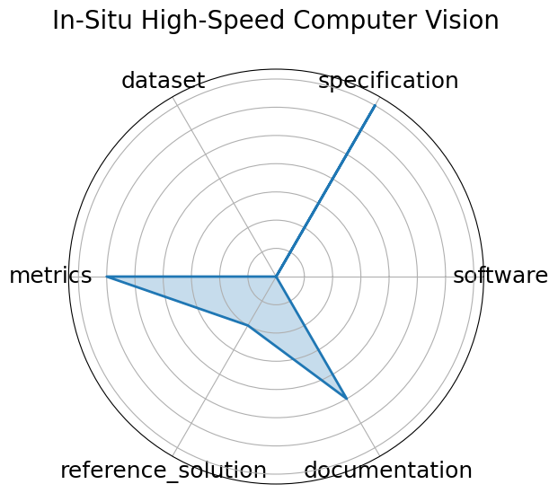

# In-Situ High-Speed Computer Vision

**Date**: 2023-12-05

**Name**: In-Situ High-Speed Computer Vision

**Domain**: Fusion/Plasma

**Focus**: Real-time image classification for in-situ plasma diagnostics

**Keywords**: plasma, in-situ vision, real-time ML

**Task Types**: Image Classification

**Metrics**: Accuracy, FPS

**Models**: CNN

**Citation**:

- Yumou Wei, Ryan F. Forelli, Chris Hansen, Jeffrey P. Levesque, Nhan Tran, Joshua C. Agar, Giuseppe Di Guglielmo, Michael E. Mauel, and Gerald A. Navratil. Low latency optical-based mode tracking with machine learning deployed on fpgas on a tokamak. 2024. URL: https://arxiv.org/abs/2312.00128, arXiv:2312.00128, doi:https://doi.org/10.1063/5.0190354.

  - bibtex: |

      @misc{wei2024lowlatencyopticalbasedmode,

        archiveprefix = {arXiv},

        author        = {Yumou Wei and Ryan F. Forelli and Chris Hansen and Jeffrey P. Levesque and Nhan Tran and Joshua C. Agar and Giuseppe Di Guglielmo and Michael E. Mauel and Gerald A. Navratil},

        doi           = {https://doi.org/10.1063/5.0190354},

        eprint        = {2312.00128},

        primaryclass  = {physics.plasm-ph},

        title         = {Low latency optical-based mode tracking with machine learning deployed on FPGAs on a tokamak},

        url           = {https://arxiv.org/abs/2312.00128},

        year          = {2024}

      }

**Ratings:**

Specification:

  - **Rating:** 7.0

  - **Reason:** General task defined  real-time microscopy inference , but no standardized I/O format, latency constraint, or complete problem framing yet.

Dataset:

  - **Rating:** 0.0

  - **Reason:** Dataset not provided or described in any formal way.

Metrics:

  - **Rating:** 6.0

  - **Reason:** Mentions throughput and accuracy, but metrics are not formally defined or benchmarked.

Reference Solution:

  - **Rating:** 2.0

  - **Reason:** Prototype CNNs described; no baseline or implementation released.

Documentation:

  - **Rating:** 5.0

  - **Reason:** OpenReview paper and Gemini doc give some insight, but no working code, environment, or example.

**Radar Plot:**
 