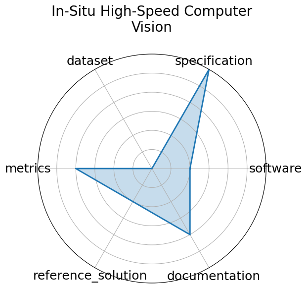

# In-Situ High-Speed Computer Vision

<a class="md-button back-link" href="../">← Back to all benchmarks</a>

  
Date: 2023-12-05

  
Name: In-Situ High-Speed Computer Vision

  
Domain: Fusion/Plasma

  
Focus: Real-time image classification for in-situ plasma diagnostics

  
Task Types: Image Classification

  
Metrics: Accuracy, FPS

  
Models: CNN

<h3>Keywords</h3>

<a class="chip chip-link" href="../#kw=plasma">plasma</a> <a class="chip chip-link" href="../#kw=in-situ%20vision">in-situ vision</a> <a class="chip chip-link" href="../#kw=real-time%20ML">real-time ML</a> 

<h3>Citation</h3>

- Yumou Wei, Ryan F. Forelli, Chris Hansen, Jeffrey P. Levesque, Nhan Tran, Joshua C. Agar, Giuseppe Di Guglielmo, Michael E. Mauel, and Gerald A. Navratil. Low latency optical-based mode tracking with machine learning deployed on fpgas on a tokamak. 2024. URL: https://arxiv.org/abs/2312.00128, arXiv:2312.00128, doi:https://doi.org/10.1063/5.0190354.

<pre><code class="language-bibtex">@misc{wei2024lowlatencyopticalbasedmode,
  archiveprefix = {arXiv},
  author        = {Yumou Wei and Ryan F. Forelli and Chris Hansen and Jeffrey P. Levesque and Nhan Tran and Joshua C. Agar and Giuseppe Di Guglielmo and Michael E. Mauel and Gerald A. Navratil},
  doi           = {https://doi.org/10.1063/5.0190354},
  eprint        = {2312.00128},
  primaryclass  = {physics.plasm-ph},
  title         = {Low latency optical-based mode tracking with machine learning deployed on FPGAs on a tokamak},
  url           = {https://arxiv.org/abs/2312.00128},
  year          = {2024}
}</code></pre>
<h3>Ratings</h3>

  
CategoryRating

  
  
Software
  
1.00
  

  
No public implementation or containerized setup released

  
Specification
  
3.00
  

  
No standardized I/O, latency constraint, or complete framing

  
Dataset
  
0.00
  

  
Dataset not provided or described in any formal way

  
Metrics
  
2.00
  

  
Throughput and accuracy mentioned, but not defined or benchmarked

  
Reference Solution
  
1.00
  

  
Prototype CNNs described; no code, baseline, or training details available

  
Documentation
  
2.00
  

  
Some insight via papers, but no working repo, setup, or replication path

  <strong>Average rating:</strong> 1.50/5
<h3>Radar plot</h3>

<strong>Edit:</strong> <a href="https://github.com/mlcommons-science/benchmark/tree/main/source">edit this entry</a>

