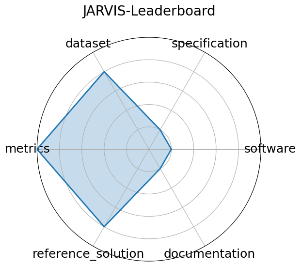

# JARVIS-Leaderboard

<a class="md-button back-link" href="../">← Back to all benchmarks</a>

  
Date: 2023-06-20

  
Name: JARVIS-Leaderboard

  
Domain: Materials Science; Benchmarking

  
Focus: Comparative evaluation of materials design methods

  
Task Types: Method benchmarking, Leaderboard ranking

  
Metrics: MAE, RMSE, Accuracy

  
Models: unkown

<h3>Keywords</h3>

<a class="chip chip-link" href="../#kw=leaderboards">leaderboards</a> <a class="chip chip-link" href="../#kw=materials%20methods">materials methods</a> <a class="chip chip-link" href="../#kw=simulation">simulation</a> 

<h3>Citation</h3>

- Kamal Choudhary, Daniel Wines, Kangming Li, Kevin F. Garrity, Vishu Gupta, Aldo H. Romero, Jaron T. Krogel, Kayahan Saritas, Addis Fuhr, Panchapakesan Ganesh, Paul R. C. Kent, Keqiang Yan, Yuchao Lin, Shuiwang Ji, Ben Blaiszik, Patrick Reiser, Pascal Friederich, Ankit Agrawal, Pratyush Tiwary, Eric Beyerle, Peter Minch, Trevor D. Rhone, Ichiro Takeuchi, Robert B. Wexler, Arun Mannodi-Kanakkithodi, Elif Ertekin, Avanish Mishra, Nithin Mathew, Mitchell Wood, Andrew D. Rohskopf, Jason Hattrick-Simpers, Shih-Han Wang, Luke E. K. Achenie, Hongliang Xin, Maureen Williams, Adam J. Biacchi, and Francesca Tavazza. JARVIS-Leaderboard: a large scale benchmark of materials design methods. npj Computational Materials, 10(1):93, 2024. URL: https://doi.org/10.1038/s41524-024-01259-w, doi:10.1038/s41524-024-01259-w.

<pre><code class="language-bibtex">@article{choudhary2024jarvis,
  title = {{JARVIS-Leaderboard}: a large scale benchmark of materials design methods},
author = {Choudhary, Kamal and Wines, Daniel and Li, Kangming and Garrity, Kevin F. and Gupta, Vishu and Romero, Aldo H. and Krogel, Jaron T. and Saritas, Kayahan and Fuhr, Addis and Ganesh, Panchapakesan and Kent, Paul R. C. and Yan, Keqiang and Lin, Yuchao and Ji, Shuiwang and Blaiszik, Ben and Reiser, Patrick and Friederich, Pascal and Agrawal, Ankit and Tiwary, Pratyush and Beyerle, Eric and Minch, Peter and Rhone, Trevor D. and Takeuchi, Ichiro and Wexler, Robert B. and Mannodi-Kanakkithodi, Arun and Ertekin, Elif and Mishra, Avanish and Mathew, Nithin and Wood, Mitchell and Rohskopf, Andrew D. and Hattrick-Simpers, Jason and Wang, Shih-Han and Achenie, Luke E. K. and Xin, Hongliang and Williams, Maureen and Biacchi, Adam J. and Tavazza, Francesca},
  journal = {npj Computational Materials},
  volume = {10},
  number = {1},
  pages = {93},
  year = {2024},
  doi = {10.1038/s41524-024-01259-w},
  url = {https://doi.org/10.1038/s41524-024-01259-w}
}</code></pre>
<h3>Ratings</h3>

  
CategoryRating

  
  
Software
  
1.00
  

  
Setup script provided, but no code provided

  
Specification
  
1.00
  

  
Only dataset format is defined.

  
Dataset
  
4.00
  

  
Data is public and adheres to FAIR principles across the NIST-hosted infrastructure; however, metadata completeness varies slightly across benchmarks. No splits.

  
Metrics
  
5.00
  

  
Metrics stated for each benchmark.

  
Reference Solution
  
4.00
  

  
Many baselines across tasks (CGCNN, ALIGNN, M3GNet, etc.); no constraints specified.

  
Documentation
  
1.00
  

  
Only the task is specified.

  <strong>Average rating:</strong> 2.67/5
<h3>Radar plot</h3>

<strong>Edit:</strong> <a href="https://github.com/mlcommons-science/benchmark/tree/main/source">edit this entry</a>

