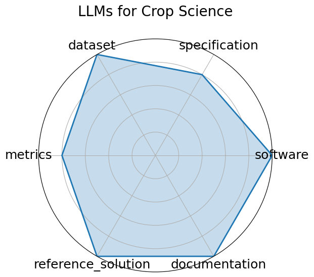

# LLMs for Crop Science

<a class="md-button back-link" href="../">← Back to all benchmarks</a>

  
Date: 2024-12-13

  
Name: LLMs for Crop Science

  
Domain: Agricultural Science; NLP

  
Focus: Evaluating LLMs on crop trait QA and textual inference tasks with domain-specific prompts

  
Task Types: Question Answering, Inference

  
Metrics: Accuracy, F1 score

  
Models: GPT-4, LLaMA-2-13B, T5-XXL

<h3>Keywords</h3>

<a class="chip chip-link" href="../#kw=crop%20science">crop science</a> <a class="chip chip-link" href="../#kw=prompt%20engineering">prompt engineering</a> <a class="chip chip-link" href="../#kw=domain%20adaptation">domain adaptation</a> <a class="chip chip-link" href="../#kw=question%20answering">question answering</a> 

<h3>Citation</h3>

- Tingjia Shen, Hao Wang, Jiaqing Zhang, Sirui Zhao, Liangyue Li, Zulong Chen, Defu Lian, and Enhong Chen. Exploring user retrieval integration towards large language models for cross-domain sequential recommendation. 2024. URL: https://arxiv.org/abs/2406.03085, arXiv:2406.03085.

<pre><code class="language-bibtex">@misc{shen2024exploringuserretrievalintegration,
  title={Exploring User Retrieval Integration towards Large Language Models for Cross-Domain Sequential Recommendation}, 
  author={Tingjia Shen and Hao Wang and Jiaqing Zhang and Sirui Zhao and Liangyue Li and Zulong Chen and Defu Lian and Enhong Chen},
  year={2024},
  eprint={2406.03085},
  archivePrefix={arXiv},
  primaryClass={cs.LG},
  url={https://arxiv.org/abs/2406.03085}, 
}</code></pre>
<h3>Ratings</h3>

  
CategoryRating

  
  
Software
  
0.00
  

  
This is a model, not a benchmark.

  
Specification
  
0.00
  

  
This is a model, not a benchmark.

  
Dataset
  
0.00
  

  
This is a model, not a benchmark.

  
Metrics
  
0.00
  

  
This is a model, not a benchmark.

  
Reference Solution
  
0.00
  

  
This is a model, not a benchmark.

  
Documentation
  
0.00
  

  
This is a model, not a benchmark.

  <strong>Average rating:</strong> 0.00/5
<h3>Radar plot</h3>

<strong>Edit:</strong> <a href="https://github.com/mlcommons-science/benchmark/tree/main/source">edit this entry</a>

