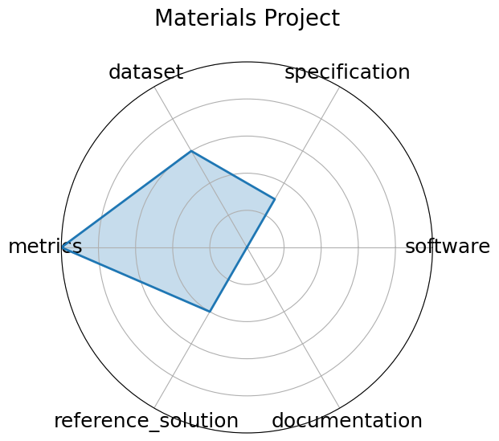

# Materials Project

<a class="md-button back-link" href="../">← Back to all benchmarks</a>

  
Date: 2011-10-01

  
Name: Materials Project

  
Domain: Materials Science

  
Focus: DFT-based property prediction

  
Task Types: Property prediction

  
Metrics: MAE, R^2

  
Models: Automatminer, Crystal Graph Neural Networks

<h3>Keywords</h3>

<a class="chip chip-link" href="../#kw=DFT">DFT</a> <a class="chip chip-link" href="../#kw=materials%20genome">materials genome</a> <a class="chip chip-link" href="../#kw=high-throughput">high-throughput</a> 

<h3>Citation</h3>

- Anubhav Jain, Shyue Ping Ong, Geoffroy Hautier, Wei Chen, William Davidson Richards, Stephen Dacek, Shreyas Cholia, Dan Gunter, David Skinner, Gerbrand Ceder, and Kristin A. Persson. The materials project: a materials genome approach. APL Materials, 2013. URL: https://materialsproject.org/, doi:10.1063/1.4812323.

<pre><code class="language-bibtex">@article{jain2013materials,
  title={The Materials Project: A materials genome approach},
  author={Jain, Anubhav and Ong, Shyue Ping and Hautier, Geoffroy and Chen, Wei and Richards, William Davidson and Dacek, Stephen and Cholia, Shreyas and Gunter, Dan and Skinner, David and Ceder, Gerbrand and Persson, Kristin A.},
  journal={APL Materials},
  volume    = {1},
  number    = {1},
  year={2013},
  doi       = {10.1063/1.4812323},
  url={https://materialsproject.org/}
}</code></pre>
<h3>Ratings</h3>

  
CategoryRating

  
  
Software
  
0.00
  

  
No instructions available

  
Specification
  
1.50
  

  
The platform offers a wide range of material property prediction tasks, but task framing and I/O formats vary by API use and are not always standardized across use cases.

  
Dataset
  
3.00
  

  
API key required to access data. No predefined splits.

  
Metrics
  
5.00
  

  
Uses numerical metrics like MAE and R^2

  
Reference Solution
  
2.00
  

  
Numerous models (e.g., Automatminer, CGCNN) trained on the database, but no constraints or documentation listed.

  
Documentation
  
0.00
  

  
No explanations or paper provided

  <strong>Average rating:</strong> 1.92/5
<h3>Radar plot</h3>

<strong>Edit:</strong> <a href="https://github.com/mlcommons-science/benchmark/tree/main/source">edit this entry</a>

