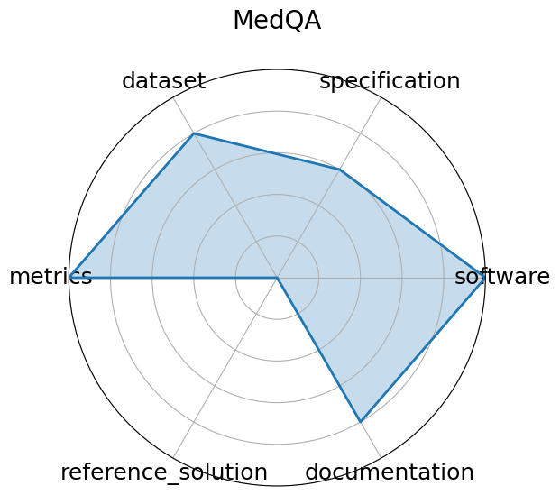

# MedQA

<a class="md-button back-link" href="../">← Back to all benchmarks</a>

  
Date: 2020-09-28

  
Name: MedQA

  
Domain: Medical Question Answering

  
Focus: Medical board exam QA

  
Task Types: Multiple choice

  
Metrics: Accuracy

  
Models: Neural reader, Retrieval-based QA systems

<h3>Keywords</h3>

<a class="chip chip-link" href="../#kw=USMLE">USMLE</a> <a class="chip chip-link" href="../#kw=diagnostic%20QA">diagnostic QA</a> <a class="chip chip-link" href="../#kw=medical%20knowledge">medical knowledge</a> <a class="chip chip-link" href="../#kw=multilingual">multilingual</a> 

<h3>Citation</h3>

- Di Jin, Eileen Pan, Nassim Oufattole, Wei-Hung Weng, Hanyi Fang, and Peter Szolovits. What disease does this patient have? a large-scale open domain question answering dataset from medical exams. 2020. URL: https://arxiv.org/abs/2009.13081, arXiv:2009.13081.

<pre><code class="language-bibtex">@misc{jin2020diseasedoespatienthave,
    archiveprefix = {arXiv},
    author        = {Di Jin and Eileen Pan and Nassim Oufattole and Wei-Hung Weng and Hanyi Fang and Peter Szolovits},
    eprint        = {2009.13081},
    primaryclass  = {cs.CL},
    title         = {What Disease does this Patient Have? A Large-scale Open Domain Question Answering Dataset from Medical Exams},
    url           = {https://arxiv.org/abs/2009.13081},
    year          = {2020}
  }</code></pre>
<h3>Ratings</h3>

  
CategoryRating

  
  
Software
  
5.00
  

  
All code available on the github

  
Specification
  
3.00
  

  
Task is clearly defined as multiple-choice QA for medical board exams; input and output formats are explicit; task scope is rigorous and structured. System constraints not specified.

  
Dataset
  
4.00
  

  
Dataset is publicly available (GitHub, paper, Hugging Face), well-structured. However, versioning and metadata could be more standardized to fully meet FAIR criteria.

  
Metrics
  
5.00
  

  
Uses clear, quantitative metric (accuracy), standard for multiple-choice benchmarks; easily comparable across models.

  
Reference Solution
  
0.00
  

  
No reference solution mentioned.

  
Documentation
  
4.00
  

  
Paper is available. Evaluation criteria are not mentioned.

  <strong>Average rating:</strong> 3.50/5
<h3>Radar plot</h3>

<strong>Edit:</strong> <a href="https://github.com/mlcommons-science/benchmark/tree/main/source">edit this entry</a>

