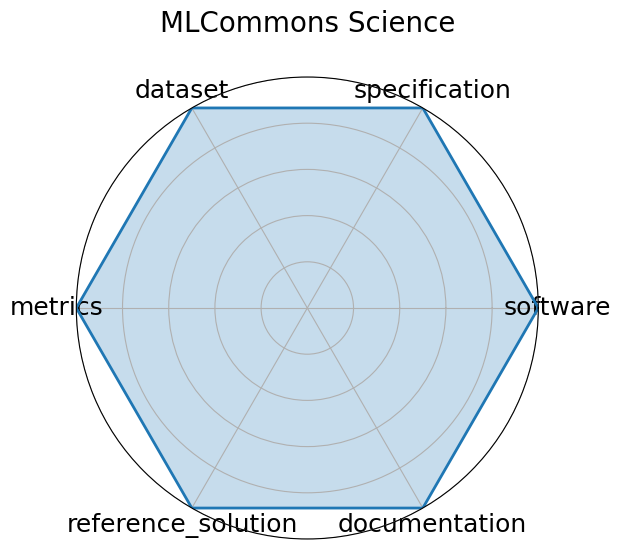

# MLCommons Science

<a class="md-button back-link" href="../">← Back to all benchmarks</a>

  
Date: 2023-06-01

  
Name: MLCommons Science

  
Domain: Earthquake, Satellite Image, Drug Discovery, Electron Microscope, CFD

  
Focus: AI benchmarks for scientific applications including time-series, imaging, and simulation

  
Task Types: Time-series analysis, Image classification, Simulation surrogate modeling

  
Metrics: MAE, Accuracy, Speedup vs simulation

  
Models: CNN, GNN, Transformer

<h3>Keywords</h3>

<a class="chip chip-link" href="../#kw=science%20AI">science AI</a> <a class="chip chip-link" href="../#kw=benchmark">benchmark</a> <a class="chip chip-link" href="../#kw=MLCommons">MLCommons</a> <a class="chip chip-link" href="../#kw=HPC">HPC</a> 

<h3>Citation</h3>

- Jeyan Thiyagalingam, Gregor von Laszewski, Junqi Yin, Murali Emani, Juri Papay, Gregg Barrett, Piotr Luszczek, Aristeidis Tsaris, Christine Kirkpatrick, Feiyi Wang, Tom Gibbs, Venkatram Vishwanath, Mallikarjun Shankar, Geoffrey Fox, and Tony Hey. Ai benchmarking for science: efforts from the mlcommons science working group. In Hartwig Anzt, Amanda Bienz, Piotr Luszczek, and Marc Baboulin, editors, High Performance Computing. ISC High Performance 2022 International Workshops, 47–64. Cham, 2022. Springer International Publishing.

<pre><code class="language-bibtex">@InProceedings{10.1007/978-3-031-23220-6_4,
  author=&quot;Thiyagalingam, Jeyan
  and von Laszewski, Gregor
  and Yin, Junqi
  and Emani, Murali
  and Papay, Juri
  and Barrett, Gregg
  and Luszczek, Piotr
  and Tsaris, Aristeidis
  and Kirkpatrick, Christine
  and Wang, Feiyi
  and Gibbs, Tom
  and Vishwanath, Venkatram
  and Shankar, Mallikarjun
  and Fox, Geoffrey
  and Hey, Tony&quot;,
  editor=&quot;Anzt, Hartwig
  and Bienz, Amanda
  and Luszczek, Piotr
  and Baboulin, Marc&quot;,
  title=&quot;AI Benchmarking for Science: Efforts from the MLCommons Science Working Group&quot;,
  booktitle=&quot;High Performance Computing. ISC High Performance 2022 International Workshops&quot;,
  year=&quot;2022&quot;,
  publisher=&quot;Springer International Publishing&quot;,
  address=&quot;Cham&quot;,
  pages=&quot;47--64&quot;,
  abstract=&quot;With machine learning (ML) becoming a transformative tool for science, the scientific community needs a clear catalogue of ML techniques, and their relative benefits on various scientific problems, if they were to make significant advances in science using AI. Although this comes under the purview of benchmarking, conventional benchmarking initiatives are focused on performance, and as such, science, often becomes a secondary criteria.&quot;,
  isbn=&quot;978-3-031-23220-6&quot;
}</code></pre>
<h3>Ratings</h3>

  
CategoryRating

  
  
Software
  
5.00
  

  
Actively maintained GitHub repository available at https://github.com/mlcommons/science
with implementations, scripts, and reproducibility support.

  
Specification
  
5.00
  

  
All five specification aspects are covered: system constraints, task, dataset format,
benchmark inputs, and outputs.

  
Dataset
  
5.00
  

  
Public scientific datasets are used with defined splits. At least 4 FAIR principles
are followed.

  
Metrics
  
5.00
  

  
Clearly defined metrics such as accuracy, training time, and GPU utilization are
used. These metrics are explained and effectively capture solution performance.

  
Reference Solution
  
5.00
  

  
A reference implementation is available, well-documented, trainable/open, and includes
full metric evaluation and software/hardware details.

  
Documentation
  
5.00
  

  
Thorough documentation exists covering the task, background, motivation, evaluation
criteria, and includes a supporting paper.

  <strong>Average rating:</strong> 5.00/5
<h3>Radar plot</h3>

<strong>Edit:</strong> <a href="https://github.com/mlcommons-science/benchmark/tree/main/source">edit this entry</a>

