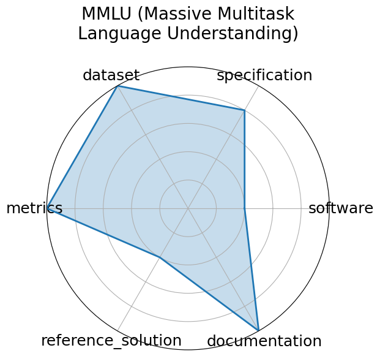

# MMLU (Massive Multitask Language Understanding)

<a class="md-button back-link" href="../">← Back to all benchmarks</a>

  
Date: 2020-09-07

  
Name: MMLU  Massive Multitask Language Understanding

  
Domain: Multidomain

  
Focus: Academic knowledge and reasoning across 57 subjects

  
Task Types: Multiple choice

  
Metrics: Accuracy

  
Models: GPT-4o, Gemini 1.5 Pro, o1, DeepSeek-R1

<h3>Keywords</h3>

<a class="chip chip-link" href="../#kw=multitask">multitask</a> <a class="chip chip-link" href="../#kw=multiple-choice">multiple-choice</a> <a class="chip chip-link" href="../#kw=zero-shot">zero-shot</a> <a class="chip chip-link" href="../#kw=few-shot">few-shot</a> <a class="chip chip-link" href="../#kw=knowledge%20probing">knowledge probing</a> 

<h3>Citation</h3>

- Dan Hendrycks, Collin Burns, and Saurav Kadavath. Measuring massive multitask language understanding. 2021. URL: https://arxiv.org/abs/2009.03300.

<pre><code class="language-bibtex">@misc{hendrycks2021measuring,
  title={Measuring Massive Multitask Language Understanding},
  author={Hendrycks, Dan and Burns, Collin and Kadavath, Saurav},
  journal={arXiv preprint arXiv:2009.03300},
  year={2021},
  url={https://arxiv.org/abs/2009.03300}
}</code></pre>
<h3>Ratings</h3>

  
CategoryRating

  
  
Software
  
0.00
  

  
No instructions to download or run data given on the site

  
Specification
  
4.00
  

  
No system constraints

  
Dataset
  
5.00
  

  
Meets all FAIR principles and properly versioned.

  
Metrics
  
5.00
  

  
Fully defined, represents a solution&#x27;s performance.

  
Reference Solution
  
2.00
  

  
Reference models are available (i.e. GPT-3), but are not trainable or publicly documented

  
Documentation
  
5.00
  

  
Well-explained in a provided paper.

  <strong>Average rating:</strong> 3.50/5
<h3>Radar plot</h3>

<strong>Edit:</strong> <a href="https://github.com/mlcommons-science/benchmark/tree/main/source">edit this entry</a>

