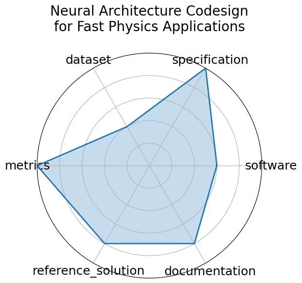

# Neural Architecture Codesign for Fast Physics Applications

<a class="md-button back-link" href="../">← Back to all benchmarks</a>

  
Date: 2025-01-09

  
Name: Neural Architecture Codesign for Fast Physics Applications

  
Domain: Physics; Materials Science; Particle Physics

  
Focus: Automated neural architecture search and hardware-efficient model codesign for fast physics applications

  
Task Types: Classification, Peak finding

  
Metrics: Accuracy, Latency, Resource utilization

  
Models: NAC-based BraggNN, NAC-optimized Deep Sets (jet)

<h3>Keywords</h3>

<a class="chip chip-link" href="../#kw=neural%20architecture%20search">neural architecture search</a> <a class="chip chip-link" href="../#kw=FPGA%20deployment">FPGA deployment</a> <a class="chip chip-link" href="../#kw=quantization">quantization</a> <a class="chip chip-link" href="../#kw=pruning">pruning</a> <a class="chip chip-link" href="../#kw=hls4ml">hls4ml</a> 

<h3>Citation</h3>

- Jason Weitz, Dmitri Demler, Luke McDermott, Nhan Tran, and Javier Duarte. Neural architecture codesign for fast physics applications. 2025. URL: https://arxiv.org/abs/2501.05515, arXiv:2501.05515.

<pre><code class="language-bibtex">@misc{weitz2025neuralarchitecturecodesignfast,
  archiveprefix={arXiv},
  author={Jason Weitz and Dmitri Demler and Luke McDermott and Nhan Tran and Javier Duarte},
  eprint={2501.05515},
  primaryclass={cs.LG},
  title={Neural Architecture Codesign for Fast Physics Applications},
  url={https://arxiv.org/abs/2501.05515},
  year={2025}
}</code></pre>
<h3>Ratings</h3>

  
CategoryRating

  
  
Software
  
3.00
  

  
Toolchain (hls4ml, nac-opt) described but not yet containerized or fully packaged

  
Specification
  
5.00
  

  
Fully specified task with constraints and target deployment; includes hardware context

  
Dataset
  
2.00
  

  
Simulated datasets referenced but not publicly available or FAIR-compliant

  
Metrics
  
5.00
  

  
Clear, quantitative metrics aligned with task goals and hardware evaluation

  
Reference Solution
  
4.00
  

  
Models tested on hardware with source code references; full training pipeline not yet released

  
Documentation
  
4.00
  

  
Detailed paper and tools described; open repo planned but not yet complete

  <strong>Average rating:</strong> 3.83/5
<h3>Radar plot</h3>

<strong>Edit:</strong> <a href="https://github.com/mlcommons-science/benchmark/tree/main/source">edit this entry</a>

