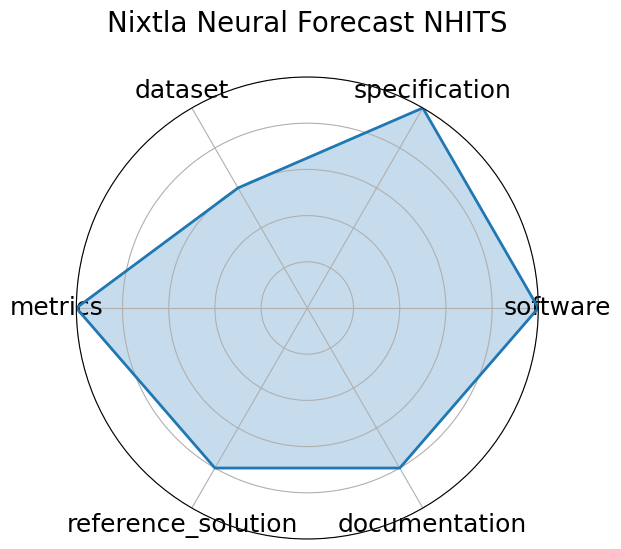

# Nixtla Neural Forecast NHITS

<a class="md-button back-link" href="../">← Back to all benchmarks</a>

  
Date: 2023-06-01

  
Name: Nixtla Neural Forecast NHITS

  
Domain: Time-series; General ML

  
Focus: Official NHITS implementation for long-horizon time series forecasting

  
Task Types: Time-series forecasting

  
Metrics: RMSE, MAPE

  
Models: NHITS

<h3>Keywords</h3>

<a class="chip chip-link" href="../#kw=NHITS">NHITS</a> <a class="chip chip-link" href="../#kw=long-horizon%20forecasting">long-horizon forecasting</a> <a class="chip chip-link" href="../#kw=neural%20interpolation">neural interpolation</a> <a class="chip chip-link" href="../#kw=time-series">time-series</a> 

<h3>Citation</h3>

- Cristian Challu, Kin G Olivares, Boris N Oreshkin, Federico Garza Ramirez, Max Mergenthaler Canseco, and Artur Dubrawski. Nhits: neural hierarchical interpolation for time series forecasting. In Proceedings of the AAAI conference on artificial intelligence, volume 37, 6989–6997. 2023.

<pre><code class="language-bibtex">@inproceedings{challu2023nhits,
 title={Nhits: Neural hierarchical interpolation for time series forecasting},
 author={Challu, Cristian and Olivares, Kin G and Oreshkin, Boris N and Ramirez, Federico Garza and Canseco, Max Mergenthaler and Dubrawski, Artur},
 booktitle={Proceedings of the AAAI conference on artificial intelligence},
 volume={37},
 number={6},
 pages={6989--6997},
 year={2023}
 }</code></pre>
<h3>Ratings</h3>

  
CategoryRating

  
  
Software
  
5.00
  

  
Implemented within the open-source NeuralForecast library under Apache 2.0.
Includes training, evaluation, and hyperparameter tuning pipelines. Actively maintained.

  
Specification
  
5.00
  

  
The NHITS forecasting task is clearly defined with structured input/output formats.
Model design targets long-horizon accuracy and compute efficiency.

  
Dataset
  
3.00
  

  
Uses standard benchmark datasets like M4, but does not bundle them directly.
FAIR compliance depends on external dataset sources and user setup.

  
Metrics
  
5.00
  

  
Evaluated using RMSE, MAPE, and other standard forecasting metrics, integrated
into training and evaluation APIs.

  
Reference Solution
  
4.00
  

  
Official NHITS implementation is fully reproducible with training/eval configs,
though pretrained weights are not always provided.

  
Documentation
  
4.00
  

  
Well-documented on GitHub and in AAAI paper, with code examples, training guidance,
and usage tutorials. More model-specific docs could improve clarity further.

  <strong>Average rating:</strong> 4.33/5
<h3>Radar plot</h3>

<strong>Edit:</strong> <a href="https://github.com/mlcommons-science/benchmark/tree/main/source">edit this entry</a>

