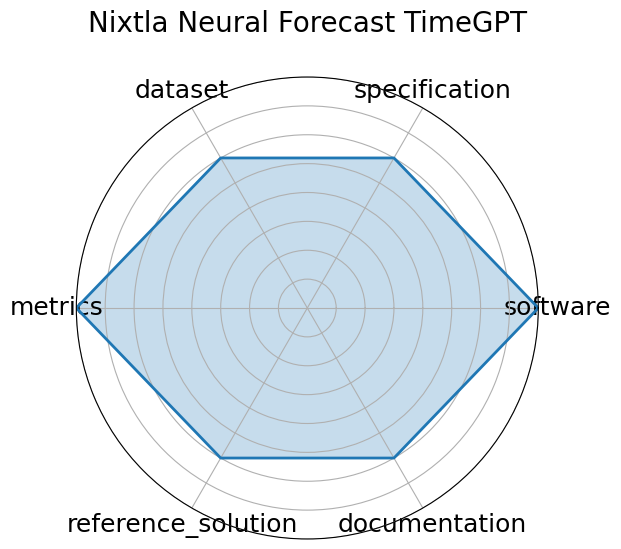

# Nixtla Neural Forecast TimeGPT

<a class="md-button back-link" href="../">← Back to all benchmarks</a>

  
Date: 2023-10-05

  
Name: Nixtla Neural Forecast TimeGPT

  
Domain: Time-series; General ML

  
Focus: Time-series foundation model &quot;TimeGPT&quot; for forecasting and anomaly detection

  
Task Types: Time-series forecasting, Anomaly detection

  
Metrics: RMSE, Anomaly detection metrics

  
Models: TimeGPT

<h3>Keywords</h3>

<a class="chip chip-link" href="../#kw=TimeGPT">TimeGPT</a> <a class="chip chip-link" href="../#kw=foundation%20model">foundation model</a> <a class="chip chip-link" href="../#kw=time-series">time-series</a> <a class="chip chip-link" href="../#kw=generative%20model">generative model</a> 

<h3>Citation</h3>

- Azul Garza, Cristian Challu, and Max Mergenthaler-Canseco. Timegpt-1. 2024. URL: https://arxiv.org/abs/2310.03589, arXiv:2310.03589.

<pre><code class="language-bibtex">@misc{garza2024timegpt1,
  archiveprefix = {arXiv},
  author        = {Azul Garza and Cristian Challu and Max Mergenthaler-Canseco},
  eprint        = {2310.03589},
  primaryclass  = {cs.LG},
  title         = {TimeGPT-1},
  url           = {https://arxiv.org/abs/2310.03589},
  year          = {2024}
}</code></pre>
<h3>Ratings</h3>

  
CategoryRating

  
  
Software
  
4.00
  

  
Fully open-source Apache 2.0 implementation integrated in NeuralForecast,
supporting training and evaluation via API. Production-grade deployment available via Nixtla API and Azure.

  
Specification
  
3.00
  

  
Concept and forecasting goals are described, but formal input/output definitions
and task constraints are not rigorously specified.

  
Dataset
  
3.00
  

  
Evaluated on existing open datasets, but consolidated data release, splits, and FAIR
metadata are not provided.

  
Metrics
  
4.00
  

  
Uses standard forecasting metrics such as RMSE, MASE, SMAPE, and anomaly detection
metrics consistently across evaluations.

  
Reference Solution
  
3.00
  

  
TimeGPT implementation is available, but baseline comparisons and additional reference
models are limited.

  
Documentation
  
3.00
  

  
Basic README with installation and usage examples; more detailed API docs and tutorials
would improve usability.

  <strong>Average rating:</strong> 3.33/5
<h3>Radar plot</h3>

<strong>Edit:</strong> <a href="https://github.com/mlcommons-science/benchmark/tree/main/source">edit this entry</a>

