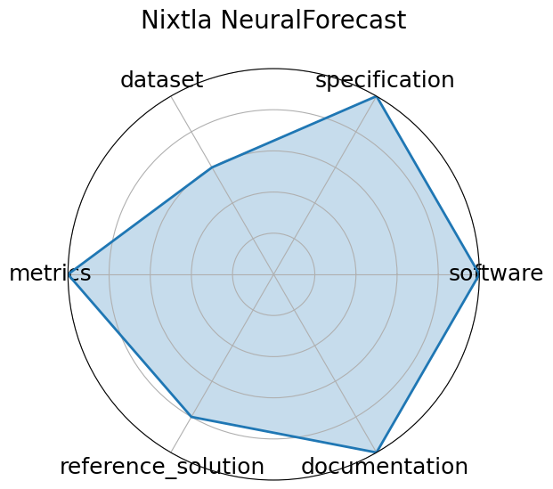

# Nixtla NeuralForecast

<a class="md-button back-link" href="../">← Back to all benchmarks</a>

  
Date: 2022-04-01

  
Name: Nixtla NeuralForecast

  
Domain: Time-series forecasting; General ML

  
Focus: High-performance neural forecasting library with &gt;30 models

  
Task Types: Time-series forecasting

  
Metrics: RMSE, MAPE, CRPS

  
Models: NBEATS, NHITS, TFT, DeepAR

<h3>Keywords</h3>

<a class="chip chip-link" href="../#kw=time-series">time-series</a> <a class="chip chip-link" href="../#kw=neural%20forecasting">neural forecasting</a> <a class="chip chip-link" href="../#kw=NBEATS%2C%20NHITS%2C%20TFT">NBEATS, NHITS, TFT</a> <a class="chip chip-link" href="../#kw=probabilistic%20forecasting">probabilistic forecasting</a> <a class="chip chip-link" href="../#kw=usability">usability</a> 

<h3>Citation</h3>

- Kin G. Olivares, Cristian Challú, Federico Garza, Max Mergenthaler Canseco, and Artur Dubrawski. Neuralforecast: user friendly state-of-the-art neural forecasting models. PyCon Salt Lake City, Utah, US 2022, 2022. URL: https://github.com/Nixtla/neuralforecast.

<pre><code class="language-bibtex">@misc{olivares2022library_neuralforecast,
  author={Kin G. Olivares and Cristian Challú and Federico Garza and Max Mergenthaler Canseco and Artur Dubrawski},
  title = {NeuralForecast: User friendly state-of-the-art neural forecasting models.},
  year={2022},
  howpublished={PyCon Salt Lake City, Utah, US 2022},
  url={https://github.com/Nixtla/neuralforecast}
}</code></pre>
<h3>Ratings</h3>

  
CategoryRating

  
  
Software
  
5.00
  

  
Actively maintained open-source library under Apache 2.0. Offers a clean API,
extensive model zoo (&gt;30 models), integration with Ray, Optuna, and supports
scalable training and inference workflows.

  
Specification
  
5.00
  

  
Forecasting task is well-defined with clear input/output structures. Framework supports
probabilistic and deterministic forecasting, with unified interfaces and support for batch evaluation.

  
Dataset
  
3.00
  

  
NeuralForecast does not include its own datasets but supports standard datasets (e.g., M4, M5, ETT).
FAIR compliance depends on user-supplied data.

  
Metrics
  
5.00
  

  
RMSE, MAPE, CRPS, and other domain-relevant metrics are well supported and integrated into the evaluation loop.

  
Reference Solution
  
4.00
  

  
Includes runnable model baselines and training scripts for all supported models.
Some models have pretrained weights, but not all are fully benchmarked out-of-the-box.

  
Documentation
  
5.00
  

  
Rich documentation with examples, API references, tutorials, notebooks, and CLI support.
PyPI, GitHub, and official blog posts offer clear guidance for usage and extension.

  <strong>Average rating:</strong> 4.50/5
<h3>Radar plot</h3>

<strong>Edit:</strong> <a href="https://github.com/mlcommons-science/benchmark/tree/main/source">edit this entry</a>

