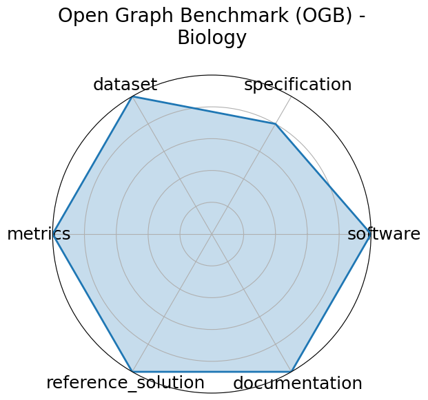

# Open Graph Benchmark (OGB) - Biology

<a class="md-button back-link" href="../">← Back to all benchmarks</a>

  
Date: 2020-05-02

  
Name: Open Graph Benchmark  OGB  - Biology

  
Domain: Graph ML

  
Focus: Biological graph property prediction

  
Task Types: Node property prediction, Link property prediction, Graph property prediction

  
Metrics: Accuracy, ROC-AUC

  
Models: GCN, GraphSAGE, GAT

<h3>Keywords</h3>

<a class="chip chip-link" href="../#kw=node%20prediction">node prediction</a> <a class="chip chip-link" href="../#kw=link%20prediction">link prediction</a> <a class="chip chip-link" href="../#kw=graph%20classification">graph classification</a> 

<h3>Citation</h3>

- Weihua Hu, Matthias Fey, Marinka Zitnik, Yuxiao Dong, Hongyu Ren, Bowen Liu, Michele Catasta, and Jure Leskovec. Open graph benchmark: datasets for machine learning on graphs. 2021. URL: https://arxiv.org/abs/2005.00687, arXiv:2005.00687.

<pre><code class="language-bibtex">@misc{hu2021opengraphbenchmarkdatasets,
    archiveprefix = {arXiv},
    author        = {Weihua Hu and Matthias Fey and Marinka Zitnik and Yuxiao Dong and Hongyu Ren and Bowen Liu and Michele Catasta and Jure Leskovec},
    eprint        = {2005.00687},
    primaryclass  = {cs.LG},
    title         = {Open Graph Benchmark: Datasets for Machine Learning on Graphs},
    url           = {https://arxiv.org/abs/2005.00687},
    year          = {2021}
}</code></pre>
<h3>Ratings</h3>

  
CategoryRating

  
  
Software
  
5.00
  

  
All necessary information is provided on the Github

  
Specification
  
4.00
  

  
Tasks (node/link/graph property prediction) are clearly specified with input/output formats and standardized protocols; constraints (e.g., splits) are well-defined. No constraints.

  
Dataset
  
5.00
  

  
Fully FAIR- datasets are versioned, split, and accessible via a standardized API; extensive metadata and documentation are included.

  
Metrics
  
5.00
  

  
Reproducible, quantitative metrics (e.g., ROC-AUC, accuracy) that are tightly aligned with the tasks.

  
Reference Solution
  
3.00
  

  
Multiple baselines implemented and documented (GCN, GAT, GraphSAGE). No contraints.

  
Documentation
  
5.00
  

  
All necessary information is included in a paper.

  <strong>Average rating:</strong> 4.50/5
<h3>Radar plot</h3>

<strong>Edit:</strong> <a href="https://github.com/mlcommons-science/benchmark/tree/main/source">edit this entry</a>

