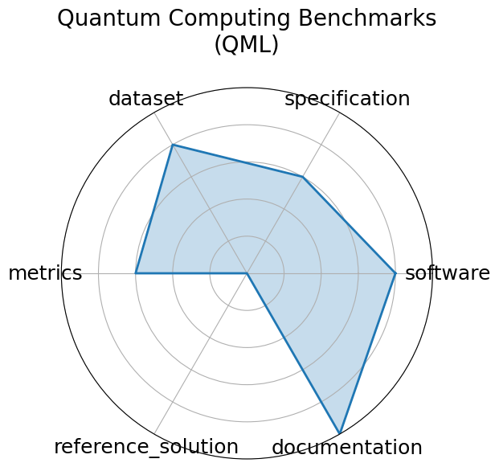

# Quantum Computing Benchmarks (QML)

<a class="md-button back-link" href="../">← Back to all benchmarks</a>

  
Date: 2022-02-22

  
Name: Quantum Computing Benchmarks  QML

  
Domain: Quantum Computing

  
Focus: Quantum algorithm performance evaluation

  
Task Types: Circuit benchmarking, State classification

  
Metrics: Fidelity, Success probability

  
Models: IBM Q, IonQ, AQT@LBNL

<h3>Keywords</h3>

<a class="chip chip-link" href="../#kw=quantum%20circuits">quantum circuits</a> <a class="chip chip-link" href="../#kw=state%20preparation">state preparation</a> <a class="chip chip-link" href="../#kw=error%20correction">error correction</a> 

<h3>Citation</h3>

- Florian J. Kiwit, Marwa Marso, Philipp Ross, Carlos A. Riofrío, Johannes Klepsch, and Andre Luckow. Application-oriented benchmarking of quantum generative learning using quark. In 2023 IEEE International Conference on Quantum Computing and Engineering (QCE), 475 484. IEEE, September 2023. URL: http://dx.doi.org/10.1109/QCE57702.2023.00061, doi:10.1109/qce57702.2023.00061.

<pre><code class="language-bibtex">@inproceedings{kiwit2023,
  title={Application-Oriented Benchmarking of Quantum Generative Learning Using QUARK},
  url={http://dx.doi.org/10.1109/QCE57702.2023.00061},
  DOI={10.1109/qce57702.2023.00061},
  booktitle={2023 IEEE International Conference on Quantum Computing and Engineering (QCE)},
  publisher={IEEE},
  author={Kiwit, Florian J. and Marso, Marwa and Ross, Philipp and Riofrío, Carlos A. and Klepsch, Johannes and Luckow, Andre},
  year={2023},
  month=sep, pages={475-484}
}</code></pre>
<h3>Ratings</h3>

  
CategoryRating

  
  
Software
  
4.00
  

  
Run instructions exist, but are not easy to follow

  
Specification
  
3.00
  

  
No system constraints. Task clarity and dataset format are not clearly specified.

  
Dataset
  
4.00
  

  
Datasets are accessible, but not split.

  
Metrics
  
3.00
  

  
Partially defined, somewhat inferrable metrics. Unknown whether a system&#x27;s performance is captured.

  
Reference Solution
  
0.00
  

  
Not provided

  
Documentation
  
1.00
  

  
Only the task is defined. 

  <strong>Average rating:</strong> 2.50/5
<h3>Radar plot</h3>

<strong>Edit:</strong> <a href="https://github.com/mlcommons-science/benchmark/tree/main/source">edit this entry</a>

