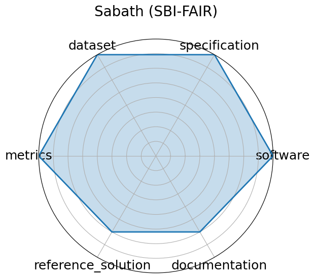

# Sabath (SBI-FAIR)

<a class="md-button back-link" href="../">← Back to all benchmarks</a>

  
Date: 2021-09-27

  
Name: Sabath  SBI-FAIR

  
Domain: Systems; Metadata

  
Focus: FAIR metadata framework for ML-driven surrogate workflows in HPC systems

  
Task Types: Systems benchmarking

  
Metrics: Metadata completeness, FAIR compliance

  
Models: NA

<h3>Keywords</h3>

<a class="chip chip-link" href="../#kw=meta-benchmark">meta-benchmark</a> <a class="chip chip-link" href="../#kw=metadata">metadata</a> <a class="chip chip-link" href="../#kw=HPC">HPC</a> <a class="chip chip-link" href="../#kw=surrogate%20modeling">surrogate modeling</a> 

<h3>Citation</h3>

- Piotr Luszczek. Sabath: fair metadata technology for surrogate benchmarks. Technical Report, University of Tennessee, 2021. URL: https://github.com/icl-utk-edu/slip/tree/sabath.

<pre><code class="language-bibtex">@techreport{luszczek2021sabath,
  title={SABATH: FAIR Metadata Technology for Surrogate Benchmarks},
  author={Luszczek, Piotr},
  year={2021},
  institution={University of Tennessee},
  url={https://github.com/icl-utk-edu/slip/tree/sabath}
}</code></pre>
<h3>Ratings</h3>

  
CategoryRating

  
  
Software
  
4.00
  

  
Actively maintained GitHub repository (https://github.com/icl-utk-edu/slip/tree/sabath)
with BSD-licensed tooling for FAIR metadata capture; integrates with existing surrogate
modeling benchmarks.

  
Specification
  
4.00
  

  
FAIR metadata structure and logging goals are clearly described. Input/output definitions
are implied through integrations (e.g., MiniWeatherML), though not always formalized.

  
Dataset
  
4.00
  

  
Datasets used in surrogate benchmarks are publicly available, well-structured, and
FAIR-aligned, but not independently hosted by Sabath itself.

  
Metrics
  
4.00
  

  
Emphasizes metadata completeness and FAIR compliance. Metrics are clear and well-matched
to its metadata-focused benchmarking context.

  
Reference Solution
  
3.00
  

  
Includes integration with multiple surrogate benchmarks and models, though not all are
fully documented or packaged as standardized reference solutions.

  
Documentation
  
3.00
  

  
Basic instructions and code are provided on GitHub, but more detailed walkthroughs,
use-case examples, or tutorials are limited.

  <strong>Average rating:</strong> 3.67/5
<h3>Radar plot</h3>

<strong>Edit:</strong> <a href="https://github.com/mlcommons-science/benchmark/tree/main/source">edit this entry</a>

