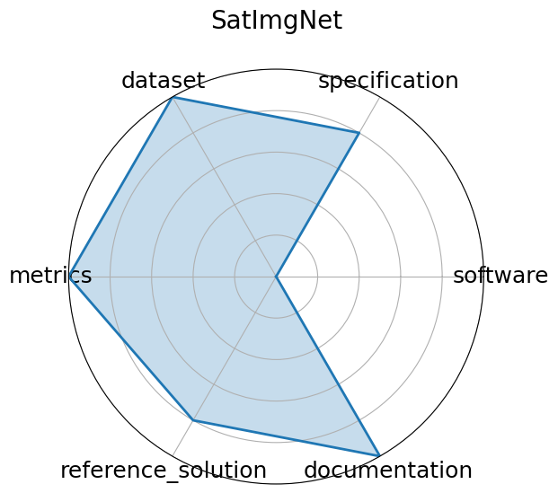

# SatImgNet

<a class="md-button back-link" href="../">← Back to all benchmarks</a>

  
Date: 2023-04-23

  
Name: SatImgNet

  
Domain: Remote Sensing

  
Focus: Satellite imagery classification

  
Task Types: Image classification

  
Metrics: Accuracy

  
Models: CLIP, BLIP, ALBEF

<h3>Keywords</h3>

<a class="chip chip-link" href="../#kw=land-use">land-use</a> <a class="chip chip-link" href="../#kw=zero-shot">zero-shot</a> <a class="chip chip-link" href="../#kw=multi-task">multi-task</a> 

<h3>Citation</h3>

- Jonathan Roberts, Kai Han, and Samuel Albanie. Satin: a multi-task metadataset for classifying satellite imagery using vision-language models. 2023. URL: https://huggingface.co/datasets/saral-ai/satimagnet.

<pre><code class="language-bibtex">@misc{roberts2023satin,
  title={SATIN: A multi-task metadataset for classifying satellite imagery using vision-language models},
  author={Roberts, Jonathan and Han, Kai and Albanie, Samuel},
  journal={arXiv preprint arXiv:2304.11619},
  year={2023},
  url={https://huggingface.co/datasets/saral-ai/satimagnet}
}</code></pre>
<h3>Ratings</h3>

  
CategoryRating

  
  
Software
  
0.00
  

  
No scripts or environment information provided

  
Specification
  
4.00
  

  
Tasks (image classification across 27 satellite datasets) are clearly defined with multi-task and zero-shot framing; input/output structure is mostly standard but some task-specific nuances require interpretation.

  
Dataset
  
5.00
  

  
Hosted on Hugging Face, versioned, FAIR-compliant with rich metadata; covers many well-known remote sensing datasets unified under one metadataset, though documentation depth varies slightly across tasks.

  
Metrics
  
5.00
  

  
Accuracy of classification is an appropriate metric

  
Reference Solution
  
4.00
  

  
Baselines like CLIP, BLIP, ALBEF evaluated in the paper; no constraints specified

  
Documentation
  
5.00
  

  
Paper provides all required information

  <strong>Average rating:</strong> 3.83/5
<h3>Radar plot</h3>

<strong>Edit:</strong> <a href="https://github.com/mlcommons-science/benchmark/tree/main/source">edit this entry</a>

