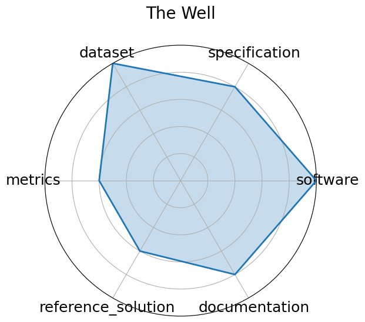

# The Well

<a class="md-button back-link" href="../">← Back to all benchmarks</a>

  
Date: 2024-12-03

  
Name: The Well

  
Domain: biological systems, fluid dynamics, acoustic scattering, astrophysical MHD

  
Focus: Foundation model + surrogate dataset spanning 16 physical simulation domains

  
Task Types: Supervised Learning

  
Metrics: Dataset size, Domain breadth

  
Models: FNO baselines, U-Net baselines

<h3>Keywords</h3>

<a class="chip chip-link" href="../#kw=surrogate%20modeling">surrogate modeling</a> <a class="chip chip-link" href="../#kw=foundation%20model">foundation model</a> <a class="chip chip-link" href="../#kw=physics%20simulations">physics simulations</a> <a class="chip chip-link" href="../#kw=spatiotemporal%20dynamics">spatiotemporal dynamics</a> 

<h3>Citation</h3>

- Ruben Ohana, Michael McCabe, Lucas Meyer, Rudy Morel, Fruzsina J. Agocs, Miguel Beneitez, Marsha Berger, Blakesley Burkhart, Stuart B. Dalziel, Drummond B. Fielding, Daniel Fortunato, Jared A. Goldberg, Keiya Hirashima, Yan-Fei Jiang, Rich R. Kerswell, Suryanarayana Maddu, Jonah Miller, Payel Mukhopadhyay, Stefan S. Nixon, Jeff Shen, Romain Watteaux, Bruno Régaldo-Saint Blancard, François Rozet, Liam H. Parker, Miles Cranmer, and Shirley Ho. The well: a large-scale collection of diverse physics simulations for machine learning. In A. Globerson, L. Mackey, D. Belgrave, A. Fan, U. Paquet, J. Tomczak, and C. Zhang, editors, Advances in Neural Information Processing Systems, volume 37, 44989–45037. Curran Associates, Inc., 2024. URL: https://proceedings.neurips.cc/paper_files/paper/2024/file/4f9a5acd91ac76569f2fe291b1f4772b-Paper-Datasets_and_Benchmarks_Track.pdf.

<pre><code class="language-bibtex">@inproceedings{neurips2024_4f9a5acd,
  author = {Ohana, Ruben and McCabe, Michael and Meyer, Lucas and Morel, Rudy and Agocs, Fruzsina J. and Beneitez, Miguel and Berger, Marsha and Burkhart, Blakesley and Dalziel, Stuart B. and Fielding, Drummond B. and Fortunato, Daniel and Goldberg, Jared A. and Hirashima, Keiya and Jiang, Yan-Fei and Kerswell, Rich R. and Maddu, Suryanarayana and Miller, Jonah and Mukhopadhyay, Payel and Nixon, Stefan S. and Shen, Jeff and Watteaux, Romain and Blancard, Bruno R\&#x27;{e}galdo-Saint and Rozet, Fran\c{c}ois and Parker, Liam H. and Cranmer, Miles and Ho, Shirley},
  booktitle = {Advances in Neural Information Processing Systems},
  editor = {A. Globerson and L. Mackey and D. Belgrave and A. Fan and U. Paquet and J. Tomczak and C. Zhang},
  pages = {44989--45037},
  publisher = {Curran Associates, Inc.},
  title = {The Well: a Large-Scale Collection of Diverse Physics Simulations for Machine Learning},
  url = {https://proceedings.neurips.cc/paper_files/paper/2024/file/4f9a5acd91ac76569f2fe291b1f4772b-Paper-Datasets_and_Benchmarks_Track.pdf},
  volume = {37},
  year = {2024}
}</code></pre>
<h3>Ratings</h3>

  
CategoryRating

  
  
Software
  
5.00
  

  
BSD-licensed software and unified API are available via GitHub and PyPI.
Supports loading and manipulating large HDF5 datasets across 16 domains.

  
Specification
  
4.00
  

  
The benchmark includes clearly defined surrogate modeling tasks, data structure, and metadata.
However, constraints and formal task specs vary slightly across domains.

  
Dataset
  
5.00
  

  
15 TB of ML-ready HDF5 datasets across 16 physics domains. Public, well-structured,
richly annotated, and designed with FAIR principles in mind.

  
Metrics
  
3.00
  

  
Domain breadth and dataset size are emphasized. Standardized quantitative metrics for
model evaluation (e.g., RMSE, accuracy) are not uniformly applied across all domains.

  
Reference Solution
  
3.00
  

  
Includes FNO and U-Net baselines, but does not yet provide fully trained, reproducible
models or scripts across all datasets.

  
Documentation
  
4.00
  

  
The GitHub repo and NeurIPS paper provide detailed guidance on dataset use,
structure, and training setup. Tutorials and walkthroughs could be expanded further.

  <strong>Average rating:</strong> 4.00/5
<h3>Radar plot</h3>

<strong>Edit:</strong> <a href="https://github.com/mlcommons-science/benchmark/tree/main/source">edit this entry</a>

