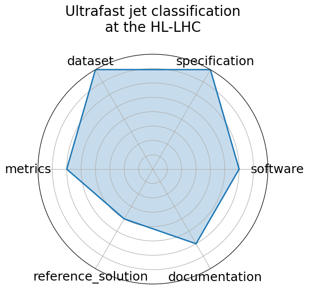

# Ultrafast jet classification at the HL-LHC

<a class="md-button back-link" href="../">← Back to all benchmarks</a>

  
Date: 2024-07-08

  
Name: Ultrafast jet classification at the HL-LHC

  
Domain: Particle Physics

  
Focus: FPGA-optimized real-time jet origin classification at the HL-LHC

  
Task Types: Classification

  
Metrics: Accuracy, Latency, Resource utilization

  
Models: MLP, Deep Sets, Interaction Network

<h3>Keywords</h3>

<a class="chip chip-link" href="../#kw=jet%20classification">jet classification</a> <a class="chip chip-link" href="../#kw=FPGA">FPGA</a> <a class="chip chip-link" href="../#kw=quantization-aware%20training">quantization-aware training</a> <a class="chip chip-link" href="../#kw=Deep%20Sets">Deep Sets</a> <a class="chip chip-link" href="../#kw=Interaction%20Networks">Interaction Networks</a> 

<h3>Citation</h3>

- Patrick Odagiu, Zhiqiang Que, Javier Duarte, Johannes Haller, Gregor Kasieczka, Artur Lobanov, Vladimir Loncar, Wayne Luk, Jennifer Ngadiuba, Maurizio Pierini, Philipp Rincke, Arpita Seksaria, Sioni Summers, Andre Sznajder, Alexander Tapper, and Thea K. Aarrestad. Ultrafast jet classification on fpgas for the hl-lhc. 2024. URL: https://arxiv.org/abs/2402.01876, arXiv:2402.01876, doi:https://doi.org/10.1088/2632-2153/ad5f10.

<pre><code class="language-bibtex">@misc{odagiu2024ultrafastjetclassificationfpgas,
  archiveprefix = {arXiv},
  author        = {Patrick Odagiu and Zhiqiang Que and Javier Duarte and Johannes Haller and Gregor Kasieczka and Artur Lobanov and Vladimir Loncar and Wayne Luk and Jennifer Ngadiuba and Maurizio Pierini and Philipp Rincke and Arpita Seksaria and Sioni Summers and Andre Sznajder and Alexander Tapper and Thea K. Aarrestad},
  doi           = {https://doi.org/10.1088/2632-2153/ad5f10},
  eprint        = {2402.01876},
  primaryclass  = {hep-ex},
  title         = {Ultrafast jet classification on FPGAs for the HL-LHC},
  url           = {https://arxiv.org/abs/2402.01876},
  year          = {2024}
}</code></pre>
<h3>Ratings</h3>

  
CategoryRating

  
  
Software
  
3.00
  

  
Not containerized; Setup and automation incomplete

  
Specification
  
4.00
  

  
Hardware constraints are referenced but not fully detailed or standardized

  
Dataset
  
4.00
  

  
FAIR metadata limited; no clear mention of dataset format or splits

  
Metrics
  
3.00
  

  
Metrics exist (accuracy, latency, utilization), but formal definitions and evaluation guidance are limited

  
Reference Solution
  
2.00
  

  
Reference implementations not fully reproducible; no evaluation pipeline or training setup provided

  
Documentation
  
3.00
  

  
No linked GitHub repo or setup instructions; paper provides partial guidance only

  <strong>Average rating:</strong> 3.17/5
<h3>Radar plot</h3>

<strong>Edit:</strong> <a href="https://github.com/mlcommons-science/benchmark/tree/main/source">edit this entry</a>

