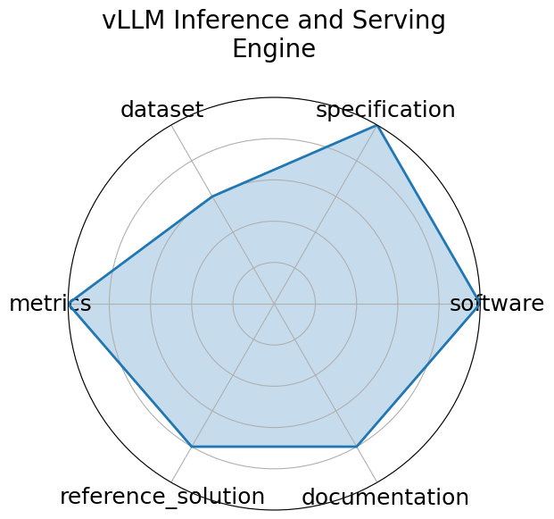

# vLLM Inference and Serving Engine

<a class="md-button back-link" href="../">← Back to all benchmarks</a>

  
Date: 2023-09-12

  
Name: vLLM Inference and Serving Engine

  
Domain: LLM; HPC/inference

  
Focus: High-throughput, memory-efficient inference and serving engine for LLMs

  
Task Types: Inference Benchmarking

  
Metrics: Tokens/sec, Time to First Token (TTFT), Memory footprint

  
Models: LLaMA, Mixtral, FlashAttention-based models

<h3>Keywords</h3>

<a class="chip chip-link" href="../#kw=LLM%20inference">LLM inference</a> <a class="chip chip-link" href="../#kw=PagedAttention">PagedAttention</a> <a class="chip chip-link" href="../#kw=CUDA%20graph">CUDA graph</a> <a class="chip chip-link" href="../#kw=streaming%20API">streaming API</a> <a class="chip chip-link" href="../#kw=quantization">quantization</a> 

<h3>Citation</h3>

- Woosuk Kwon, Zhuohan Li, Siyuan Zhuang, Ying Sheng, Lianmin Zheng, Cody Hao Yu, Joseph Gonzalez, Hao Zhang, and Ion Stoica. Efficient memory management for large language model serving with pagedattention. In Proceedings of the 29th Symposium on Operating Systems Principles, SOSP &#x27;23, 611 626. New York, NY, USA, 2023. Association for Computing Machinery. URL: https://doi.org/10.1145/3600006.3613165, doi:10.1145/3600006.3613165.

<pre><code class="language-bibtex">@inproceedings{10.1145/3600006.3613165,
  author = {Kwon, Woosuk and Li, Zhuohan and Zhuang, Siyuan and Sheng, Ying and Zheng, Lianmin and Yu, Cody Hao and Gonzalez, Joseph and Zhang, Hao and Stoica, Ion},
  title = {Efficient Memory Management for Large Language Model Serving with PagedAttention},
  year = {2023},
  publisher = {Association for Computing Machinery},
  address = {New York, NY, USA},
  url = {https://doi.org/10.1145/3600006.3613165},
  doi = {10.1145/3600006.3613165},
  abstract = {High throughput serving of large language models (LLMs) requires batching sufficiently many requests at a time. However, existing systems struggle because the key-value cache (KV cache) memory for each request is huge and grows and shrinks dynamically. When managed inefficiently, this memory can be significantly wasted by fragmentation and redundant duplication, limiting the batch size. To address this problem, we propose PagedAttention, an attention algorithm inspired by the classical virtual memory and paging techniques in operating systems. On top of it, we build vLLM, an LLM serving system that achieves (1) near-zero waste in KV cache memory and (2) flexible sharing of KV cache within and across requests to further reduce memory usage. Our evaluations show that vLLM improves the throughput of popular LLMs by 2--4\texttimes{} with the same level of latency compared to the state-of-the-art systems, such as FasterTransformer and Orca. The improvement is more pronounced with longer sequences, larger models, and more complex decoding algorithms. vLLM&#x27;s source code is publicly available at https://github.com/vllm-project/vllm.},
  booktitle = {Proceedings of the 29th Symposium on Operating Systems Principles},
  pages = {611-626},
  numpages = {16},
  location = {Koblenz, Germany},
  series = {SOSP &#x27;23}
}</code></pre>
<h3>Ratings</h3>

  
CategoryRating

  
  
Software
  
5.00
  

  
Actively maintained open-source project under Apache 2.0. GitHub repo includes
full serving engine, benchmarking scripts, CUDA integration, and deployment examples.

  
Specification
  
5.00
  

  
Inference benchmarks are well-defined with clear input/output formats and platform-specific constraints.
Covers multiple models, hardware backends, and batching configurations.

  
Dataset
  
3.00
  

  
No traditional dataset is included. Instead, it uses structured configs and logs suitable for inference benchmarking.
FAIR principles are only partially applicable.

  
Metrics
  
5.00
  

  
Comprehensive performance metrics like tokens/sec, time-to-first-token (TTFT), and memory footprint
are consistently applied and benchmarked across frameworks.

  
Reference Solution
  
4.00
  

  
Provides runnable scripts and configs for several models (LLaMA, Mixtral, etc.) across platforms.
Baselines are reproducible, though not all models are fully wrapped or hosted.

  
Documentation
  
4.00
  

  
Well-structured GitHub documentation with setup instructions, config examples, benchmarking comparisons,
and performance tuning guides.

  <strong>Average rating:</strong> 4.33/5
<h3>Radar plot</h3>

<strong>Edit:</strong> <a href="https://github.com/mlcommons-science/benchmark/tree/main/source">edit this entry</a>

