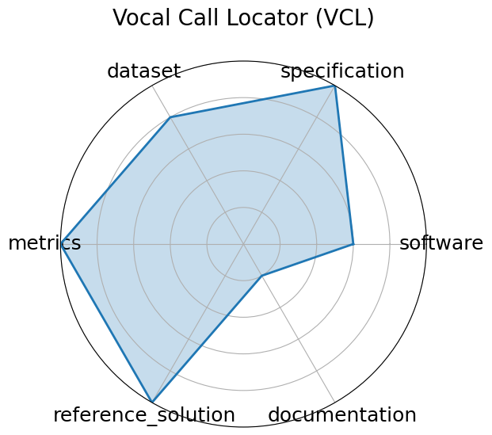

# Vocal Call Locator (VCL)

<a class="md-button back-link" href="../">← Back to all benchmarks</a>

  
Date: 2024-12-13

  
Name: Vocal Call Locator  VCL

  
Domain: Neuroscience; Bioacoustics

  
Focus: Benchmarking sound-source localization of rodent vocalizations from multi-channel audio

  
Task Types: Sound source localization

  
Metrics: Localization error (cm), Recall/Precision

  
Models: CNN-based SSL models

<h3>Keywords</h3>

<a class="chip chip-link" href="../#kw=source%20localization">source localization</a> <a class="chip chip-link" href="../#kw=bioacoustics">bioacoustics</a> <a class="chip chip-link" href="../#kw=time-series">time-series</a> <a class="chip chip-link" href="../#kw=SSL">SSL</a> 

<h3>Citation</h3>

- Ralph E Peterson, Aramis Tanelus, Christopher Ick, Bartul Mimica, Niegil Francis, Violet J Ivan, Aman Choudhri, Annegret L Falkner, Mala Murthy, David M Schneider, Dan H Sanes, and Alex H Williams. Vocal call locator benchmark (vcl) for localizing rodent vocalizations from multi-channel audio. In A. Globerson, L. Mackey, D. Belgrave, A. Fan, U. Paquet, J. Tomczak, and C. Zhang, editors, Advances in Neural Information Processing Systems, volume 37, 106370–106382. Curran Associates, Inc., 2024. URL: https://proceedings.neurips.cc/paper_files/paper/2024/file/c00d37d6b04d73b870b963a4d70051c1-Paper-Datasets_and_Benchmarks_Track.pdf.

<pre><code class="language-bibtex">@inproceedings{neurips2024_c00d37d6,
  author = {Peterson, Ralph E and Tanelus, Aramis and Ick, Christopher and Mimica, Bartul and Francis, Niegil and Ivan, Violet J and Choudhri, Aman and Falkner, Annegret L and Murthy, Mala and Schneider, David M and Sanes, Dan H and Williams, Alex H},
  booktitle = {Advances in Neural Information Processing Systems},
  editor = {A. Globerson and L. Mackey and D. Belgrave and A. Fan and U. Paquet and J. Tomczak and C. Zhang},
  pages = {106370--106382},
  publisher = {Curran Associates, Inc.},
  title = {Vocal Call Locator Benchmark (VCL) for localizing rodent vocalizations from multi-channel audio},
  url = {https://proceedings.neurips.cc/paper_files/paper/2024/file/c00d37d6b04d73b870b963a4d70051c1-Paper-Datasets_and_Benchmarks_Track.pdf},
  volume = {37},
  year = {2024}
}</code></pre>
<h3>Ratings</h3>

  
CategoryRating

  
  
Software
  
3.00
  

  
Some baseline CNN models for sound source localization are reported,
but no publicly available or fully integrated runnable codebase yet.

  
Specification
  
5.00
  

  
Well-defined localization tasks with multiple scenarios and real-world
environment conditions; input/output formats clearly described.

  
Dataset
  
4.00
  

  
Large-scale audio dataset covering real and simulated data with
standardized splits, though exact data formats are not fully detailed.

  
Metrics
  
5.00
  

  
Includes localization error, precision, recall, and other relevant metrics
for robust evaluation.

  
Reference Solution
  
5.00
  

  
Multiple baselines evaluated over diverse models and architectures,
supporting reproducibility of benchmark comparisons.

  
Documentation
  
1.00
  

  
Methodology and paper are thorough, but setup instructions and runnable
code are not publicly provided, limiting user onboarding.

  <strong>Average rating:</strong> 3.83/5
<h3>Radar plot</h3>

<strong>Edit:</strong> <a href="https://github.com/mlcommons-science/benchmark/tree/main/source">edit this entry</a>

