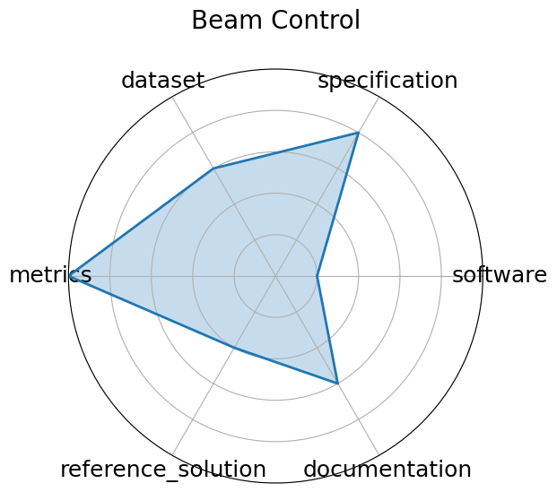

# Beam Control

**Date**: 2024-05-01

**Name**: Beam Control

**Domain**: Accelerators and Magnets

**Focus**: Reinforcement learning control of accelerator beam position

**Keywords**: RL, beam stabilization, control systems, simulation

**Task Types**: Control

**Metrics**: Stability, Control loss

**Models**: DDPG, PPO  planned 

**Citation**:

- Javier Duarte, Nhan Tran, Ben Hawks, Christian Herwig, Jules Muhizi, Shvetank Prakash, and Vijay Janapa Reddi. Fastml science benchmarks: accelerating real-time scientific edge machine learning. 2022. URL: https://arxiv.org/abs/2207.07958, arXiv:2207.07958.

  - bibtex: |

      @misc{duarte2022fastmlsciencebenchmarksaccelerating,

        archiveprefix = {arXiv},

        author        = {Javier Duarte and Nhan Tran and Ben Hawks and Christian Herwig and Jules Muhizi and Shvetank Prakash and Vijay Janapa Reddi},

        eprint        = {2207.07958},

        primaryclass  = {cs.LG},

        title         = {FastML Science Benchmarks: Accelerating Real-Time Scientific Edge Machine Learning},

        url           = {https://arxiv.org/abs/2207.07958},

        year          = {2022}

      }

- Diana Kafkes and Jason St. John. Boostr: a dataset for accelerator control systems. 2021. URL: https://arxiv.org/abs/2101.08359, arXiv:2101.08359.

  - bibtex: |

      @misc{kafkes2021boostrdatasetacceleratorcontrol,

        archiveprefix = {arXiv},

        author        = {Diana Kafkes and Jason St. John},

        eprint        = {2101.08359},

        primaryclass  = {physics.acc-ph},

        title         = {BOOSTR: A Dataset for Accelerator Control Systems},

        url           = {https://arxiv.org/abs/2101.08359},

        year          = {2021}

      }

**Ratings:**

Specification:

  - **Rating:** 9.0

  - **Reason:** Task is well defined  real-time compression of sparse, irregular sensor data using autoencoders ; latency constraints are implied but not fully quantified.

Dataset:

  - **Rating:** 8.0

  - **Reason:** Dataset is custom and synthetic but described well; FAIR-compliance is partial  reusable and accessible, but not externally versioned with rich metadata .

Metrics:

  - **Rating:** 9.0

  - **Reason:** Uses standard quantitative metrics  MSE, compression ratio  clearly aligned with compression and reconstruction goals.

Reference Solution:

  - **Rating:** 7.0

  - **Reason:** Baseline  autoencoder and quantized variant  is provided, but training/inference pipeline is minimally documented and needs user setup.

Documentation:

  - **Rating:** 8.0

  - **Reason:** GitHub repo contains core components, but more structured setup instructions and pretrained weights would improve usability.

**Radar Plot:**
 