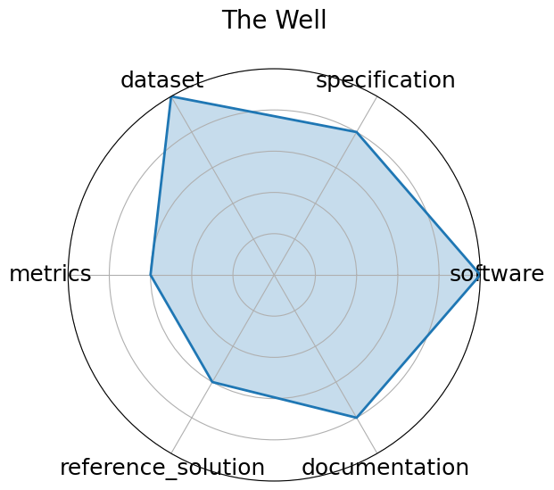

# The Well

**Date**: 2024-12-03

**Name**: The Well

**Domain**: biological systems, fluid dynamics, acoustic scattering, astrophysical MHD

**Focus**: Foundation model + surrogate dataset spanning 16 physical simulation domains

**Keywords**: surrogate modeling, foundation model, physics simulations, spatiotemporal dynamics

**Task Types**: Supervised Learning

**Metrics**: Dataset size, Domain breadth

**Models**: FNO baselines, U‑Net baselines

**Citation**:

- Ruben Ohana, Michael McCabe, Lucas Meyer, Rudy Morel, Fruzsina J. Agocs, Miguel Beneitez, Marsha Berger, Blakesley Burkhart, Stuart B. Dalziel, Drummond B. Fielding, Daniel Fortunato, Jared A. Goldberg, Keiya Hirashima, Yan-Fei Jiang, Rich R. Kerswell, Suryanarayana Maddu, Jonah Miller, Payel Mukhopadhyay, Stefan S. Nixon, Jeff Shen, Romain Watteaux, Bruno Régaldo-Saint Blancard, François Rozet, Liam H. Parker, Miles Cranmer, and Shirley Ho. The well: a large-scale collection of diverse physics simulations for machine learning. In A. Globerson, L. Mackey, D. Belgrave, A. Fan, U. Paquet, J. Tomczak, and C. Zhang, editors, Advances in Neural Information Processing Systems, volume 37, 44989–45037. Curran Associates, Inc., 2024. URL: https://proceedings.neurips.cc/paper_files/paper/2024/file/4f9a5acd91ac76569f2fe291b1f4772b-Paper-Datasets_and_Benchmarks_Track.pdf.

  - bibtex: |

      @inproceedings{neurips2024_4f9a5acd,

        author = {Ohana, Ruben and McCabe, Michael and Meyer, Lucas and Morel, Rudy and Agocs, Fruzsina J. and Beneitez, Miguel and Berger, Marsha and Burkhart, Blakesley and Dalziel, Stuart B. and Fielding, Drummond B. and Fortunato, Daniel and Goldberg, Jared A. and Hirashima, Keiya and Jiang, Yan-Fei and Kerswell, Rich R. and Maddu, Suryanarayana and Miller, Jonah and Mukhopadhyay, Payel and Nixon, Stefan S. and Shen, Jeff and Watteaux, Romain and Blancard, Bruno R\'{e}galdo-Saint and Rozet, Fran\c{c}ois and Parker, Liam H. and Cranmer, Miles and Ho, Shirley},

        booktitle = {Advances in Neural Information Processing Systems},

        editor = {A. Globerson and L. Mackey and D. Belgrave and A. Fan and U. Paquet and J. Tomczak and C. Zhang},

        pages = {44989--45037},

        publisher = {Curran Associates, Inc.},

        title = {The Well: a Large-Scale Collection of Diverse Physics Simulations for Machine Learning},

        url = {https://proceedings.neurips.cc/paper_files/paper/2024/file/4f9a5acd91ac76569f2fe291b1f4772b-Paper-Datasets_and_Benchmarks_Track.pdf},

        volume = {37},

        year = {2024}

      }

**Ratings:**

Specification:

  - **Rating:** 7.0

  - **Reason:** Explores LLM understanding of mental health scenarios; framing is creative but loosely defined.

Dataset:

  - **Rating:** 6.0

  - **Reason:** Dataset is described in concept but not released; privacy limits public access though synthetic proxies are referenced.

Metrics:

  - **Rating:** 7.0

  - **Reason:** Uses manual annotation and quality scores, but lacks standardized automatic metrics.

Reference Solution:

  - **Rating:** 6.0

  - **Reason:** Provides few-shot prompt examples and human rating calibration details.

Documentation:

  - **Rating:** 5.0

  - **Reason:** Paper gives use cases, but code and data are not yet public.

**Radar Plot:**
 