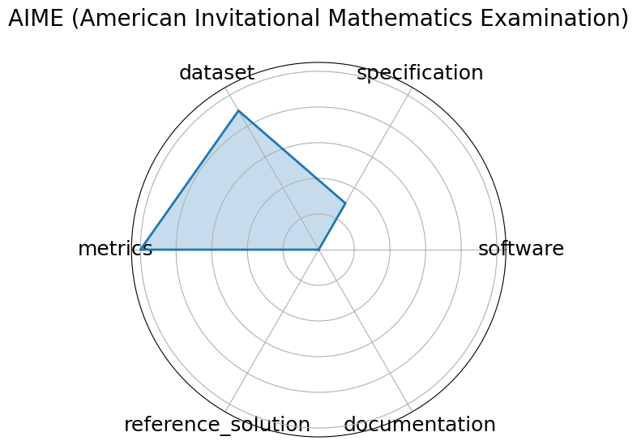

# AIME (American Invitational Mathematics Examination)


**Date**: 2025-03-13


**Name**: AIME  American Invitational Mathematics Examination 


**Domain**: Mathematics


**Focus**: Pre-college advanced problem solving


**Keywords**: algebra, combinatorics, number theory, geometry


**Task Types**: Problem solving


**Metrics**: Accuracy


**Models**: unkown


**Citation**:


- TBD. Aime. March 2025. [Online accessed 2025-06-24]. URL: https://www.vals.ai/benchmarks/aime-2025-03-13.

  - bibtex:
      ```
      @misc{www-aime,

        author = {TBD},

        title = {AIME},

        url = {https://www.vals.ai/benchmarks/aime-2025-03-13},

        month = mar,

        year = 2025,

        note = {[Online accessed 2025-06-24]}

      }

      ```

**Ratings:**


Software:


  - **Rating:** 0


  - **Reason:** No code available 


Specification:


  - **Rating:** 0


  - **Reason:** Obvious what the problems are, but not specified how to administer them to AI models. No HW constraints 


Dataset:


  - **Rating:** 4


  - **Reason:** Easily accessible data with problems and solutions, but no splits 


Metrics:


  - **Rating:** 5


  - **Reason:**  by default  Answer is correct or it's not 


Reference Solution:


  - **Rating:** 0


  - **Reason:** Not given. Human performance stats exist, but no mentions of AI performance 


Documentation:


  - **Rating:** 0


  - **Reason:** Not given 


**Average Rating:** 1.5


**Radar Plot:**
 