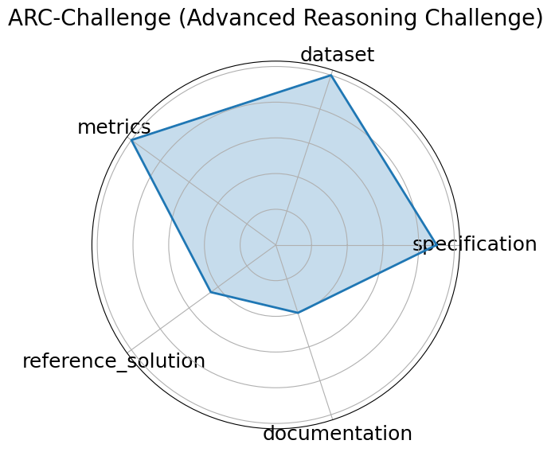

# ARC-Challenge (Advanced Reasoning Challenge)


**Edit:** [edit this entry](https://github.com/mlcommons-science/benchmark/tree/main/source)


**Date**: 2018-03-14


**Name**: ARC-Challenge  Advanced Reasoning Challenge 


**Domain**: Science


**Focus**: Grade-school science with reasoning emphasis


**Keywords**: grade-school, science QA, challenge set, reasoning


**Task Types**: Multiple choice


**Metrics**: Accuracy


**Models**: GPT-4, Claude


**Citation**:


- Peter Clark, Isaac Cowhey, and Oren Etzioni. Think you have solved question answering? try arc, the ai2 reasoning challenge. In EMNLP 2018, 237 248. 2018. URL: https://allenai.org/data/arc.

  - bibtex:
      ```
      @inproceedings{clark2018think,

        title={Think you have solved question answering? Try ARC, the AI2 Reasoning Challenge},

        author={Clark, Peter and Cowhey, Isaac and Etzioni, Oren},

        booktitle={EMNLP 2018},

        pages={237-248},

        year={2018},

        url={https://allenai.org/data/arc}

      }

      ```

**Ratings:**


Software:


  - **Rating:** 0


  - **Reason:** No link to code or documentation 


Specification:


  - **Rating:** 2


  - **Reason:** Task is clear, but no constraints or format is mentioned 


Dataset:


  - **Rating:** 4


  - **Reason:** Data accessible, offers instructions on how to download the data via CLI tools. No splits. 


Metrics:


  - **Rating:** 5


  - **Reason:**  by default  All questions in the dataset are multiple choice, all have a correct answer 


Reference Solution:


  - **Rating:** 1


  - **Reason:** There are over 300 models listed, but very few, if any, show performance on the dataset or list constraints 


Documentation:


  - **Rating:** 5


  - **Reason:** Explains all necessary information inside a paper 


**Average Rating:** 2.833


**Radar Plot:**
 