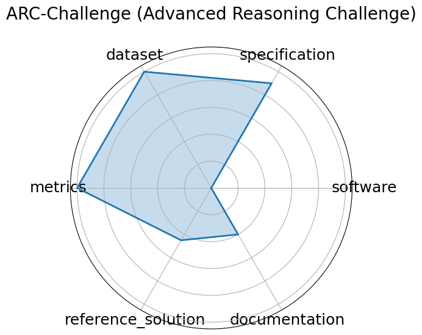

# ARC-Challenge (Advanced Reasoning Challenge)

**Date**: 2018-03-14

**Name**: ARC-Challenge  Advanced Reasoning Challenge 

**Domain**: Science

**Focus**: Grade-school science with reasoning emphasis

**Keywords**: grade-school, science QA, challenge set, reasoning

**Task Types**: Multiple choice

**Metrics**: Accuracy

**Models**: GPT-4, Claude

**Citation**:

- Peter Clark, Isaac Cowhey, and Oren Etzioni. Think you have solved question answering? try arc, the ai2 reasoning challenge. In EMNLP 2018, 237 248. 2018. URL: https://allenai.org/data/arc.

  - bibtex: |

      @inproceedings{clark2018think,

        title={Think you have solved question answering? Try ARC, the AI2 Reasoning Challenge},

        author={Clark, Peter and Cowhey, Isaac and Etzioni, Oren},

        booktitle={EMNLP 2018},

        pages={237-248},

        year={2018},

        url={https://allenai.org/data/arc}

      }

**Ratings:**

Specification:

  - **Rating:** 9

  - **Reason:** Exact format of data, questions, and answers are specified. No HW constraints 

Dataset:

  - **Rating:** 10

  - **Reason:** Data accessible, offers instructions on how to download the data via CLI tools 

Metrics:

  - **Rating:** 10

  - **Reason:**  by default  All questions in the dataset are multiple choice, all have a correct answer 

Reference Solution:

  - **Rating:** 4.5

  - **Reason:** There are over 300 models listed, but very few, if any, show performance on the dataset 

Documentation:

  - **Rating:** 4

  - **Reason:** There are easy ways to download the dataset. Documentation quantity and clarity depends on authors of tested models 

**Radar Plot:**
 