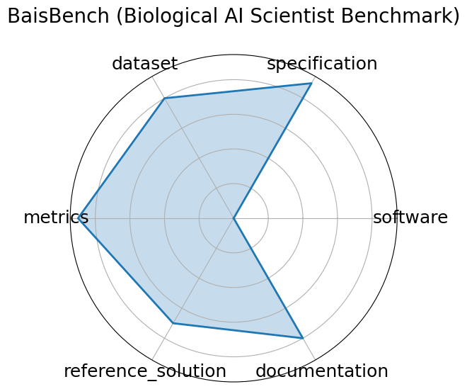

# BaisBench (Biological AI Scientist Benchmark)

**Date**: 2025-05-13

**Name**: BaisBench  Biological AI Scientist Benchmark 

**Domain**: Computational Biology

**Focus**: Omics-driven AI research tasks

**Keywords**: single-cell annotation, biological QA, autonomous discovery

**Task Types**: Cell type annotation, Multiple choice

**Metrics**: Annotation accuracy, QA accuracy

**Models**: LLM-based AI scientist agents

**Citation**:

- Erpai Luo, Jinmeng Jia, Yifan Xiong, Xiangyu Li, Xiaobo Guo, Baoqi Yu, Lei Wei, and Xuegong Zhang. Benchmarking ai scientists in omics data-driven biological research. 2025. URL: https://arxiv.org/abs/2505.08341, arXiv:2505.08341.

  - bibtex: |

      @misc{luo2025benchmarkingaiscientistsomics,

        archiveprefix = {arXiv},

        author        = {Erpai Luo and Jinmeng Jia and Yifan Xiong and Xiangyu Li and Xiaobo Guo and Baoqi Yu and Lei Wei and Xuegong Zhang},

        eprint        = {2505.08341},

        primaryclass  = {cs.AI},

        title         = {Benchmarking AI scientists in omics data-driven biological research},

        url           = {https://arxiv.org/abs/2505.08341},

        year          = {2025}

      }

**Ratings:**

Specification:

  - **Rating:** 9

  - **Reason:** Task clearly defined-cell type annotation and biological QA; input/output formats are well-described; system constraints are not deeply quantified. 

Dataset:

  - **Rating:** 8

  - **Reason:** Uses public scRNA-seq datasets linked in paper appendix; structured and accessible, though versioning and full metadata not formalized per FAIR standards. 

Metrics:

  - **Rating:** 9

  - **Reason:** Includes precise and interpretable metrics  annotation and QA accuracy ; directly aligned with task outputs and benchmarking goals. 

Reference Solution:

  - **Rating:** 7

  - **Reason:** Model evaluations and LLM agent results discussed; however, no fully packaged, runnable baseline with training/eval pipeline confirmed yet. 

Documentation:

  - **Rating:** 8

  - **Reason:** Dataset and paper accessible; IPYNB files for setup are available on the github repo; further instructions are minimal. 

**Radar Plot:**
 