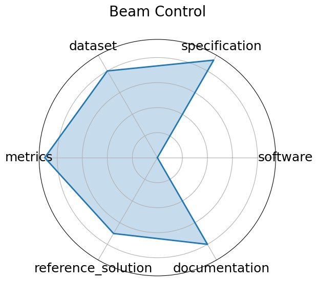

# Beam Control


**Edit:** [edit this entry](https://github.com/mlcommons-science/benchmark/tree/main/source)


**Date**: 2024-05-01


**Name**: Beam Control


**Domain**: Accelerators and Magnets


**Focus**: Reinforcement learning control of accelerator beam position


**Keywords**: RL, beam stabilization, control systems, simulation


**Task Types**: Control


**Metrics**: Stability, Control loss


**Models**: DDPG, PPO  planned 


**Citation**:


- Javier Duarte, Nhan Tran, Ben Hawks, Christian Herwig, Jules Muhizi, Shvetank Prakash, and Vijay Janapa Reddi. Fastml science benchmarks: accelerating real-time scientific edge machine learning. 2022. URL: https://arxiv.org/abs/2207.07958, arXiv:2207.07958.

  - bibtex:
      ```
      @misc{duarte2022fastmlsciencebenchmarksaccelerating3,

        archiveprefix = {arXiv},

        author        = {Javier Duarte and Nhan Tran and Ben Hawks and Christian Herwig and Jules Muhizi and Shvetank Prakash and Vijay Janapa Reddi},

        eprint        = {2207.07958},

        primaryclass  = {cs.LG},

        title         = {FastML Science Benchmarks: Accelerating Real-Time Scientific Edge Machine Learning},

        url           = {https://arxiv.org/abs/2207.07958},

        year          = {2022}

      }

- Diana Kafkes and Jason St. John. Boostr: a dataset for accelerator control systems. 2021. URL: https://arxiv.org/abs/2101.08359, arXiv:2101.08359.

  - bibtex:
      ```
      @misc{kafkes2021boostrdatasetacceleratorcontrol,

        archiveprefix = {arXiv},

        author        = {Diana Kafkes and Jason St. John},

        eprint        = {2101.08359},

        primaryclass  = {physics.acc-ph},

        title         = {BOOSTR: A Dataset for Accelerator Control Systems},

        url           = {https://arxiv.org/abs/2101.08359},

        year          = {2021}

      }

      ```

**Ratings:**


Software:


  - **Rating:** 1


  - **Reason:** Code not documented; Incomplete setup and not containerized 


Specification:


  - **Rating:** 4


  - **Reason:** Latency/resource constraints not fully quantified 


Dataset:


  - **Rating:** 3


  - **Reason:** Not findable  no DOI/indexing ; Not interoperable  format/schema unspecified  


Metrics:


  - **Rating:** 5


  - **Reason:** All criteria met 


Reference Solution:


  - **Rating:** 2


  - **Reason:** HW/SW requirements missing; Metrics not evaluated with reference; Baseline not trainable/open 


Documentation:


  - **Rating:** 3


  - **Reason:** Setup instructions and pretrained model details are missing 


**Average Rating:** 3.0


**Radar Plot:**
 