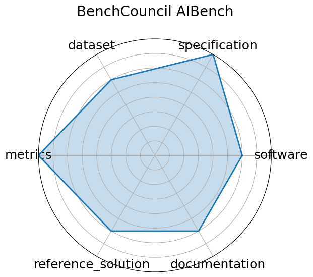

# BenchCouncil AIBench

**Date**: 2020-01-01

**Name**: BenchCouncil AIBench

**Domain**: General

**Focus**: End-to-end AI benchmarking across micro, component, and application levels

**Keywords**: benchmarking, AI systems, application-level evaluation

**Task Types**: Training, Inference, End-to-end AI workloads

**Metrics**: Throughput, Latency, Accuracy

**Models**: ResNet, BERT, GANs, Recommendation systems

**Citation**:

- Wanling Gao, Fei Tang, Lei Wang, Jianfeng Zhan, Chunxin Lan, Chunjie Luo, Yunyou Huang, Chen Zheng, Jiahui Dai, Zheng Cao, Daoyi Zheng, Haoning Tang, Kunlin Zhan, Biao Wang, Defei Kong, Tong Wu, Minghe Yu, Chongkang Tan, Huan Li, Xinhui Tian, Yatao Li, Junchao Shao, Zhenyu Wang, Xiaoyu Wang, and Hainan Ye. Aibench: an industry standard internet service ai benchmark suite. 2019. URL: https://arxiv.org/abs/1908.08998, arXiv:1908.08998.

  - bibtex: |

      @misc{gao2019aibenchindustrystandardinternet,

        archiveprefix = {arXiv},

        author        = {Wanling Gao and Fei Tang and Lei Wang and Jianfeng Zhan and Chunxin Lan and Chunjie Luo and Yunyou Huang and Chen Zheng and Jiahui Dai and Zheng Cao and Daoyi Zheng and Haoning Tang and Kunlin Zhan and Biao Wang and Defei Kong and Tong Wu and Minghe Yu and Chongkang Tan and Huan Li and Xinhui Tian and Yatao Li and Junchao Shao and Zhenyu Wang and Xiaoyu Wang and Hainan Ye},

        eprint        = {1908.08998},

        primaryclass  = {cs.CV},

        title         = {AIBench: An Industry Standard Internet Service AI Benchmark Suite},

        url           = {https://arxiv.org/abs/1908.08998},

        year          = {2019}

      }

**Ratings:**

Specification:

  - **Rating:** 8.0

  - **Reason:** Task  plasma diagnostic classification  and real-time deployment described; system specs  FPS targets  implied but not fully quantified. 

Dataset:

  - **Rating:** 6.0

  - **Reason:** Dataset is sensor stream-based but not shared or FAIR-documented. 

Metrics:

  - **Rating:** 8.0

  - **Reason:** FPS and classification accuracy reported and relevant. 

Reference Solution:

  - **Rating:** 7.0

  - **Reason:** CNN model described and evaluated, but public implementation and benchmarks are not available yet. 

Documentation:

  - **Rating:** 6.0

  - **Reason:** Paper and Gemini doc exist, but full setup instructions and tools are still in progress. 

**Radar Plot:**
 