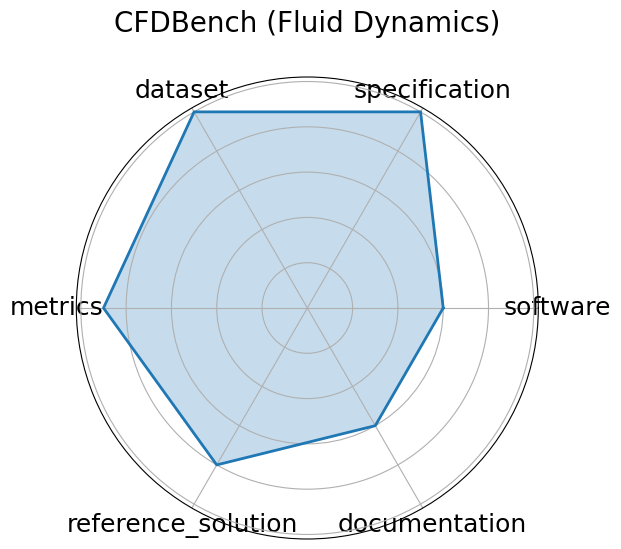

# CFDBench (Fluid Dynamics)


**Date**: 2024-10-01


**Name**: CFDBench  Fluid Dynamics 


**Domain**: Fluid Dynamics; Scientific ML


**Focus**: Neural operator surrogate modeling


**Keywords**: neural operators, CFD, FNO, DeepONet


**Task Types**: Surrogate modeling


**Metrics**: L2 error, MAE


**Models**: FNO, DeepONet, U-Net


**Citation**:


- Yining Luo, Yingfa Chen, and Zhen Zhang. Cfdbench: a large-scale benchmark for machine learning methods in fluid dynamics. 2024. URL: https://arxiv.org/abs/2310.05963.

  - bibtex:
      ```
      @misc{luo2024cfdbenchlargescalebenchmarkmachine,

        title={CFDBench: A Large-Scale Benchmark for Machine Learning Methods in Fluid Dynamics},

        author={Luo, Yining and Chen, Yingfa and Zhang, Zhen},

        year={2024},

        url={https://arxiv.org/abs/2310.05963}

      }

      ```

**Ratings:**


Software:


  - **Rating:** 5


  - **Reason:** The benchmark provides Python scripts for data loading, preprocessing, and model training/evaluation 


Specification:


  - **Rating:** 0


  - **Reason:** Not listed 


Dataset:


  - **Rating:** 0


  - **Reason:** Not given 


Metrics:


  - **Rating:** 5


  - **Reason:** Quantitative metrics  L2 error, MAE, relative error  are clearly defined and align with regression task objectives. 


Reference Solution:


  - **Rating:** 5


  - **Reason:** Baseline models like FNO and DeepONet are implemented, hardware specified. 


Documentation:


  - **Rating:** 5


  - **Reason:** Associated paper gives all necessary information. 


**Average Rating:** 3.333


**Radar Plot:**
 