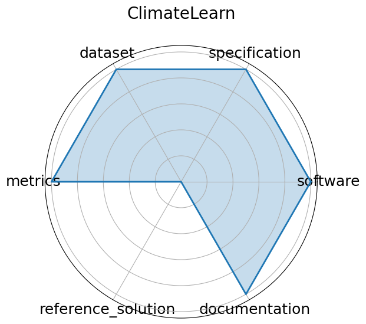

# ClimateLearn


**Date**: 2023-07-19


**Name**: ClimateLearn


**Domain**: Climate Science; Forecasting


**Focus**: ML for weather and climate modeling


**Keywords**: medium-range forecasting, ERA5, data-driven


**Task Types**: Forecasting


**Metrics**: RMSE, Anomaly correlation


**Models**: CNN baselines, ResNet variants


**Citation**:


- Tung Nguyen, Jason Jewik, Hritik Bansal, Prakhar Sharma, and Aditya Grover. Climatelearn: benchmarking machine learning for weather and climate modeling. 2023. URL: https://arxiv.org/abs/2307.01909, arXiv:2307.01909.

  - bibtex:
      ```
      @misc{nguyen2023climatelearnbenchmarkingmachinelearning, 

        title={ClimateLearn: Benchmarking Machine Learning for Weather and Climate Modeling}, 

        author={Tung Nguyen and Jason Jewik and Hritik Bansal and Prakhar Sharma and Aditya Grover},

        year={2023}, eprint={2307.01909}, 

        archivePrefix={arXiv}, 

        primaryClass={cs.LG},

        url={https://arxiv.org/abs/2307.01909}

      }

      ```

**Ratings:**


Software:


  - **Rating:** 5


  - **Reason:** Quickstart notebook makes for easy usage 


Specification:


  - **Rating:** 5


  - **Reason:** Task framing  medium-range climate forecasting , input/output formats, and evaluation windows are clearly defined; benchmark supports both physical and learned models with detailed constraints. 


Dataset:


  - **Rating:** 5


  - **Reason:** Provides standardized access to ERA5 and other reanalysis datasets, with ML-ready splits, metadata, and Xarray-compatible formats; versioned and fully FAIR-compliant. 


Metrics:


  - **Rating:** 5


  - **Reason:** ACC and RMSE are standard, quantitative, and appropriate for climate forecasting; well-integrated into the benchmark, though interpretation across domains may vary. 


Reference Solution:


  - **Rating:** 0


  - **Reason:** The benchmark is geared for CNN architectures, but no specific model was mentioned. 


Documentation:


  - **Rating:** 5


  - **Reason:** Explained in the benchmark's paper.  


**Average Rating:** 4.167


**Radar Plot:**
 