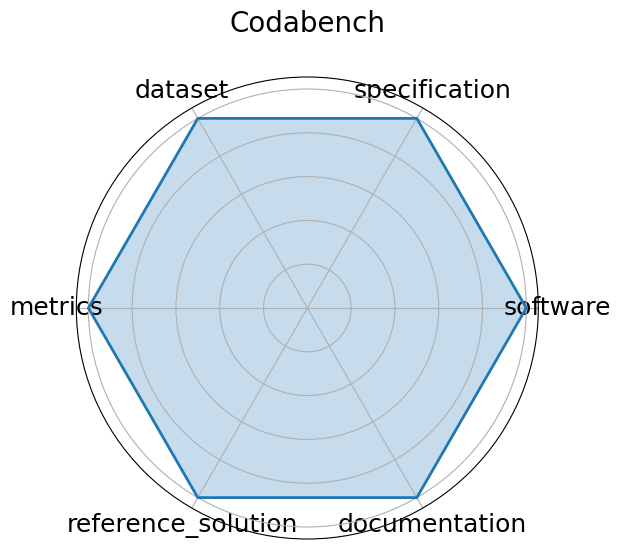

# Codabench


**Date**: 2022-01-01


**Name**: Codabench


**Domain**: General ML; Multiple


**Focus**: Open-source platform for organizing reproducible AI benchmarks and competitions


**Keywords**: benchmark platform, code submission, competitions, meta-benchmark


**Task Types**: Multiple


**Metrics**: Submission count, Leaderboard ranking, Task-specific metrics


**Models**: Arbitrary code submissions


**Citation**:


- Zhen Xu, Sergio Escalera, Adrien Pavão, Magali Richard, Wei-Wei Tu, Quanming Yao, Huan Zhao, and Isabelle Guyon. Codabench: flexible, easy-to-use, and reproducible meta-benchmark platform. Patterns, 3(7):100543, July 2022. URL: http://dx.doi.org/10.1016/j.patter.2022.100543, doi:10.1016/j.patter.2022.100543.

  - bibtex:
      ```
      @article{xu-2022,

        author    = {Xu, Zhen and Escalera, Sergio and Pavão, Adrien and Richard, Magali and Tu, Wei-Wei and Yao, Quanming and Zhao, Huan and Guyon, Isabelle},

        doi       = {10.1016/j.patter.2022.100543},

        issn      = {2666-3899},

        journal   = {Patterns},

        month     = jul,

        number    = {7},

        pages     = {100543},

        publisher = {Elsevier BV},

        title     = {Codabench: Flexible, easy-to-use, and reproducible meta-benchmark platform},

        url       = {http://dx.doi.org/10.1016/j.patter.2022.100543},

        volume    = {3},

        year      = {2022}

      }

      ```

**Ratings:**


Software:


  - **Rating:** 1


  - **Reason:** This is a platform for posting benchmarks, not a benchmark in itself. 


Specification:


  - **Rating:** 1


  - **Reason:** This is a platform for posting benchmarks, not a benchmark in itself. 


Dataset:


  - **Rating:** 1


  - **Reason:** This is a platform for posting benchmarks, not a benchmark in itself. 


Metrics:


  - **Rating:** 1


  - **Reason:** This is a platform for posting benchmarks, not a benchmark in itself. 


Reference Solution:


  - **Rating:** 1


  - **Reason:** This is a platform for posting benchmarks, not a benchmark in itself. 


Documentation:


  - **Rating:** 1


  - **Reason:** This is a platform for posting benchmarks, not a benchmark in itself. 


**Average Rating:** 1.0


**Radar Plot:**
 