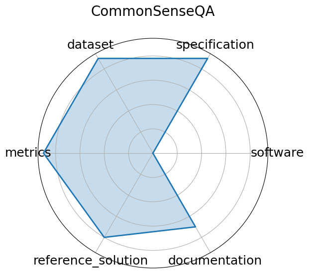

# CommonSenseQA

**Date**: 2019-11-20

**Name**: CommonSenseQA

**Domain**: NLP; Commonsense

**Focus**: Commonsense question answering

**Keywords**: ConceptNet, multiple-choice, adversarial

**Task Types**: Multiple choice

**Metrics**: Accuracy

**Models**: BERT-large, RoBERTa, GPT-3

**Citation**:

- Alon Talmor, Jonathan Herzig, Nicholas Lourie, and Jonathan Berant. Commonsenseqa: a question answering challenge targeting commonsense knowledge. 2019. URL: https://arxiv.org/abs/1811.00937, arXiv:1811.00937.

  - bibtex: |

      @misc{talmor2019commonsenseqaquestionansweringchallenge,

        title={CommonsenseQA: A Question Answering Challenge Targeting Commonsense Knowledge}, 

        author={Alon Talmor and Jonathan Herzig and Nicholas Lourie and Jonathan Berant},

        year={2019},

        eprint={1811.00937},

        archivePrefix={arXiv},

        primaryClass={cs.CL},

        url={https://arxiv.org/abs/1811.00937}, 

      }

**Ratings:**

Specification:

  - **Rating:** 9.0

  - **Reason:** Task and format  multiple-choice QA with 5 options  are clearly defined; grounded in ConceptNet with consistent structure, though no hardware/system constraints are specified. 

Dataset:

  - **Rating:** 9.0

  - **Reason:** Public, versioned, and FAIR-compliant; includes metadata, splits, and licensing; well-integrated with HuggingFace and other ML libraries. 

Metrics:

  - **Rating:** 9.0

  - **Reason:** Accuracy is a simple, reproducible metric aligned with task goals; no ambiguity in evaluation. 

Reference Solution:

  - **Rating:** 8.0

  - **Reason:** Several baseline models  e.g., BERT, RoBERTa  are reported with scores; implementations exist in public repos, but not bundled as an official starter kit. 

Documentation:

  - **Rating:** 7.0

  - **Reason:** Clear paper, GitHub repo, and integration with HuggingFace Datasets; full reproducibility requires manually connecting models to dataset. 

**Radar Plot:**
 