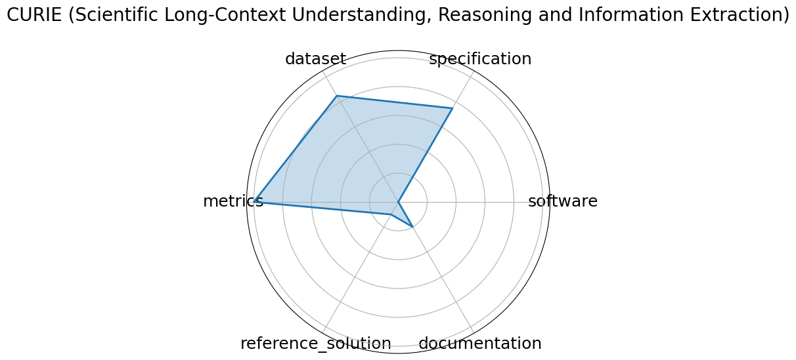

# CURIE (Scientific Long-Context Understanding, Reasoning and Information Extraction)


**Date**: 2024-04-02


**Name**: CURIE  Scientific Long-Context Understanding, Reasoning and Information Extraction 


**Domain**: Multidomain Science


**Focus**: Long-context scientific reasoning


**Keywords**: long-context, information extraction, multimodal


**Task Types**: Information extraction, Reasoning, Concept tracking, Aggregation, Algebraic manipulation, Multimodal comprehension


**Metrics**: Accuracy


**Models**: unkown


**Citation**:


- Hao Cui, Zahra Shamsi, Gowoon Cheon, Xuejian Ma, Shutong Li, Maria Tikhanovskaya, Peter Norgaard, Nayantara Mudur, Martyna Plomecka, Paul Raccuglia, Yasaman Bahri, Victor V. Albert, Pranesh Srinivasan, Haining Pan, Philippe Faist, Brian Rohr, Ekin Dogus Cubuk, Muratahan Aykol, Amil Merchant, Michael J. Statt, Dan Morris, Drew Purves, Elise Kleeman, Ruth Alcantara, Matthew Abraham, Muqthar Mohammad, Ean Phing VanLee, Chenfei Jiang, Elizabeth Dorfman, Eun-Ah Kim, Michael P Brenner, Viren Jain, Sameera Ponda, and Subhashini Venugopalan. Curie: evaluating llms on multitask scientific long context understanding and reasoning. 2025. URL: https://arxiv.org/abs/2503.13517, arXiv:2503.13517.

  - bibtex:
      ```
      @misc{cui2025curieevaluatingllmsmultitask,

        title={CURIE: Evaluating LLMs On Multitask Scientific Long Context Understanding and Reasoning}, 

        author={Hao Cui and Zahra Shamsi and Gowoon Cheon and Xuejian Ma and Shutong Li and Maria Tikhanovskaya and Peter Norgaard and Nayantara Mudur and Martyna Plomecka and Paul Raccuglia and Yasaman Bahri and Victor V. Albert and Pranesh Srinivasan and Haining Pan and Philippe Faist and Brian Rohr and Ekin Dogus Cubuk and Muratahan Aykol and Amil Merchant and Michael J. Statt and Dan Morris and Drew Purves and Elise Kleeman and Ruth Alcantara and Matthew Abraham and Muqthar Mohammad and Ean Phing VanLee and Chenfei Jiang and Elizabeth Dorfman and Eun-Ah Kim and Michael P Brenner and Viren Jain and Sameera Ponda and Subhashini Venugopalan},

        year={2025},

        eprint={2503.13517},

        archivePrefix={arXiv},

        primaryClass={cs.CL},

        url={https://arxiv.org/abs/2503.13517}, 

      }

      ```

**Ratings:**


Software:


  - **Rating:** 4


  - **Reason:** Code is available, but not well documented 


Specification:


  - **Rating:** 1


  - **Reason:** Explains types of problems in detail, but does not state exactly how to administer them. 


Dataset:


  - **Rating:** 4


  - **Reason:** Dataset is available via Github, but hard to find 


Metrics:


  - **Rating:** 5


  - **Reason:** Quantitiative metrics such as ROUGE-L and F1 used. Metrics are tailored to the specific problem. 


Reference Solution:


  - **Rating:** 1


  - **Reason:** Exists, but is not open 


Documentation:


  - **Rating:** 5


  - **Reason:** Associated paper explains all criteria 


**Average Rating:** 3.333


**Radar Plot:**
 