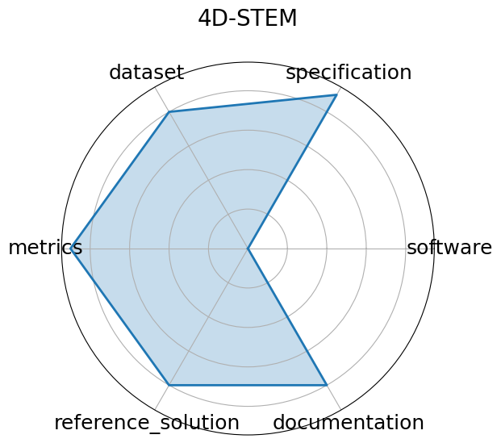

# 4D-STEM


**Date**: 2023-12-03


**Name**: 4D-STEM


**Domain**: Material Science


**Focus**: Real-time ML for scanning transmission electron microscopy


**Keywords**: 4D-STEM, electron microscopy, real-time, image processing


**Task Types**: Image Classification, Streamed data inference


**Metrics**: Classification accuracy, Throughput


**Models**: CNN models  prototype 


**Citation**:


- Shuyu Qin, Joshua Agar, and Nhan Tran. Extremely noisy 4d-tem strain mapping using cycle consistent spatial transforming autoencoders. In AI for Accelerated Materials Design - NeurIPS 2023 Workshop. 2023. URL: https://openreview.net/forum?id=7yt3N0o0W9.

  - bibtex:
      ```
      @inproceedings{qin2023extremely,

        title={Extremely Noisy 4D-TEM Strain Mapping Using Cycle Consistent Spatial Transforming Autoencoders},

        author={Shuyu Qin and Joshua Agar and Nhan Tran},

        booktitle={AI for Accelerated Materials Design - NeurIPS 2023 Workshop},

        year={2023},

        url={https://openreview.net/forum?id=7yt3N0o0W9}

      }

      ```

**Ratings:**


Software:


  - **Rating:** 2


  - **Reason:** No standalone code repository or setup instructions provided 


Specification:


  - **Rating:** 5


  - **Reason:** None 


Dataset:


  - **Rating:** 2


  - **Reason:** No dataset links or FAIR metadata; unclear public access 


Metrics:


  - **Rating:** 4


  - **Reason:** Only localization accuracy and inference time mentioned; not formally benchmarked with scripts 


Reference Solution:


  - **Rating:** 3


  - **Reason:** BraggNN model is described and evaluated, but no direct implementation or inference scripts available 


Documentation:


  - **Rating:** 3


  - **Reason:** Paper is clear, but lacks a GitHub repo or full reproducibility pipeline 


**Average Rating:** 3.167


**Radar Plot:**
 