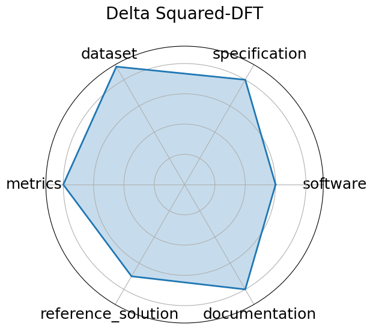

# Delta Squared-DFT


**Date**: 2024-12-13


**Name**: Delta Squared-DFT


**Domain**: Computational Chemistry; Materials Science


**Focus**: Benchmarking machine-learning corrections to DFT using Delta Squared-trained models for reaction energies


**Keywords**: density functional theory, Delta Squared-ML correction, reaction energetics, quantum chemistry


**Task Types**: Regression


**Metrics**: Mean Absolute Error  eV , Energy ranking accuracy


**Models**: Delta Squared-ML correction networks, Kernel ridge regression


**Citation**:


- Kuzma Khrabrov, Anton Ber, Artem Tsypin, Konstantin Ushenin, Egor Rumiantsev, Alexander Telepov, Dmitry Protasov, Ilya Shenbin, Anton Alekseev, Mikhail Shirokikh, Sergey Nikolenko, Elena Tutubalina, and Artur Kadurin. Delta-squared dft: a universal quantum chemistry dataset of drug-like molecules and a benchmark for neural network potentials. 2024. URL: https://arxiv.org/abs/2406.14347, arXiv:2406.14347.

  - bibtex:
      ```
      @misc{khrabrov2024nabla2dftuniversalquantumchemistry,

        title={Delta-Squared DFT: A Universal Quantum Chemistry Dataset of Drug-Like Molecules and a Benchmark for Neural Network Potentials}, 

        author={Kuzma Khrabrov and Anton Ber and Artem Tsypin and Konstantin Ushenin and Egor Rumiantsev and Alexander Telepov and Dmitry Protasov and Ilya Shenbin and Anton Alekseev and Mikhail Shirokikh and Sergey Nikolenko and Elena Tutubalina and Artur Kadurin},

        year={2024},

        eprint={2406.14347},

        archivePrefix={arXiv},

        primaryClass={physics.chem-ph},

        url={https://arxiv.org/abs/2406.14347}, 

      }

      ```

**Ratings:**


Software:


  - **Rating:** 3


  - **Reason:** Source code and baseline models available for ML correction to DFT; framework maturity is moderate. 


Specification:


  - **Rating:** 4


  - **Reason:** Benchmark focuses on reaction energy prediction with clear goals, though some task specifics could be formalized further. 


Dataset:


  - **Rating:** 4.5


  - **Reason:** Multi-modal quantum chemistry datasets are standardized and accessible; repository available. 


Metrics:


  - **Rating:** 4


  - **Reason:** Uses standard regression metrics like MAE and energy ranking accuracy; appropriate for task. 


Reference Solution:


  - **Rating:** 3.5


  - **Reason:** Includes baseline regression and kernel ridge models; implementations are reproducible. 


Documentation:


  - **Rating:** 4


  - **Reason:** Source code supports pipeline reuse, but formal evaluation splits may vary. 


**Average Rating:** 3.833


**Radar Plot:**
 