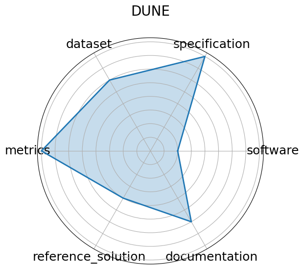

# DUNE


**Edit:** [edit this entry](https://github.com/mlcommons-science/benchmark/tree/main/source)


**Date**: 2024-10-15


**Name**: DUNE


**Domain**: Particle Physics


**Focus**: Real-time ML for DUNE DAQ time-series data


**Keywords**: DUNE, time-series, real-time, trigger


**Task Types**: Trigger selection, Time-series anomaly detection


**Metrics**: Detection efficiency, Latency


**Models**: CNN, LSTM  planned 


**Citation**:


- A. Abed Abud, B. Abi, R. Acciarri, M. A. Acero, G. Adamov, D. Adams, M. Adinolfi, A. Aduszkiewicz, Z. Ahmad, J. Ahmed, T. Alion, S. Alonso Monsalve, M. Alrashed, C. Alt, A. Alton, P. Amedo, J. Anderson, C. Andreopoulos, M. P. Andrews, F. Andrianala, S. Andringa, N. Anfimov, A. Ankowski, M. Antonova, S. Antusch, A. Aranda-Fernandez, A. Ariga, L. O. Arnold, M. A. Arroyave, J. Asaadi, A. Aurisano, V. Aushev, D. Autiero, M. Ayala-Torres, F. Azfar, H. Back, J. J. Back, C. Backhouse, P. Baesso, I. Bagaturia, L. Bagby, S. Balasubramanian, P. Baldi, B. Baller, B. Bambah, F. Barao, G. Barenboim, G. J. Barker, W. Barkhouse, C. Barnes, G. Barr, J. Barranco Monarca, N. Barros, J. L. Barrow, A. Basharina-Freshville, A. Bashyal, V. Basque, E. Belchior, J. B. R. Battat, F. Battisti, F. Bay, J. L. Bazo Alba, J. F. Beacom, E. Bechetoille, B. Behera, L. Bellantoni, G. Bellettini, V. Bellini, O. Beltramello, D. Belver, N. Benekos, F. Bento Neves, S. Berkman, P. Bernardini, R. M. Berner, H. Berns, S. Bertolucci, M. Betancourt, A. Betancur Rodríguez, M. Bhattacharjee, S. Bhuller, B. Bhuyan, S. Biagi, J. Bian, M. Biassoni, K. Biery, B. Bilki, M. Bishai, A. Bitadze, A. Blake, F. D. M. Blaszczyk, G. C. Blazey, E. Blucher, J. Boissevain, S. Bolognesi, T. Bolton, L. Bomben, M. Bonesini, M. Bongrand, F. Bonini, A. Booth, C. Booth, S. Bordoni, A. Borkum, T. Boschi, N. Bostan, P. Bour, C. Bourgeois, S. B. Boyd, D. Boyden, J. Bracinik, D. Braga, D. Brailsford, A. Brandt, J. Bremer, C. Brew, E. Brianne, S. J. Brice, C. Brizzolari, C. Bromberg, G. Brooijmans, J. Brooke, A. Bross, G. Brunetti, M. Brunetti, N. Buchanan, H. Budd, D. Caiulo, P. Calafiura, J. Calcutt, M. Calin, S. Calvez, E. Calvo, A. Caminata, M. Campanelli, K. Cankocak, D. Caratelli, G. Carini, B. Carlus, P. Carniti, I. Caro Terrazas, H. Carranza, T. Carroll, J. F. Castaño Forero, A. Castillo, C. Castromonte, E. Catano-Mur, C. Cattadori, F. Cavalier, F. Cavanna, S. Centro, G. Cerati, A. Cervelli, A. Cervera Villanueva, M. Chalifour, A. Chappell, E. Chardonnet, N. Charitonidis, A. Chatterjee, S. Chattopadhyay, H. Chen, M. Chen, Y. Chen, Z. Chen, D. Cherdack, C. Chi, S. Childress, A. Chiriacescu, G. Chisnall, K. Cho, S. Choate, D. Chokheli, S. Choubey, A. Christensen, D. Christian, G. Christodoulou, A. Chukanov, E. Church, P. Clarke, T. E. Coan, A. G. Cocco, J. A. B. Coelho, E. Conley, R. Conley, J. M. Conrad, M. Convery, S. Copello, L. Corwin, L. Cremaldi, L. Cremonesi, J. I. Crespo-Anadón, E. Cristaldo, R. Cross, A. Cudd, C. Cuesta, Y. Cui, D. Cussans, M. Dabrowski, O. Dalager, H. da Motta, L. Da Silva Peres, C. David, Q. David, G. S. Davies, S. Davini, J. Dawson, K. De, R. M. De Almeida, P. Debbins, I. De Bonis, M. P. Decowski, A. de Gouvêa, P. C. De Holanda, I. L. De Icaza Astiz, A. Deisting, P. De Jong, A. Delbart, D. Delepine, M. Delgado, A. Dell'Acqua, P. De Lurgio, J. R. T. de Mello Neto, D. M. DeMuth, S. Dennis, C. Densham, G. W. Deptuch, A. De Roeck, V. De Romeri, G. De Souza, R. Dharmapalan, F. Diaz, J. S. Díaz, S. Di Domizio, L. Di Giulio, P. Ding, L. Di Noto, C. Distefano, R. Diurba, M. Diwan, Z. Djurcic, N. Dokania, S. Dolan, M. J. Dolinski, L. Domine, D. Douglas, D. Douillet, G. Drake, F. Drielsma, D. Duchesneau, K. Duffy, P. Dunne, T. Durkin, H. Duyang, O. Dvornikov, D. A. Dwyer, A. S. Dyshkant, M. Eads, A. Earle, D. Edmunds, J. Eisch, L. Emberger, S. Emery, A. Ereditato, C. O. Escobar, G. Eurin, J. J. Evans, E. Ewart, A. C. Ezeribe, K. Fahey, A. Falcone, C. Farnese, Y. Farzan, J. Felix, M. Fernandes Carneiro da Silva, E. Fernandez-Martinez, P. Fernandez Menendez, F. Ferraro, L. Fields, F. Filthaut, A. Fiorentini, R. S. Fitzpatrick, W. Flanagan, B. Fleming, R. Flight, D. V. Forero, J. Fowler, W. Fox, J. Franc, K. Francis, D. Franco, J. Freeman, J. Freestone, J. Fried, A. Friedland, S. Fuess, I. Furic, A. P. Furmanski, A. Gago, H. Gallagher, A. Gallas, A. Gallego-Ros, N. Gallice, V. Galymov, E. Gamberini, T. Gamble, R. Gandhi, R. Gandrajula, F. Gao, S. Gao, D. Garcia-Gamez, M. Á García-Peris, S. Gardiner, D. Gastler, G. Ge, B. Gelli, A. Gendotti, S. Gent, Z. Ghorbani-Moghaddam, D. Gibin, I. Gil-Botella, S. Gilligan, C. Girerd, A. K. Giri, D. Gnani, O. Gogota, M. Gold, S. Gollapinni, K. Gollwitzer, R. A. Gomes, L. V. Gomez Bermeo, L. S. Gomez Fajardo, F. Gonnella, J. A. Gonzalez-Cuevas, D. Gonzalez-Diaz, M. Gonzalez-Lopez, M. C. Goodman, O. Goodwin, S. Goswami, C. Gotti, E. Goudzovski, C. Grace, M. Graham, R. Gran, E. Granados, P. Granger, A. Grant, C. Grant, D. Gratieri, P. Green, L. Greenler, J. Greer, W. C. Griffith, M. Groh, J. Grudzinski, K. Grzelak, W. Gu, V. Guarino, R. Guenette, E. Guerard, A. Guglielmi, B. Guo, K. K. Guthikonda, R. Gutierrez, P. Guzowski, M. M. Guzzo, S. Gwon, A. Habig, H. Hadavand, R. Haenni, A. Hahn, J. Haiston, P. Hamacher-Baumann, T. Hamernik, P. Hamilton, J. Han, D. A. Harris, J. Hartnell, J. Harton, T. Hasegawa, C. Hasnip, R. Hatcher, K. W. Hatfield, A. Hatzikoutelis, C. Hayes, E. Hazen, A. Heavey, K. M. Heeger, J. Heise, K. Hennessy, S. Henry, M. A. Hernandez Morquecho, K. Herner, L. Hertel, V Hewes, A. Higuera, T. Hill, S. J. Hillier, A. Himmel, J. Hoff, C. Hohl, A. Holin, E. Hoppe, G. A. Horton-Smith, M. Hostert, A. Hourlier, B. Howard, R. Howell, J. Huang, J. Huang, J. Hugon, G. Iles, N. Ilic, A. M. Iliescu, R. Illingworth, A. Ioannisian, L. Isenhower, R. Itay, A. Izmaylov, S. Jackson, V. Jain, E. James, B. Jargowsky, F. Jediny, D. Jena, Y. S. Jeong, C. Jesús-Valls, X. Ji, L. Jiang, S. Jiménez, A. Jipa, R. Johnson, B. Jones, S. B. Jones, M. Judah, C. K. Jung, T. Junk, Y. Jwa, M. Kabirnezhad, A. Kaboth, I. Kadenko, I. Kakorin, F. Kamiya, N. Kaneshige, G. Karagiorgi, G. Karaman, A. Karcher, M. Karolak, Y. Karyotakis, S. Kasai, S. P. Kasetti, L. Kashur, N. Kazaryan, E. Kearns, P. Keener, K. J. Kelly, E. Kemp, O. Kemularia, W. Ketchum, S. H. Kettell, M. Khabibullin, A. Khotjantsev, A. Khvedelidze, D. Kim, B. King, B. Kirby, M. Kirby, J. Klein, K. Koehler, L. W. Koerner, S. Kohn, P. P. Koller, L. Kolupaeva, M. Kordosky, T. Kosc, U. Kose, V. A. Kostelecký, K. Kothekar, F. Krennrich, I. Kreslo, Y. Kudenko, V. A. Kudryavtsev, S. Kulagin, J. Kumar, P. Kumar, P. Kunze, N. Kurita, C. Kuruppu, V. Kus, T. Kutter, A. Lambert, B. Land, K. Lande, C. E. Lane, K. Lang, T. Langford, J. Larkin, P. Lasorak, D. Last, C. Lastoria, A. Laundrie, A. Lawrence, I. Lazanu, R. LaZur, T. Le, S. Leardini, J. Learned, P. LeBrun, T. LeCompte, G. Lehmann Miotto, R. Lehnert, M. A. Leigui de Oliveira, M. Leitner, L. Li, S. W. Li, T. Li, Y. Li, H. Liao, C. S. Lin, Q. Lin, S. Lin, A. Lister, B. R. Littlejohn, J. Liu, S. Lockwitz, T. Loew, M. Lokajicek, I. Lomidze, K. Long, K. Loo, D. Lorca, T. Lord, J. M. LoSecco, W. C. Louis, X. -G. Lu, K. B. Luk, X. Luo, N. Lurkin, T. Lux, V. P. Luzio, D. MacFarlane, A. A. Machado, P. Machado, C. T. Macias, J. R. Macier, A. Maddalena, A. Madera, P. Madigan, S. Magill, K. Mahn, A. Maio, A. Major, J. A. Maloney, G. Mandrioli, R. C. Mandujano, J. Maneira, L. Manenti, S. Manly, A. Mann, K. Manolopoulos, M. Manrique Plata, V. N. Manyam, L. Manzanillas, M. Marchan, A. Marchionni, W. Marciano, D. Marfatia, C. Mariani, J. Maricic, R. Marie, F. Marinho, A. D. Marino, D. Marsden, M. Marshak, C. M. Marshall, J. Marshall, J. Marteau, J. Martin-Albo, N. Martinez, D. A. Martinez Caicedo, S. Martynenko, K. Mason, A. Mastbaum, M. Masud, S. Matsuno, J. Matthews, C. Mauger, N. Mauri, K. Mavrokoridis, I. Mawby, R. Mazza, A. Mazzacane, E. Mazzucato, T. McAskill, E. McCluskey, N. McConkey, K. S. McFarland, C. McGrew, A. McNab, A. Mefodiev, P. Mehta, P. Melas, O. Mena, S. Menary, H. Mendez, D. P. Méndez, A. Menegolli, G. Meng, M. D. Messier, W. Metcalf, T. Mettler, M. Mewes, H. Meyer, T. Miao, G. Michna, T. Miedema, J. Migenda, V. Mikola, R. Milincic, W. Miller, J. Mills, C. Milne, O. Mineev, O. G. Miranda, S. Miryala, C. S. Mishra, S. R. Mishra, A. Mislivec, D. Mladenov, I. Mocioiu, K. Moffat, N. Moggi, R. Mohanta, T. A. Mohayai, N. Mokhov, J. Molina, L. Molina Bueno, A. Montanari, C. Montanari, D. Montanari, L. M. Montano Zetina, J. Moon, M. Mooney, A. F. Moor, D. Moreno, C. Morris, C. Mossey, E. Motuk, C. A. Moura, J. Mousseau, W. Mu, L. Mualem, J. Mueller, M. Muether, S. Mufson, F. Muheim, A. Muir, M. Mulhearn, D. Munford, H. Muramatsu, S. Murphy, J. Musser, J. Nachtman, S. Nagu, M. Nalbandyan, R. Nandakumar, D. Naples, S. Narita, D. Navas-Nicolás, A. Navrer-Agasson, N. Nayak, M. Nebot-Guinot, K. Negishi, J. K. Nelson, J. Nesbit, M. Nessi, D. Newbold, M. Newcomer, D. Newhart, H. Newton, R. Nichol, F. Nicolas-Arnaldos, E. Niner, K. Nishimura, A. Norman, A. Norrick, R. Northrop, P. Novella, J. A. Nowak, M. Oberling, J. P. Ochoa-Ricoux, A. Olivares Del Campo, A. Olivier, A. Olshevskiy, Y. Onel, Y. Onishchuk, J. Ott, L. Pagani, S. Pakvasa, G. Palacio, O. Palamara, S. Palestini, J. M. Paley, M. Pallavicini, C. Palomares, J. L. Palomino-Gallo, E. Pantic, V. Paolone, V. Papadimitriou, R. Papaleo, A. Papanestis, S. Paramesvaran, S. Parke, Z. Parsa, M. Parvu, S. Pascoli, L. Pasqualini, J. Pasternak, J. Pater, C. Patrick, L. Patrizii, R. B. Patterson, S. J. Patton, T. Patzak, A. Paudel, B. Paulos, L. Paulucci, Z. Pavlovic, G. Pawloski, D. Payne, V. Pec, S. J. M. Peeters, E. Pennacchio, A. Penzo, O. L. G. Peres, J. Perry, D. Pershey, G. Pessina, G. Petrillo, C. Petta, R. Petti, F. Piastra, L. Pickering, F. Pietropaolo, R. Plunkett, R. Poling, X. Pons, N. Poonthottathil, S. Pordes, J. Porter, M. Potekhin, R. Potenza, B. V. K. S. Potukuchi, J. Pozimski, M. Pozzato, S. Prakash, T. Prakash, S. Prince, D. Pugnere, X. Qian, M. C. Queiroga Bazetto, J. L. Raaf, V. Radeka, J. Rademacker, B. Radics, A. Rafique, E. Raguzin, M. Rai, M. Rajaoalisoa, I. Rakhno, A. Rakotonandrasana, L. Rakotondravohitra, Y. A. Ramachers, R. Rameika, M. A. Ramirez Delgado, B. Ramson, A. Rappoldi, G. Raselli, P. Ratoff, S. Raut, R. F. Razakamiandra, J. S. Real, B. Rebel, M. Reggiani-Guzzo, T. Rehak, J. Reichenbacher, S. D. Reitzner, H. Rejeb Sfar, A. Renshaw, S. Rescia, F. Resnati, A. Reynolds, C. Riccio, G. Riccobene, L. C. J. Rice, J. Ricol, A. Rigamonti, Y. Rigaut, D. Rivera, L. Rochester, M. Roda, P. Rodrigues, M. J. Rodriguez Alonso, E. Rodriguez Bonilla, J. Rodriguez Rondon, S. Rosauro-Alcaraz, M. Rosenberg, P. Rosier, B. Roskovec, M. Rossella, J. Rout, P. Roy, S. Roy, A. Rubbia, C. Rubbia, F. C. Rubio, B. Russell, D. Ruterbories, R. Saakyan, S. Sacerdoti, T. Safford, R. Sahay, N. Sahu, P. Sala, N. Samios, O. Samoylov, M. C. Sanchez, D. A. Sanders, D. Sankey, S. Santana, M. Santos-Maldonado, N. Saoulidou, P. Sapienza, C. Sarasty, I. Sarcevic, G. Savage, V. Savinov, A. Scaramelli, A. Scarff, A. Scarpelli, T. Schaffer, H. Schellman, P. Schlabach, D. Schmitz, K. Scholberg, A. Schukraft, E. Segreto, J. Sensenig, I. Seong, A. Sergi, D. Sgalaberna, M. H. Shaevitz, S. Shafaq, M. Shamma, R. Sharankova, H. R. Sharma, R. Sharma, R. Kumar, T. Shaw, C. Shepherd-Themistocleous, S. Shin, D. Shooltz, R. Shrock, L. Simard, F. Simon, N. Simos, J. Sinclair, G. Sinev, J. Singh, J. Singh, V. Singh, R. Sipos, F. W. Sippach, G. Sirri, A. Sitraka, K. Siyeon, K. Skarpaas VIII, A. Smith, E. Smith, P. Smith, J. Smolik, M. Smy, E. L. Snider, P. Snopok, M. Soares Nunes, H. Sobel, M. Soderberg, C. J. Solano Salinas, S. Söldner-Rembold, N. Solomey, V. Solovov, W. E. Sondheim, M. Sorel, J. Soto-Oton, A. Sousa, K. Soustruznik, F. Spagliardi, M. Spanu, J. Spitz, N. J. C. Spooner, K. Spurgeon, R. Staley, M. Stancari, L. Stanco, R. Stanley, R. Stein, H. M. Steiner, J. Stewart, B. Stillwell, J. Stock, F. Stocker, T. Stokes, M. Strait, T. Strauss, S. Striganov, A. Stuart, J. G. Suarez, H. Sullivan, D. Summers, A. Surdo, V. Susic, L. Suter, C. M. Sutera, R. Svoboda, B. Szczerbinska, A. M. Szelc, R. Talaga, H. A. Tanaka, B. Tapia Oregui, A. Tapper, S. Tariq, E. Tatar, R. Tayloe, A. M. Teklu, M. Tenti, K. Terao, C. A. Ternes, F. Terranova, G. Testera, A. Thea, J. L. Thompson, C. Thorn, S. C. Timm, J. Todd, A. Tonazzo, D. Torbunov, M. Torti, M. Tortola, F. Tortorici, D. Totani, M. Toups, C. Touramanis, J. Trevor, S. Trilov, W. H. Trzaska, Y. T. Tsai, Z. Tsamalaidze, K. V. Tsang, N. Tsverava, S. Tufanli, C. Tull, E. Tyley, M. Tzanov, M. A. Uchida, J. Urheim, T. Usher, S. Uzunyan, M. R. Vagins, P. Vahle, G. A. Valdiviesso, E. Valencia, Z. Vallari, J. W. F. Valle, S. Vallecorsa, R. Van Berg, R. G. Van de Water, F. Varanini, D. Vargas, G. Varner, J. Vasel, S. Vasina, G. Vasseur, N. Vaughan, K. Vaziri, S. Ventura, A. Verdugo, S. Vergani, M. A. Vermeulen, M. Verzocchi, M. Vicenzi, H. Vieira de Souza, C. Vignoli, C. Vilela, B. Viren, T. Vrba, T. Wachala, A. V. Waldron, M. Wallbank, H. Wang, J. Wang, M. H. L. S. Wang, Y. Wang, Y. Wang, K. Warburton, D. Warner, M. Wascko, D. Waters, A. Watson, P. Weatherly, A. Weber, M. Weber, H. Wei, A. Weinstein, D. Wenman, M. Wetstein, A. White, L. H. Whitehead, D. Whittington, M. J. Wilking, C. Wilkinson, Z. Williams, F. Wilson, R. J. Wilson, J. Wolcott, T. Wongjirad, A. Wood, K. Wood, E. Worcester, M. Worcester, C. Wret, W. Wu, W. Wu, Y. Xiao, E. Yandel, G. Yang, K. Yang, S. Yang, T. Yang, A. Yankelevich, N. Yershov, K. Yonehara, T. Young, B. Yu, H. Yu, J. Yu, W. Yuan, R. Zaki, J. Zalesak, L. Zambelli, B. Zamorano, A. Zani, L. Zazueta, G. Zeit, G. P. Zeller, J. Zennamo, K. Zeug, C. Zhang, M. Zhao, E. Zhivun, G. Zhu, P. Zilberman, E. D. Zimmerman, M. Zito, S. Zucchelli, J. Zuklin, V. Zutshi, and R. Zwaska. Deep underground neutrino experiment (dune) near detector conceptual design report. 2021. URL: https://arxiv.org/abs/2103.13910, arXiv:2103.13910.

  - bibtex:
      ```
      @misc{abud2021deep,

        title={Deep Underground Neutrino Experiment (DUNE) Near Detector Conceptual Design Report}, 

        author={A. Abed Abud and B. Abi and R. Acciarri and M. A. Acero and G. Adamov and D. Adams and M. Adinolfi and A. Aduszkiewicz and Z. Ahmad and J. Ahmed and T. Alion and S. Alonso Monsalve and M. Alrashed and C. Alt and A. Alton and P. Amedo and J. Anderson and C. Andreopoulos and M. P. Andrews and F. Andrianala and S. Andringa and N. Anfimov and A. Ankowski and M. Antonova and S. Antusch and A. Aranda-Fernandez and A. Ariga and L. O. Arnold and M. A. Arroyave and J. Asaadi and A. Aurisano and V. Aushev and D. Autiero and M. Ayala-Torres and F. Azfar and H. Back and J. J. Back and C. Backhouse and P. Baesso and I. Bagaturia and L. Bagby and S. Balasubramanian and P. Baldi and B. Baller and B. Bambah and F. Barao and G. Barenboim and G. J. Barker and W. Barkhouse and C. Barnes and G. Barr and J. Barranco Monarca and N. Barros and J. L. Barrow and A. Basharina-Freshville and A. Bashyal and V. Basque and E. Belchior and J. B. R. Battat and F. Battisti and F. Bay and J. L. Bazo Alba and J. F. Beacom and E. Bechetoille and B. Behera and L. Bellantoni and G. Bellettini and V. Bellini and O. Beltramello and D. Belver and N. Benekos and F. Bento Neves and S. Berkman and P. Bernardini and R. M. Berner and H. Berns and S. Bertolucci and M. Betancourt and A. Betancur Rodríguez and M. Bhattacharjee and S. Bhuller and B. Bhuyan and S. Biagi and J. Bian and M. Biassoni and K. Biery and B. Bilki and M. Bishai and A. Bitadze and A. Blake and F. D. M. Blaszczyk and G. C. Blazey and E. Blucher and J. Boissevain and S. Bolognesi and T. Bolton and L. Bomben and M. Bonesini and M. Bongrand and F. Bonini and A. Booth and C. Booth and S. Bordoni and A. Borkum and T. Boschi and N. Bostan and P. Bour and C. Bourgeois and S. B. Boyd and D. Boyden and J. Bracinik and D. Braga and D. Brailsford and A. Brandt and J. Bremer and C. Brew and E. Brianne and S. J. Brice and C. Brizzolari and C. Bromberg and G. Brooijmans and J. Brooke and A. Bross and G. Brunetti and M. Brunetti and N. Buchanan and H. Budd and D. Caiulo and P. Calafiura and J. Calcutt and M. Calin and S. Calvez and E. Calvo and A. Caminata and M. Campanelli and K. Cankocak and D. Caratelli and G. Carini and B. Carlus and P. Carniti and I. Caro Terrazas and H. Carranza and T. Carroll and J. F. Castaño Forero and A. Castillo and C. Castromonte and E. Catano-Mur and C. Cattadori and F. Cavalier and F. Cavanna and S. Centro and G. Cerati and A. Cervelli and A. Cervera Villanueva and M. Chalifour and A. Chappell and E. Chardonnet and N. Charitonidis and A. Chatterjee and S. Chattopadhyay and H. Chen and M. Chen and Y. Chen and Z. Chen and D. Cherdack and C. Chi and S. Childress and A. Chiriacescu and G. Chisnall and K. Cho and S. Choate and D. Chokheli and S. Choubey and A. Christensen and D. Christian and G. Christodoulou and A. Chukanov and E. Church and P. Clarke and T. E. Coan and A. G. Cocco and J. A. B. Coelho and E. Conley and R. Conley and J. M. Conrad and M. Convery and S. Copello and L. Corwin and L. Cremaldi and L. Cremonesi and J. I. Crespo-Anadón and E. Cristaldo and R. Cross and A. Cudd and C. Cuesta and Y. Cui and D. Cussans and M. Dabrowski and O. Dalager and H. da Motta and L. Da Silva Peres and C. David and Q. David and G. S. Davies and S. Davini and J. Dawson and K. De and R. M. De Almeida and P. Debbins and I. De Bonis and M. P. Decowski and A. de Gouvêa and P. C. De Holanda and I. L. De Icaza Astiz and A. Deisting and P. De Jong and A. Delbart and D. Delepine and M. Delgado and A. Dell'Acqua and P. De Lurgio and J. R. T. de Mello Neto and D. M. DeMuth and S. Dennis and C. Densham and G. W. Deptuch and A. De Roeck and V. De Romeri and G. De Souza and R. Dharmapalan and F. Diaz and J. S. Díaz and S. Di Domizio and L. Di Giulio and P. Ding and L. Di Noto and C. Distefano and R. Diurba and M. Diwan and Z. Djurcic and N. Dokania and S. Dolan and M. J. Dolinski and L. Domine and D. Douglas and D. Douillet and G. Drake and F. Drielsma and D. Duchesneau and K. Duffy and P. Dunne and T. Durkin and H. Duyang and O. Dvornikov and D. A. Dwyer and A. S. Dyshkant and M. Eads and A. Earle and D. Edmunds and J. Eisch and L. Emberger and S. Emery and A. Ereditato and C. O. Escobar and G. Eurin and J. J. Evans and E. Ewart and A. C. Ezeribe and K. Fahey and A. Falcone and C. Farnese and Y. Farzan and J. Felix and M. Fernandes Carneiro da Silva and E. Fernandez-Martinez and P. Fernandez Menendez and F. Ferraro and L. Fields and F. Filthaut and A. Fiorentini and R. S. Fitzpatrick and W. Flanagan and B. Fleming and R. Flight and D. V. Forero and J. Fowler and W. Fox and J. Franc and K. Francis and D. Franco and J. Freeman and J. Freestone and J. Fried and A. Friedland and S. Fuess and I. Furic and A. P. Furmanski and A. Gago and H. Gallagher and A. Gallas and A. Gallego-Ros and N. Gallice and V. Galymov and E. Gamberini and T. Gamble and R. Gandhi and R. Gandrajula and F. Gao and S. Gao and D. Garcia-Gamez and M. Á García-Peris and S. Gardiner and D. Gastler and G. Ge and B. Gelli and A. Gendotti and S. Gent and Z. Ghorbani-Moghaddam and D. Gibin and I. Gil-Botella and S. Gilligan and C. Girerd and A. K. Giri and D. Gnani and O. Gogota and M. Gold and S. Gollapinni and K. Gollwitzer and R. A. Gomes and L. V. Gomez Bermeo and L. S. Gomez Fajardo and F. Gonnella and J. A. Gonzalez-Cuevas and D. Gonzalez-Diaz and M. Gonzalez-Lopez and M. C. Goodman and O. Goodwin and S. Goswami and C. Gotti and E. Goudzovski and C. Grace and M. Graham and R. Gran and E. Granados and P. Granger and A. Grant and C. Grant and D. Gratieri and P. Green and L. Greenler and J. Greer and W. C. Griffith and M. Groh and J. Grudzinski and K. Grzelak and W. Gu and V. Guarino and R. Guenette and E. Guerard and A. Guglielmi and B. Guo and K. K. Guthikonda and R. Gutierrez and P. Guzowski and M. M. Guzzo and S. Gwon and A. Habig and H. Hadavand and R. Haenni and A. Hahn and J. Haiston and P. Hamacher-Baumann and T. Hamernik and P. Hamilton and J. Han and D. A. Harris and J. Hartnell and J. Harton and T. Hasegawa and C. Hasnip and R. Hatcher and K. W. Hatfield and A. Hatzikoutelis and C. Hayes and E. Hazen and A. Heavey and K. M. Heeger and J. Heise and K. Hennessy and S. Henry and M. A. Hernandez Morquecho and K. Herner and L. Hertel and V Hewes and A. Higuera and T. Hill and S. J. Hillier and A. Himmel and J. Hoff and C. Hohl and A. Holin and E. Hoppe and G. A. Horton-Smith and M. Hostert and A. Hourlier and B. Howard and R. Howell and J. Huang and J. Huang and J. Hugon and G. Iles and N. Ilic and A. M. Iliescu and R. Illingworth and A. Ioannisian and L. Isenhower and R. Itay and A. Izmaylov and S. Jackson and V. Jain and E. James and B. Jargowsky and F. Jediny and D. Jena and Y. S. Jeong and C. Jesús-Valls and X. Ji and L. Jiang and S. Jiménez and A. Jipa and R. Johnson and B. Jones and S. B. Jones and M. Judah and C. K. Jung and T. Junk and Y. Jwa and M. Kabirnezhad and A. Kaboth and I. Kadenko and I. Kakorin and F. Kamiya and N. Kaneshige and G. Karagiorgi and G. Karaman and A. Karcher and M. Karolak and Y. Karyotakis and S. Kasai and S. P. Kasetti and L. Kashur and N. Kazaryan and E. Kearns and P. Keener and K. J. Kelly and E. Kemp and O. Kemularia and W. Ketchum and S. H. Kettell and M. Khabibullin and A. Khotjantsev and A. Khvedelidze and D. Kim and B. King and B. Kirby and M. Kirby and J. Klein and K. Koehler and L. W. Koerner and S. Kohn and P. P. Koller and L. Kolupaeva and M. Kordosky and T. Kosc and U. Kose and V. A. Kostelecký and K. Kothekar and F. Krennrich and I. Kreslo and Y. Kudenko and V. A. Kudryavtsev and S. Kulagin and J. Kumar and P. Kumar and P. Kunze and N. Kurita and C. Kuruppu and V. Kus and T. Kutter and A. Lambert and B. Land and K. Lande and C. E. Lane and K. Lang and T. Langford and J. Larkin and P. Lasorak and D. Last and C. Lastoria and A. Laundrie and A. Lawrence and I. Lazanu and R. LaZur and T. Le and S. Leardini and J. Learned and P. LeBrun and T. LeCompte and G. Lehmann Miotto and R. Lehnert and M. A. Leigui de Oliveira and M. Leitner and L. Li and S. W. Li and T. Li and Y. Li and H. Liao and C. S. Lin and Q. Lin and S. Lin and A. Lister and B. R. Littlejohn and J. Liu and S. Lockwitz and T. Loew and M. Lokajicek and I. Lomidze and K. Long and K. Loo and D. Lorca and T. Lord and J. M. LoSecco and W. C. Louis and X. -G. Lu and K. B. Luk and X. Luo and N. Lurkin and T. Lux and V. P. Luzio and D. MacFarlane and A. A. Machado and P. Machado and C. T. Macias and J. R. Macier and A. Maddalena and A. Madera and P. Madigan and S. Magill and K. Mahn and A. Maio and A. Major and J. A. Maloney and G. Mandrioli and R. C. Mandujano and J. Maneira and L. Manenti and S. Manly and A. Mann and K. Manolopoulos and M. Manrique Plata and V. N. Manyam and L. Manzanillas and M. Marchan and A. Marchionni and W. Marciano and D. Marfatia and C. Mariani and J. Maricic and R. Marie and F. Marinho and A. D. Marino and D. Marsden and M. Marshak and C. M. Marshall and J. Marshall and J. Marteau and J. Martin-Albo and N. Martinez and D. A. Martinez Caicedo and S. Martynenko and K. Mason and A. Mastbaum and M. Masud and S. Matsuno and J. Matthews and C. Mauger and N. Mauri and K. Mavrokoridis and I. Mawby and R. Mazza and A. Mazzacane and E. Mazzucato and T. McAskill and E. McCluskey and N. McConkey and K. S. McFarland and C. McGrew and A. McNab and A. Mefodiev and P. Mehta and P. Melas and O. Mena and S. Menary and H. Mendez and D. P. Méndez and A. Menegolli and G. Meng and M. D. Messier and W. Metcalf and T. Mettler and M. Mewes and H. Meyer and T. Miao and G. Michna and T. Miedema and J. Migenda and V. Mikola and R. Milincic and W. Miller and J. Mills and C. Milne and O. Mineev and O. G. Miranda and S. Miryala and C. S. Mishra and S. R. Mishra and A. Mislivec and D. Mladenov and I. Mocioiu and K. Moffat and N. Moggi and R. Mohanta and T. A. Mohayai and N. Mokhov and J. Molina and L. Molina Bueno and A. Montanari and C. Montanari and D. Montanari and L. M. Montano Zetina and J. Moon and M. Mooney and A. F. Moor and D. Moreno and C. Morris and C. Mossey and E. Motuk and C. A. Moura and J. Mousseau and W. Mu and L. Mualem and J. Mueller and M. Muether and S. Mufson and F. Muheim and A. Muir and M. Mulhearn and D. Munford and H. Muramatsu and S. Murphy and J. Musser and J. Nachtman and S. Nagu and M. Nalbandyan and R. Nandakumar and D. Naples and S. Narita and D. Navas-Nicolás and A. Navrer-Agasson and N. Nayak and M. Nebot-Guinot and K. Negishi and J. K. Nelson and J. Nesbit and M. Nessi and D. Newbold and M. Newcomer and D. Newhart and H. Newton and R. Nichol and F. Nicolas-Arnaldos and E. Niner and K. Nishimura and A. Norman and A. Norrick and R. Northrop and P. Novella and J. A. Nowak and M. Oberling and J. P. Ochoa-Ricoux and A. Olivares Del Campo and A. Olivier and A. Olshevskiy and Y. Onel and Y. Onishchuk and J. Ott and L. Pagani and S. Pakvasa and G. Palacio and O. Palamara and S. Palestini and J. M. Paley and M. Pallavicini and C. Palomares and J. L. Palomino-Gallo and E. Pantic and V. Paolone and V. Papadimitriou and R. Papaleo and A. Papanestis and S. Paramesvaran and S. Parke and Z. Parsa and M. Parvu and S. Pascoli and L. Pasqualini and J. Pasternak and J. Pater and C. Patrick and L. Patrizii and R. B. Patterson and S. J. Patton and T. Patzak and A. Paudel and B. Paulos and L. Paulucci and Z. Pavlovic and G. Pawloski and D. Payne and V. Pec and S. J. M. Peeters and E. Pennacchio and A. Penzo and O. L. G. Peres and J. Perry and D. Pershey and G. Pessina and G. Petrillo and C. Petta and R. Petti and F. Piastra and L. Pickering and F. Pietropaolo and R. Plunkett and R. Poling and X. Pons and N. Poonthottathil and S. Pordes and J. Porter and M. Potekhin and R. Potenza and B. V. K. S. Potukuchi and J. Pozimski and M. Pozzato and S. Prakash and T. Prakash and S. Prince and D. Pugnere and X. Qian and M. C. Queiroga Bazetto and J. L. Raaf and V. Radeka and J. Rademacker and B. Radics and A. Rafique and E. Raguzin and M. Rai and M. Rajaoalisoa and I. Rakhno and A. Rakotonandrasana and L. Rakotondravohitra and Y. A. Ramachers and R. Rameika and M. A. Ramirez Delgado and B. Ramson and A. Rappoldi and G. Raselli and P. Ratoff and S. Raut and R. F. Razakamiandra and J. S. Real and B. Rebel and M. Reggiani-Guzzo and T. Rehak and J. Reichenbacher and S. D. Reitzner and H. Rejeb Sfar and A. Renshaw and S. Rescia and F. Resnati and A. Reynolds and C. Riccio and G. Riccobene and L. C. J. Rice and J. Ricol and A. Rigamonti and Y. Rigaut and D. Rivera and L. Rochester and M. Roda and P. Rodrigues and M. J. Rodriguez Alonso and E. Rodriguez Bonilla and J. Rodriguez Rondon and S. Rosauro-Alcaraz and M. Rosenberg and P. Rosier and B. Roskovec and M. Rossella and J. Rout and P. Roy and S. Roy and A. Rubbia and C. Rubbia and F. C. Rubio and B. Russell and D. Ruterbories and R. Saakyan and S. Sacerdoti and T. Safford and R. Sahay and N. Sahu and P. Sala and N. Samios and O. Samoylov and M. C. Sanchez and D. A. Sanders and D. Sankey and S. Santana and M. Santos-Maldonado and N. Saoulidou and P. Sapienza and C. Sarasty and I. Sarcevic and G. Savage and V. Savinov and A. Scaramelli and A. Scarff and A. Scarpelli and T. Schaffer and H. Schellman and P. Schlabach and D. Schmitz and K. Scholberg and A. Schukraft and E. Segreto and J. Sensenig and I. Seong and A. Sergi and D. Sgalaberna and M. H. Shaevitz and S. Shafaq and M. Shamma and R. Sharankova and H. R. Sharma and R. Sharma and R. Kumar and T. Shaw and C. Shepherd-Themistocleous and S. Shin and D. Shooltz and R. Shrock and L. Simard and F. Simon and N. Simos and J. Sinclair and G. Sinev and J. Singh and J. Singh and V. Singh and R. Sipos and F. W. Sippach and G. Sirri and A. Sitraka and K. Siyeon and K. Skarpaas VIII and A. Smith and E. Smith and P. Smith and J. Smolik and M. Smy and E. L. Snider and P. Snopok and M. Soares Nunes and H. Sobel and M. Soderberg and C. J. Solano Salinas and S. Söldner-Rembold and N. Solomey and V. Solovov and W. E. Sondheim and M. Sorel and J. Soto-Oton and A. Sousa and K. Soustruznik and F. Spagliardi and M. Spanu and J. Spitz and N. J. C. Spooner and K. Spurgeon and R. Staley and M. Stancari and L. Stanco and R. Stanley and R. Stein and H. M. Steiner and J. Stewart and B. Stillwell and J. Stock and F. Stocker and T. Stokes and M. Strait and T. Strauss and S. Striganov and A. Stuart and J. G. Suarez and H. Sullivan and D. Summers and A. Surdo and V. Susic and L. Suter and C. M. Sutera and R. Svoboda and B. Szczerbinska and A. M. Szelc and R. Talaga and H. A. Tanaka and B. Tapia Oregui and A. Tapper and S. Tariq and E. Tatar and R. Tayloe and A. M. Teklu and M. Tenti and K. Terao and C. A. Ternes and F. Terranova and G. Testera and A. Thea and J. L. Thompson and C. Thorn and S. C. Timm and J. Todd and A. Tonazzo and D. Torbunov and M. Torti and M. Tortola and F. Tortorici and D. Totani and M. Toups and C. Touramanis and J. Trevor and S. Trilov and W. H. Trzaska and Y. T. Tsai and Z. Tsamalaidze and K. V. Tsang and N. Tsverava and S. Tufanli and C. Tull and E. Tyley and M. Tzanov and M. A. Uchida and J. Urheim and T. Usher and S. Uzunyan and M. R. Vagins and P. Vahle and G. A. Valdiviesso and E. Valencia and Z. Vallari and J. W. F. Valle and S. Vallecorsa and R. Van Berg and R. G. Van de Water and F. Varanini and D. Vargas and G. Varner and J. Vasel and S. Vasina and G. Vasseur and N. Vaughan and K. Vaziri and S. Ventura and A. Verdugo and S. Vergani and M. A. Vermeulen and M. Verzocchi and M. Vicenzi and H. Vieira de Souza and C. Vignoli and C. Vilela and B. Viren and T. Vrba and T. Wachala and A. V. Waldron and M. Wallbank and H. Wang and J. Wang and M. H. L. S. Wang and Y. Wang and Y. Wang and K. Warburton and D. Warner and M. Wascko and D. Waters and A. Watson and P. Weatherly and A. Weber and M. Weber and H. Wei and A. Weinstein and D. Wenman and M. Wetstein and A. White and L. H. Whitehead and D. Whittington and M. J. Wilking and C. Wilkinson and Z. Williams and F. Wilson and R. J. Wilson and J. Wolcott and T. Wongjirad and A. Wood and K. Wood and E. Worcester and M. Worcester and C. Wret and W. Wu and W. Wu and Y. Xiao and E. Yandel and G. Yang and K. Yang and S. Yang and T. Yang and A. Yankelevich and N. Yershov and K. Yonehara and T. Young and B. Yu and H. Yu and J. Yu and W. Yuan and R. Zaki and J. Zalesak and L. Zambelli and B. Zamorano and A. Zani and L. Zazueta and G. Zeit and G. P. Zeller and J. Zennamo and K. Zeug and C. Zhang and M. Zhao and E. Zhivun and G. Zhu and P. Zilberman and E. D. Zimmerman and M. Zito and S. Zucchelli and J. Zuklin and V. Zutshi and R. Zwaska},

        year={2021},

        eprint={2103.13910},

        archivePrefix={arXiv},

        primaryClass={physics.ins-det},

        url={https://arxiv.org/abs/2103.13910}, 

      }

      ```

**Ratings:**


Software:


  - **Rating:** 1


  - **Reason:** Code not available; no containerization or setup provided 


Specification:


  - **Rating:** 4


  - **Reason:** Constraints like latency thresholds are described qualitatively but not numerically defined 


Dataset:


  - **Rating:** 3


  - **Reason:** Dataset lacks a public URL; FAIR metadata and versioning are missing 


Metrics:


  - **Rating:** 4


  - **Reason:** Metrics are relevant but no benchmark baseline or detailed evaluation guidance is provided 


Reference Solution:


  - **Rating:** 2


  - **Reason:** Autoencoder prototype exists but is not reproducible; RL model still in development 


Documentation:


  - **Rating:** 3


  - **Reason:** Documentation exists only in slides/GDocs; no implementation guide or structured release 


**Average Rating:** 2.833


**Radar Plot:**
 