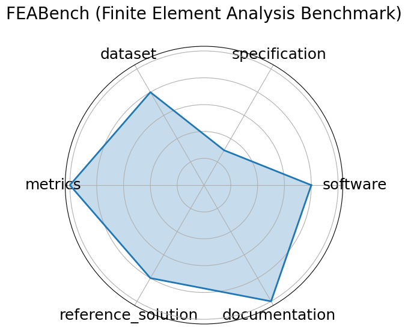

# FEABench (Finite Element Analysis Benchmark)


**Edit:** [edit this entry](https://github.com/mlcommons-science/benchmark/tree/main/source)


**Date**: 2023-01-26


**Name**: FEABench  Finite Element Analysis Benchmark 


**Domain**: Computational Engineering


**Focus**: FEA simulation accuracy and performance


**Keywords**: finite element, simulation, PDE


**Task Types**: Simulation, Performance evaluation


**Metrics**: Solve time, Error norm


**Models**: FEniCS, deal.II


**Citation**:


- Nayantara Mudur, Hao Cui, Subhashini Venugopalan, Paul Raccuglia, Michael P. Brenner, and Peter Norgaard. Feabench: evaluating language models on multiphysics reasoning ability. 2025. URL: https://arxiv.org/abs/2504.06260, arXiv:2504.06260.

  - bibtex:
      ```
      @misc{mudur2025feabenchevaluatinglanguagemodels,

        title={FEABench: Evaluating Language Models on Multiphysics Reasoning Ability}, 

        author={Nayantara Mudur and Hao Cui and Subhashini Venugopalan and Paul Raccuglia and Michael P. Brenner and Peter Norgaard},

        year={2025},

        eprint={2504.06260},

        archivePrefix={arXiv},

        primaryClass={cs.AI},

        url={https://arxiv.org/abs/2504.06260}, 

        }

      ```

**Ratings:**


Software:


  - **Rating:** 4


  - **Reason:** Code is available, but poorly documented 


Specification:


  - **Rating:** 1.5


  - **Reason:** Output is defined and task clarity is questionable 


Dataset:


  - **Rating:** 4


  - **Reason:** Available, but not split into sets 


Metrics:


  - **Rating:** 5


  - **Reason:** Fully defined metrics 


Reference Solution:


  - **Rating:** 4


  - **Reason:** Three open-source models were used. No system constraints. 


Documentation:


  - **Rating:** 5


  - **Reason:** In associated paper 


**Average Rating:** 3.917


**Radar Plot:**
 