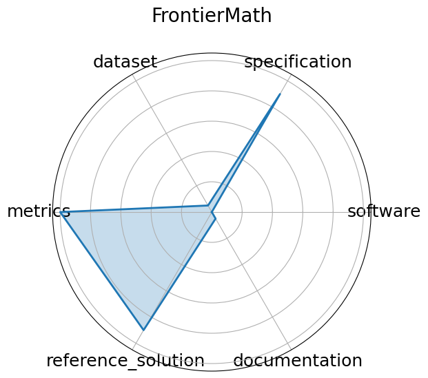

# FrontierMath


**Edit:** [edit this entry](https://github.com/mlcommons-science/benchmark/tree/main/source)


**Date**: 2024-11-07


**Name**: FrontierMath


**Domain**: Mathematics


**Focus**: Challenging advanced mathematical reasoning


**Keywords**: symbolic reasoning, number theory, algebraic geometry, category theory


**Task Types**: Problem solving


**Metrics**: Accuracy


**Models**: unkown


**Citation**:


- Elliot Glazer, Ege Erdil, Tamay Besiroglu, Diego Chicharro, Evan Chen, Alex Gunning, Caroline Falkman Olsson, Jean-Stanislas Denain, Anson Ho, Emily de Oliveira Santos, Olli Järviniemi, Matthew Barnett, Robert Sandler, Matej Vrzala, Jaime Sevilla, Qiuyu Ren, Elizabeth Pratt, Lionel Levine, Grant Barkley, Natalie Stewart, Bogdan Grechuk, Tetiana Grechuk, Shreepranav Varma Enugandla, and Mark Wildon. Frontiermath: a benchmark for evaluating advanced mathematical reasoning in ai. 2024. URL: https://arxiv.org/abs/2411.04872, arXiv:2411.04872.

  - bibtex:
      ```
      @misc{glazer2024frontiermathbenchmarkevaluatingadvanced,

        archiveprefix = {arXiv},

        author        = {Elliot Glazer and Ege Erdil and Tamay Besiroglu and Diego Chicharro and Evan Chen and Alex Gunning and Caroline Falkman Olsson and Jean-Stanislas Denain and Anson Ho and Emily de Oliveira Santos and Olli Järviniemi and Matthew Barnett and Robert Sandler and Matej Vrzala and Jaime Sevilla and Qiuyu Ren and Elizabeth Pratt and Lionel Levine and Grant Barkley and Natalie Stewart and Bogdan Grechuk and Tetiana Grechuk and Shreepranav Varma Enugandla and Mark Wildon},

        eprint        = {2411.04872},

        primaryclass  = {cs.AI},

        title         = {FrontierMath: A Benchmark for Evaluating Advanced Mathematical Reasoning in AI},

        url           = {https://arxiv.org/abs/2411.04872},

        year          = {2024}

      }

      ```

**Ratings:**


Software:


  - **Rating:** 0


  - **Reason:** No link to code provided 


Specification:


  - **Rating:** 3


  - **Reason:** Well-specified process for asking questions and receiving answers. No software or hardware constraints 


Dataset:


  - **Rating:** 0


  - **Reason:** Paper and website had no link to any dataset. It may still exist somewhere 


Metrics:


  - **Rating:** 5


  - **Reason:**  by default  All questions in the dataset have a correct answer 


Reference Solution:


  - **Rating:** 2


  - **Reason:** Displays result of leading models on the benchmark, but none are trainable or list constraints 


Documentation:


  - **Rating:** 0


  - **Reason:** No specified way to reproduce the reference solution 


**Average Rating:** 1.667


**Radar Plot:**
 